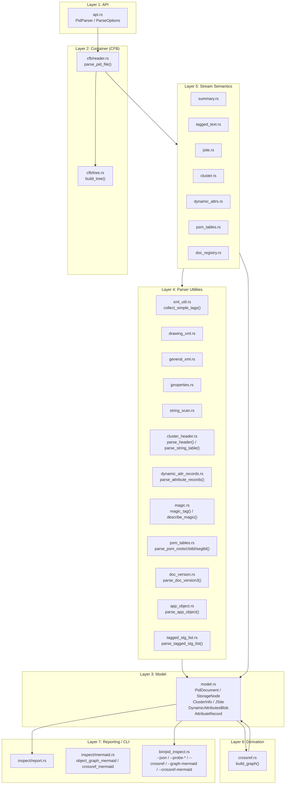
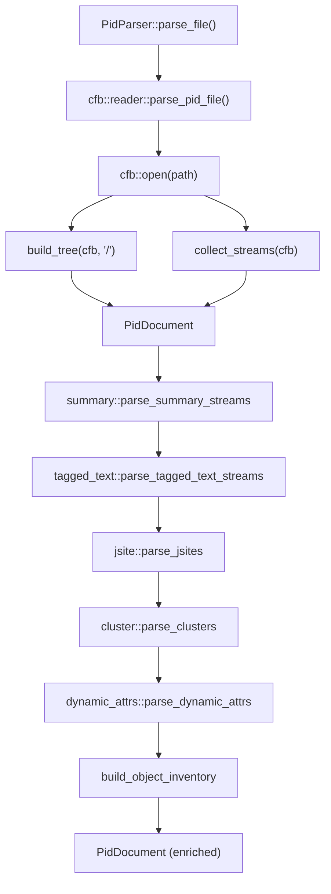
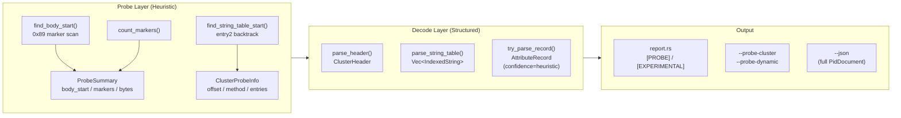

# pid-parse 架构文档

`pid-parse` 是一个 Rust 编写的 SmartPlant / Smart P&ID `.pid` 文件解析器。

项目定位为**逆向工程友好型解析器**——先让每条内部流可见、可索引、可归因，再逐步深化二进制解码。

---

## 设计原则

1. **容器优先，语义其次** — 先解析 OLE/CFBF 容器枚举流，再叠加语义解释
2. **保留原始来源** — 解析结果始终可追溯到原始流路径
3. **渐进式解码** — 未知块以结构化占位符保留，不丢弃
4. **Probe / Decode 分层** — 启发式探测结果标记为 `heuristic`，与确定性解码明确区分
5. **稳定公开 API，内部持续演进** — 公开入口保持简洁可预测

---

## 分层架构



| 层 | 文件 | 职责 |
|---|---|---|
| **L1: API** | `src/api.rs` | 暴露 `PidParser` / `ParseOptions`，唯一公开入口 |
| **L2: Container** | `src/cfb/reader.rs`, `src/cfb/tree.rs` | 打开 OLE/CFBF 容器、构建存储树、枚举流路径 |
| **L3: Model** | `src/model.rs` | `PidDocument` 及所有结构类型（`StorageNode`, `JSite`, `ClusterInfo`, `DynamicAttributesBlob`, `AttributeRecord`, `ProbeSummary`, `ClusterProbeInfo` 等） |
| **L4: Parsers** | `src/parsers/*.rs` | 字符串扫描、XML 标签提取、Cluster 公共头解析、DA 记录解码 |
| **L5: Streams** | `src/streams/*.rs` | 将命名流映射到语义处理器（Summary、TaggedText、JSite、Cluster、DynamicAttrs） |
| **L6: Derivation** | `src/crossref.rs` | 从已解出的 `PidDocument` 派生跨引用对象图（cluster 覆盖率、符号用量、属性类摘要、PSMroots 解析状态） |
| **L7: Report/CLI** | `src/inspect/report.rs`, `src/inspect/mermaid.rs`, `src/bin/pid_inspect.rs` | 人类可读报告、JSON 导出、Probe 探测输出、Cross Reference 专项、Mermaid 图导出 |

---

## .pid 文件内部结构

```mermaid
flowchart LR
    subgraph PID[".pid File (OLE/CFBF Container)"]
        direction TB
        root["Root Entry"]
        root --> sum1["&#x2705;SummaryInformation"]
        root --> sum2["&#x2705;DocumentSummaryInformation"]
        root --> ttd["TaggedTxtData/"]
        ttd --> draw["Drawing (XML)"]
        ttd --> gen["General (XML)"]
        root --> js1["JSite0/"]
        root --> js2["JSite1/"]
        root --> jsN["JSiteN/"]
        js1 --> jp["JProperties"]
        js1 --> ole["&#x0001;Ole"]
        root --> psm["PSMcluster0"]
        root --> sty["StyleCluster"]
        root --> dam["Dynamic Attributes Metadata"]
        root --> uda["Unclustered Dynamic Attributes"]
        root --> sh1["Sheet0"]
        root --> sh2["Sheet1"]
    end

    subgraph Decode["Decode Targets"]
        direction TB
        d1["SummaryInfo\n(app, title, dates)"]
        d2["DrawingMeta\n(number, template, UIDs)"]
        d3["JSite[]\n(symbols, GUIDs, OLE)"]
        d4["ClusterInfo[]\n(header, string_table)"]
        d5["DynamicAttributesBlob\n(attribute_records)"]
        d6["ObjectInventory\n(items, counts)"]
    end

    sum1 --> d1
    draw --> d2
    js1 --> d3
    psm --> d4
    uda --> d5
    d5 --> d6
```



---

## 核心数据流



**阶段式富化模型**：每个流处理器向同一个 `PidDocument` 追加信息，新增解码器无需重写管线。

---

## Probe / Decode 分层



- **Probe 层**：启发式探测（0x89 标记扫描、entry2 回溯定位），输出 `ProbeSummary` / `ClusterProbeInfo`
- **Decode 层**：结构化解码（公共头、字符串表、属性记录），每条记录携带 `confidence` 字段
- **输出层**：报告中标注 `[PROBE]` / `[EXPERIMENTAL/heuristic]`，CLI 提供 `--probe-*` 模式

---

## 关键类型

| 类型 | 说明 |
|---|---|
| `PidDocument` | 顶层聚合体，包含文件所有已知信息 |
| `StorageNode` | OLE/CFBF 目录树的递归表示 |
| `StreamEntry` | 扁平流索引条目（路径、大小、magic、预览） |
| `SummaryInfo` | OLE Summary 元数据（应用名、标题、日期） |
| `DrawingMeta` | 图纸元数据（图号、模板、UIDs），兼容 `SP_` 前缀 |
| `JSite` | JSite 存储语义（符号路径、GUID、OLE 链接） |
| `ClusterInfo` | Cluster 流信息（header + string_table + probe_info） |
| `ClusterHeader` | 公共头：magic `0x6C90F544` + type/records/body_len/flags |
| `ClusterProbeInfo` | string table 启发式定位元数据 |
| `DynamicAttributesBlob` | DA 流解析结果（strings + records + probe_summary） |
| `AttributeRecord` | 属性记录：class_name + attributes + confidence |
| `ProbeSummary` | 启发式扫描统计（body_start/markers/records/bytes），DA 与 Sheet 共用 |
| `SheetStream` | Sheet 流（header + probe + attribute_records + magic_tag） |
| `PsmRoots` / `PsmRootEntry` | PSMroots 解码结果（根名列表） |
| `PsmClusterTable` / `PsmClusterEntry` | PSMclustertable 解码结果（cluster 权威名单） |
| `PsmSegmentTable` | PSMsegmenttable 解码结果（段 flag 数组） |
| `VersionHistory` / `VersionRecord` | DocVersion3 版本日志（product/version/op/timestamp） |
| `AppObjectRegistry` / `AppObjectEntry` | AppObject COM 插件列表（CLSID + DLL 路径） |
| `TaggedTextStorageList` | JTaggedTxtStgList 映射表 |
| `ObjectInventory` | P&ID 对象清单（设备、管道、仪表统计） |
| `CrossReferenceGraph` | 派生层：把已解出的所有对象串起来 |
| `ClusterCoverage` | PSM 声明 vs. 实际 cluster/sheet 流对齐结果 |
| `SymbolUsage` | `symbol_path → [JSite]` 反向索引 |
| `AttributeClassSummary` | 每个 DA 属性类的记录数、出现过的属性名、涉及的图号/模型号 |
| `RootPresence` | `PSMroots` 每条根名与 CFB 顶层目录项的对齐状态（STORAGE/STREAM/MISSING） |

---

## 当前能力边界 (v0.3.0)

**已实现**：

- OLE/CFBF 容器遍历与流索引
- `SummaryInformation` / `DocumentSummaryInformation` 二进制解码
- `TaggedTxtData/Drawing` 和 `General` XML 元数据提取（含 `SP_` 前缀兼容）
- `JSite*` 存储索引 + 符号路径提取 + GUID 扫描
- Cluster 公共头解析 (magic `0x6C90F544`)
- `PSMcluster0` 字符串表解析（启发式定位 + sentinel 正确处理）
- `Unclustered Dynamic Attributes` 记录解码（231 条记录 / 10 个类）
- **Sheet 流公共头解析** + 0x89 标记探测（证实 Sheet 非 DA 记录格式）
- **PSM 索引表解析**（`PSMroots` / `PSMclustertable` / `PSMsegmenttable`）—— 可得到 cluster 权威清单
- **文档注册表类流解析**：`DocVersion3` 版本日志 / `AppObject` COM 插件注册表 / `JTaggedTxtStgList`
- **Magic tag 工具**（root / clst / stab / Smar / OLES）+ 顶层未识别流可视化
- P&ID 对象清单构建
- **关系端点解码** (v0.3.0)：DA 记录 31B trailer（record_id / field_x / class_id）+ Sheet 端点对记录 →`PidRelationship.source_drawing_id` / `target_drawing_id` 端到端可用
- **DocVersion2 原始保留**（`DocVersion2Raw`：size / magic / hex_preview，结构化解码待定）
- **跨引用对象图** (v0.3.0-rc2)：cluster 覆盖率检查 / 符号 ↔ JSite 反向索引 / DA 属性类摘要 / PSMroots 解析状态
- **Mermaid 可视化导出** (v0.3.0)：`ObjectGraph` / `CrossReferenceGraph` 直接渲染为 mermaid 文本，无需外部工具
- 文本报告 + JSON 导出 + Probe 探测输出（cluster / dynamic / sheet / relationships / endpoints / **crossref**）+ Mermaid 图 (`--graph-mermaid` / `--crossref-mermaid`)

**尚未实现**：

- Sheet 流页面图元/几何解码（type=0x00CE 其他结构，除端点对记录外）
- `DocVersion2` 48B 结构化解码
- PSMcluster0 / StyleCluster 完整二进制记录解码
- `PSMclustertable` 记录内的 cluster-index / flags 精确字段映射
- 往返序列化

---

## 演进路线

| 阶段 | 目标 | 状态 |
|---|---|---|
| Phase 1 | 稳定文档索引 + 编译闭合 | ✅ 完成 |
| Phase 2 | 语义提取（Summary/XML/JProperties/DA 记录） | ✅ 完成 |
| Phase 3 | 二进制结构解码 + Probe/Decode 分层 | ✅ 完成 |
| Phase 4 | Sheet 流 header 复用 + magic 识别 + 未识别流可视化 | ✅ 完成 |
| Phase 5a | PSM 索引表（root / clst / stab）解析 | ✅ 完成 |
| Phase 5b | 文档注册表类流（DocVersion3 / AppObject / JTaggedTxtStgList）解析 | ✅ 完成 |
| Phase 6  | 关系端点解码（DA 31B trailer + Sheet 端点对记录 + DocVersion2 原始保留）| ✅ 完成 (v0.3.0) |
| Phase 6c | 跨引用对象图（cluster 覆盖率 / 符号用量 / 属性类 / PSMroots 解析状态） | ✅ 完成 (v0.3.0-rc2) |
| Phase 7a | Mermaid 可视化导出（ObjectGraph / CrossReferenceGraph） | ✅ 完成 (v0.3.0) |
| Phase 7  | DocVersion2 结构化 / PSMcluster0 / StyleCluster 完整记录 / JSON Schema / 往返序列化 | 🔜 下一步 |

---

## 公开 API

```rust
let parser = pid_parse::PidParser::new();
let doc = parser.parse_file("drawing.pid")?;
```

所有下游使用都建立在 `PidDocument` 之上，保持稳定。

---

## CLI 用法

```bash
# 文本报告
cargo run --bin pid_inspect -- drawing.pid

# JSON 完整导出
cargo run --bin pid_inspect -- drawing.pid --json

# Cluster 流探测（偏移量、检测方法、字符串表）
cargo run --bin pid_inspect -- drawing.pid --probe-cluster

# 动态属性探测（0x89 标记数、记录统计、属性详情）
cargo run --bin pid_inspect -- drawing.pid --probe-dynamic

# Sheet 流探测（header / probe / magic / ASCII 预览）
cargo run --bin pid_inspect -- drawing.pid --probe-sheet

# 跨引用对象图（cluster 覆盖率 / 符号用量 / 属性类 / PSMroots 状态）
cargo run --bin pid_inspect -- drawing.pid --crossref

# Mermaid 图导出
cargo run --bin pid_inspect -- drawing.pid --graph-mermaid > object_graph.mmd
cargo run --bin pid_inspect -- drawing.pid --crossref-mermaid > crossref.mmd
```

---

## 测试

```bash
cargo test
```

- 集成测试 26 个（真实 `.pid` 样本，含 PSM 三表 + 版本日志 + COM 注册表 + 关系端点 + 存储映射）
- 单元测试 18 个（`collect_simple_tags` / `parse_header` / `parse_string_table` / `magic_tag` / `describe_magic` / `sheet_stream_reuses_cluster_header`）
- 模块内测试 62 个（rc1：`sheet_endpoint_records` 6 / `relationship_probe` 4 / `dynamic_attr_records` trailer ~15 / ... + rc2：`crossref` 6 + v0.3.0：`inspect::mermaid` 8）
- **总计 106 个测试**（无样本时可跑 80 个：18 unit + 62 模块内）
