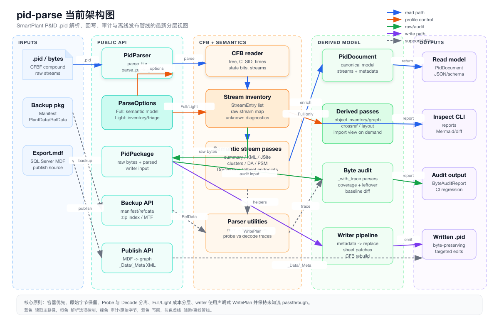
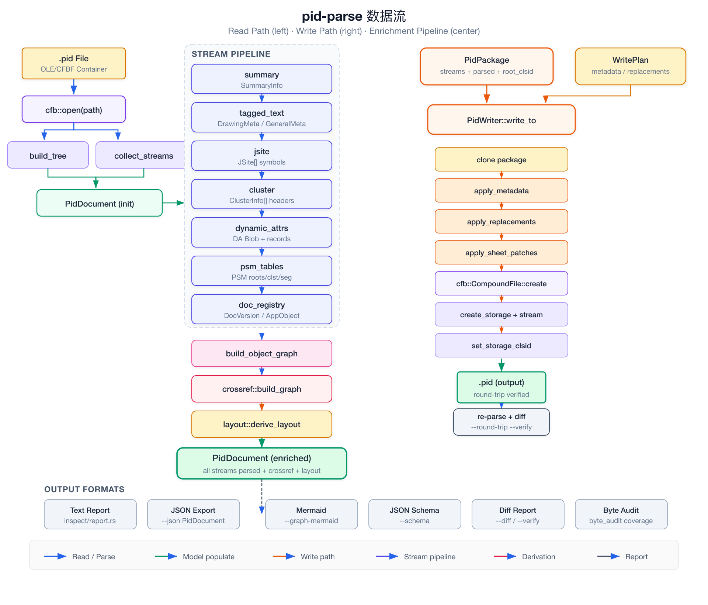

# pid-parse 架构与原理指南

> SmartPlant P&ID `.pid` 文件逆向工程解析器 — Rust 实现

## 目录

- [项目概述](#项目概述)
- [设计哲学](#设计哲学)
- [分层架构](#分层架构)
- [核心数据流](#核心数据流)
- [.pid 文件结构](#pid-文件结构)
- [关键类型体系](#关键类型体系)
- [Probe / Decode 双层解码策略](#probe--decode-双层解码策略)
- [Writer 回写机制](#writer-回写机制)
- [独立管线](#独立管线)
- [依赖关系](#依赖关系)

---

## 项目概述

`pid-parse` 是一个用 Rust 编写的 **SmartPlant / Smart P&ID `.pid` 文件解析库和CLI工具集**。

当前产品化状态、能力边界与下一阶段需求见
[`docs/prd-pid-parse-current-state.md`](prd-pid-parse-current-state.md)。

`.pid` 文件本质是 **OLE/CFBF（Compound File Binary Format）复合文档**，内部包含数十条命名流（streams），存储了 P&ID 图纸的全部信息——从元数据、符号定义到管道属性和关系端点。

项目目标是对这种闭源二进制格式进行**完整逆向**，提供：

- **只读解析**：将 `.pid` 文件解析为结构化的 `PidDocument`
- **读写往返**：通过 `PidPackage` + `PidWriter` 实现元数据编辑和文件回写
- **检查报告**：文本报告、JSON 导出、Mermaid 图、diff 对比、字节审计



当前架构图的可打开 HTML 版本：
[`docs/diagrams/pid-parse-current-architecture.html`](diagrams/pid-parse-current-architecture.html)。

当前架构图的 SVG 版本与配套原理说明：
[`docs/diagrams/pid-parse-current-architecture.svg`](diagrams/pid-parse-current-architecture.svg)、
[`docs/current-architecture-principles.md`](current-architecture-principles.md)。

---

## 设计哲学

### 1. 容器优先，语义其次

先完整枚举 OLE/CFBF 容器中的所有流（streams），再逐层叠加语义解释。即使某个流尚未被理解，它也会以 `unknown_streams` 的形式保留在输出中。

### 2. 保留原始来源

每个解析结果都可追溯到原始流路径。`StreamEntry` 记录了流的路径、大小、magic 标识和字节预览。`PidPackage` 保留完整的原始字节。

### 3. 渐进式解码

未知的二进制块不会被丢弃，而是以结构化占位符保留。新增解码器只需向现有管线添加一个处理步骤，无需重写整条管线。

### 4. Probe / Decode 分层

启发式探测（Probe）和确定性解码（Decode）严格分离。Probe 结果标记为 `heuristic`，与精确解码的数据明确区分。

### 5. 稳定公开 API

对外只暴露 `PidParser`、`PidPackage`、`PidWriter` 等少数入口，内部模块可自由演进。

---

## 分层架构

项目采用 **8 层架构**，每层有明确职责：

| 层 | 模块 | 职责 |
|---|---|---|
| **L1: API** | `api.rs` | 唯一公开入口：`PidParser::parse_file()` / `parse_package()` |
| **L2: CFB Container** | `cfb/reader.rs`, `cfb/tree.rs` | 打开 OLE/CFBF 容器、构建存储树、枚举流路径、提取 CLSID/时间戳 |
| **L3: Model** | `model.rs` | 核心数据模型：`PidDocument` 及 50+ 子类型 |
| **L4: Parser Utilities** | `parsers/*.rs` | 无状态工具函数：XML 标签提取、Cluster 头解析、DA 记录解码、Magic 识别 |
| **L5: Stream Semantics** | `streams/*.rs` | 将命名流映射到语义处理器，按顺序富化 `PidDocument` |
| **L6: Derivation** | `crossref.rs`, `layout.rs`, `import_view.rs` | 从解析结果派生跨引用图、布局模型、导入视图 |
| **L7: Report / CLI** | `inspect/*.rs`, `schema.rs`, `bin/pid_inspect.rs` | 报告生成、JSON/Schema 导出、Mermaid 图、diff 渲染 |
| **L8: Package / Writer** | `package.rs`, `writer/*.rs` | 读写往返：`PidPackage` 保留原始字节，`PidWriter` 按计划回写 |

### 层间调用规则

```
L1(API) → L2(CFB) → L5(Streams) → L4(Parsers)
                                  ↓
                              L3(Model)
                              ↓       ↓
                        L6(Derive)  L7(Report)
L1(API) → L8(Package) → Writer → CFB Write → .pid
```

- **L1 只调用 L2 和 L8**：API 层不接触内部实现
- **L5 调用 L4**：流语义层依赖解析器工具
- **L4 和 L5 都写入 L3**：两层共同填充 `PidDocument`
- **L6 和 L7 只读取 L3**：派生层和报告层不修改模型
- **L8 独立于读路径**：Writer 基于 `PidPackage` 的快照操作

---

## 核心数据流



### 读取路径（Read Path）

```
.pid 文件
    ↓ cfb::open(path)
    ├── build_tree()        → 构建 OLE 目录树
    └── collect_streams()   → 枚举所有流的原始字节
              ↓
        PidDocument (初始化)
              ↓ Stream Pipeline（顺序执行）
        ┌─────────────────────────────────────┐
        │ 1. summary      → SummaryInfo       │
        │ 2. tagged_text   → DrawingMeta       │
        │ 3. jsite         → JSite[] 符号      │
        │ 4. cluster       → ClusterInfo[]     │
        │ 5. dynamic_attrs → DA Blob + 记录    │
        │ 6. psm_tables    → PSM 索引表        │
        │ 7. doc_registry  → 版本日志/COM注册   │
        └─────────────────────────────────────┘
              ↓
        build_object_graph()  → 对象关系图
        crossref::build_graph → 跨引用图
        layout::derive_layout → 布局模型
              ↓
        PidDocument (enriched) — 完整解析结果
```

**核心设计**：**阶段式富化模型**。每个流处理器向同一个 `PidDocument` 实例追加信息。新增解码器只需在管线中插入一个新步骤，无需修改已有代码。

### 写入路径（Write Path）

```
PidPackage + WritePlan
        ↓ PidWriter::write_to()
    clone package（保护原始数据）
        ↓
    apply_metadata_updates  → 修改 XML 元数据
    apply_replacements      → 替换指定流
    apply_sheet_patches     → 字节级 Sheet 修补
        ↓
    cfb::CompoundFile::create
    create_storage + create_stream（按原始顺序）
    set_storage_clsid（保留所有 CLSID）
        ↓
    .pid (output)
        ↓ 可选验证
    re-parse + diff_packages → --verify 确认零差异
```

### Normalized Geometry 坐标合同

`build_normalized_geometry()` 是 parser 与 H7CAD 等下游渲染方之间的几何合同。
当前合同刻意区分三类信息：

- `page_dimensions_mm`：从 template name 推断出的页面尺寸证据，只说明纸张大小。
- `PidCoordinateContext.coordinate_space`：实体坐标当前多为 `SourceSheet` 或 `Unknown`。
- `PidPageTransform`：source/model → page 的变换状态；当前保持 `Unavailable`。

这意味着：

- 有 `page_dimensions_mm` 不等于已经 decoded page transform。
- i32/f64 coordinate evidence、scalar hits、template name 都不能单独让
  `PidPageTransform::Available` 出现。
- `PidPageTransform::Available` 需要 source coordinate space、units、transform
  direction 和 bounded byte provenance 都可证明。
- H7CAD / JSON consumer 在 transform unavailable 时应保留 source coordinates，
  不应自行猜测 viewport 或 page-space 映射。

---

## .pid 文件结构

一个 `.pid` 文件内部的 OLE/CFBF 存储结构：

```
Root Entry (CLSID: SmartPlant P&ID 文档标识)
├── ✅SummaryInformation         ← OLE 标准摘要
├── ✅DocumentSummaryInformation ← OLE 扩展摘要
├── TaggedTxtData/               ← XML 元数据目录
│   ├── Drawing                  ← 图纸元数据 (图号/模板/UID)
│   └── General                  ← 通用元数据
├── JSite0/                      ← 符号定义 #0
│   ├── JProperties              ← 符号属性
│   └── \001Ole                  ← OLE 链接
├── JSite1/ ... JSiteN/          ← 更多符号
├── PSMcluster0                  ← 主 Cluster (header + string table)
├── StyleCluster                 ← 样式 Cluster
├── Dynamic Attributes Metadata  ← DA 元数据流
├── Unclustered Dynamic Attributes ← DA 属性记录
├── Sheet0, Sheet1, ...          ← 图纸页面数据
├── PSMroots                     ← PSM 根名列表（索引表）
├── PSMclustertable              ← Cluster 权威清单
├── PSMsegmenttable              ← 段标志数组
├── DocVersion2 / DocVersion3    ← 版本历史日志
├── AppObject                    ← COM 插件注册表
└── JTaggedTxtStgList            ← 标签文本存储映射
```

### 流的解码状态

| 流类型 | 格式 | 解码深度 |
|--------|------|----------|
| SummaryInformation | OLE Property Set | 完全解码 |
| TaggedTxtData/* | XML | 完全解码（含 SP_ 前缀兼容） |
| JSite*/JProperties | 二进制 + 嵌入 XML | 符号路径 + GUID 提取 |
| PSMcluster0 | 二进制（magic: `0x6C90F544`） | 公共头 + 字符串表 |
| Unclustered DA | 二进制 | 属性记录完全解码（231条/10类） |
| Sheet* | 二进制 | Header + 端点对记录 + magic |
| PSM 索引表 | 二进制 | 完全解码（roots/clst/seg） |
| DocVersion* | 二进制 | 完全结构化解码 |
| AppObject | 二进制 | 完全解码（CLSID + DLL） |

---

## 关键类型体系

### 顶层聚合

| 类型 | 说明 |
|------|------|
| `PidDocument` | 顶层聚合体，包含文件所有已知信息 |
| `PidPackage` | `PidDocument` + 原始字节 + root CLSID + storage CLSIDs + 时间戳 |

### 容器层

| 类型 | 说明 |
|------|------|
| `StorageNode` | OLE 目录树的递归节点 |
| `StreamEntry` | 扁平流索引（路径、大小、magic、预览字节） |

### 语义层

| 类型 | 说明 |
|------|------|
| `SummaryInfo` | OLE Summary 元数据（应用名、标题、日期） |
| `DrawingMeta` | 图纸元数据（图号、模板、UID） |
| `JSite` | 符号定义（路径、GUID、OLE 链接） |
| `ClusterInfo` | Cluster 信息（header + string_table + probe_info） |
| `ClusterHeader` | 公共头：magic `0x6C90F544` + type/records/body_len/flags |
| `DynamicAttributesBlob` | DA 流解析结果（字符串 + 记录 + 探测摘要） |
| `AttributeRecord` | 单条属性记录：class_name + attributes + confidence |

### 索引层

| 类型 | 说明 |
|------|------|
| `PsmRoots` / `PsmRootEntry` | PSM 根名列表 |
| `PsmClusterTable` / `PsmClusterEntry` | Cluster 权威清单 |
| `PsmSegmentTable` | 段标志数组 |
| `VersionHistory` / `VersionRecord` | 版本日志（Save/SaveAs + 时间戳） |
| `AppObjectRegistry` | COM 插件列表（CLSID + DLL） |

### 派生层

| 类型 | 说明 |
|------|------|
| `ObjectInventory` | P&ID 对象清单（设备/管道/仪表统计） |
| `CrossReferenceGraph` | 跨引用对象图 |
| `ClusterCoverage` | PSM 声明 vs 实际流对齐检查 |
| `SymbolUsage` | symbol_path → [JSite] 反向索引 |
| `AttributeClassSummary` | 每个属性类的统计摘要 |

### Writer 层

| 类型 | 说明 |
|------|------|
| `WritePlan` | 写入计划：metadata + replacements + sheet_patches |
| `MetadataUpdates` | 声明式元数据修改（drawing_xml, general_xml） |
| `StreamReplacement` | 流替换（路径 + 新字节） |
| `SheetPatch` | Sheet 字节级修补（offset + old + new） |

---

## Probe / Decode 双层解码策略

pid-parse 面对未知二进制格式时采用两阶段策略：

### Probe 层（启发式探测）

- **目的**：在不完全理解格式时，用启发式方法定位关键结构
- **方法**：
  - `0x89` 标记扫描定位 body 起始
  - entry2 回溯定位字符串表
  - 统计 magic 标记出现次数
- **输出**：`ProbeSummary`（body_start / markers / bytes）、`ClusterProbeInfo`（offset / method / entries）
- **标记**：输出标记为 `[PROBE]` 或 `[EXPERIMENTAL/heuristic]`

### Decode 层（结构化解码）

- **目的**：精确解析已知格式
- **方法**：
  - `parse_header()` → `ClusterHeader`
  - `parse_string_table()` → `Vec<IndexedString>`
  - `try_parse_record()` → `AttributeRecord`
- **输出**：带 `confidence` 字段的结构化数据
- **保证**：Decode 结果可用于 round-trip 回写

### 两层协作

```
原始字节 → Probe（快速定位） → Decode（精确解析） → 结构化输出
                ↓                     ↓
         ProbeSummary           AttributeRecord
        (heuristic)            (confidence=high)
```

CLI 提供 `--probe-cluster`、`--probe-dynamic`、`--probe-sheet` 等探测模式，以及 `--json` 完整导出。

---

## Writer 回写机制

### 设计约束

1. **Passthrough 优先**：未修改的流保持字节完全一致
2. **CLSID 保真**：root 和所有 storage 的 CLSID 精确保留
3. **时间戳保真**：storage 时间戳通过 cfb 0.14 精确保留
4. **状态位保真**：state bits 精确保留

### WritePlan 结构

```rust
WritePlan {
    metadata_updates: Option<MetadataUpdates>,   // XML 元数据修改
    stream_replacements: Vec<StreamReplacement>,  // 整流替换
    sheet_patches: Vec<SheetPatch>,               // 字节级修补
}
```

### 验证机制

```bash
# 写入并验证
pid_inspect drawing.pid --round-trip output.pid --verify

# 两文件对比
pid_inspect drawing.pid --diff other.pid
```

`diff_packages` 产出 `PackageDiff`，包含：
- only-in-a / only-in-b 流
- modified 流的 first_mismatch_offset + hex context
- root CLSID 等价性
- storage CLSID 对比
- 时间戳 diff

---

## 独立管线

除核心 `.pid` 解析外，项目还包含两个独立管线：

### Backup 管线

解析 SmartPlant 备份文件夹格式：

```
备份文件 → MTF envelope → MDF pages → syscatalog → text_scan
```

用于从备份中提取 MDF 文件，供后续 C# 工具处理。

### Publish 管线

从 SQL Server 数据生成 Publish Data XML：

```
SQL Server backup → (C# OrcaMDF probe) → SQLite → sqlite_load → DTOs → xml_writer → XML
```

这条管线依赖外部 C# 工具生成 SQLite 中间文件，`pid-parse` 负责后半段转换。

---

## 依赖关系

| 依赖 | 用途 |
|------|------|
| `cfb` 0.14 | OLE/CFBF 容器读写（支持 CLSID + 时间戳） |
| `quick-xml` | XML 解析/序列化 |
| `serde` / `serde_json` | 所有模型的序列化/反序列化 |
| `thiserror` | 错误类型定义 |
| `encoding_rs` | 遗留编码支持 |
| `schemars` | JSON Schema 派生 |
| `uuid` | Storage CLSID 处理 |
| `rusqlite` (bundled) | Publish 管线的 SQLite 读取 |
| `base64` | WritePlan 中字节数据的 JSON 编码 |

---

## 快速上手

### 只读解析

```rust
let parser = pid_parse::PidParser::new();
let doc = parser.parse_file("drawing.pid")?;
println!("{:#?}", doc.drawing_meta);
```

### 读写往返

```rust
use pid_parse::{PidParser, PidWriter, WritePlan};

let parser = PidParser::new();
let pkg = parser.parse_package("drawing.pid")?;

let plan = WritePlan::metadata_only(
    Some("<Drawing><DrawingNumber>NEW-001</DrawingNumber></Drawing>".into()),
    None,
);
PidWriter::write_to(&pkg, &plan, Path::new("output.pid"))?;
```

### CLI 命令

```bash
cargo run --bin pid_inspect -- drawing.pid              # 文本报告
cargo run --bin pid_inspect -- drawing.pid --json        # JSON 导出
cargo run --bin pid_inspect -- drawing.pid --crossref    # 跨引用图
cargo run --bin pid_inspect -- drawing.pid --diff b.pid  # 文件对比
```

---

*架构图和数据流图位于 `docs/diagrams/` 目录。*
