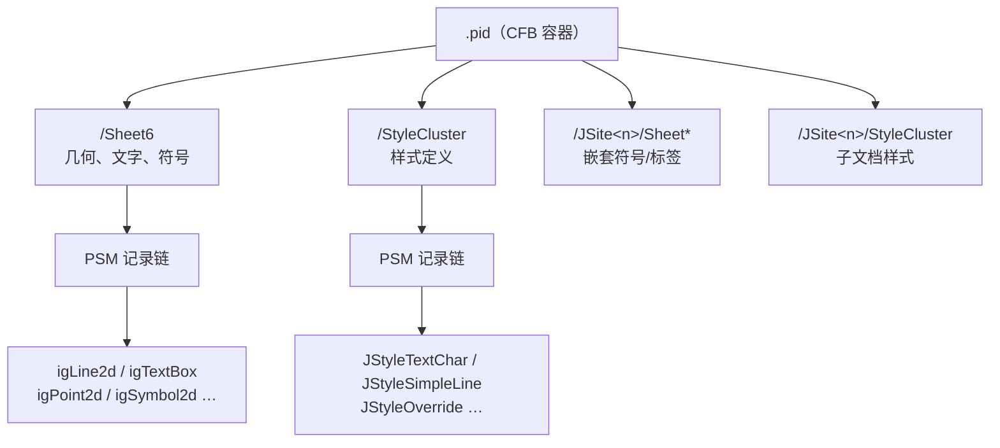
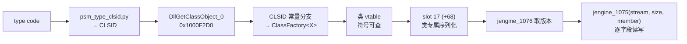

# `.pid` 文件格式指南

> 面向要读懂、扩展或调试 `pid-parse` 的人。
> 最后更新：2026-08-27。

## 先读这一段

**本文区分三个证据等级，引用任何结论前请先看它属于哪一级：**

| 等级 | 含义 | 可否据此写解码器 |
|---|---|---|
| **native-reader** | 从 SmartPlant/RAD 原生 DLL 的反编译读取序得出 | 可以 |
| **corpus** | 从多张真实图纸的字节统计得出，且跨图纸一致 | 谨慎，需 fixture ratchet |
| **hypothesis** | 单一来源或值域吻合推出 | **不可以** |

有两个 corpus 级结论被 native reader 推翻（见 §7），所以这个区分不是形式主义。

反过来也一样：**一条被判负的候选后来被证明是对的**（见 §8.1）。判负和判正一样需要
一个站得住的判据——那次用的是「取值在不在某个 id 集合里」，而 id 空间稠密到任何小整数
都能命中，所以它的阳性和阴性都不携带信息。

---

## 1. `.pid` 是什么

SmartPlant P&ID 的图纸文件，本质是一个 **CFB 容器**（与 `.doc` 同族的复合文档），
里面若干个流，每个流是一串 **PSM 记录**。

图形对象、文字、符号放在 `Sheet*` 流；线宽、颜色、字高这类显示属性放在
`StyleCluster` 流；嵌套的符号与标签各自带一套 `JSite*/…` 子流。



## 2. 快速上手

```powershell
# 看一张图解析出什么
cargo run --example pid_probe -- test-file/DWG-0201GP06-01.pid

# 看样式流的记录链
cargo run --example probe_stylecluster_records

# 把 type code 翻译成类名（需要 dlls/radsrvitem.dll 与 RAD 的 jutil.dll）
python tools/psm_type_clsid.py 0x18 0x4D 0x005A
```

从 `OpenCADStudio` 侧渲染并出图：

```powershell
$env:PID_SYMBOL_LIBRARY = "..\pid-parse\test-file\symbols-full"
cargo run --example pid_plot_dump -- ..\pid-parse\test-file\DWG-0201GP06-01.pid
```

## 3. PSM 记录信封

每条记录 6 字节头：

```text
+0  u16  type_word    低 14 位是 type code，高 2 位是 flags
+2  u32  bytes_to_follow
+6  …    payload
```

这个链头**不是 `StyleCluster` 专有的**：`Sheet*`、`PSMcluster0`、
`Dynamic Attributes Metadata`、`Unclustered Dynamic Attributes` 等流共用同一个
结构（`src/streams/cluster.rs` 早就复用 `cluster_header::parse_header()` 处理
`Sheet*`）：

```text
+0  u32  magic 0x6C90F544
+4  u32  record_count
+8       记录链开始，一条接一条
```

**从 `+8` 起顺着 `bytes_to_follow` 走就行，不需要滑窗扫描。** 2026-08-05 实测：
四张图 44 个流全部走到**零剩余**，且记录数与 pid-parse 自己的解码器逐张图相同
（359 / 279 / 563 / 48）。`probe_psm_type_code_histogram` 里那条「失败退一字节
重同步」的兜底路径实际从未被触发。

`+4` 的 `record_count` 是白送的校验和，但**只能当告警不能当断言**：多数流精确
相等，少数流实测差 1..5 条。

> ⚠ 真正的分帧陷阱不在走链，而在**在链外按 type code 滑窗找记录**。§7 那个被推翻
> 的结论就是这么来的。要找某个家族，先走链拿到记录边界，再按 type code 过滤。

### 3.1 `PSMspacemap`：持久 id 是从这里发出来的（2026-08-26）

**等级：native-reader。** 出处是 `radsrvitem.dll` 自己的读写函数——
`Segment::Load`（`sub_5647A180`，失败字符串
`FAILURE: Segment::Load()[pMgr = 0x%p]: m_iNext > 0x2000` 就在里面）和
`Segment::Save`（`sub_5647B550`）。

**流名是算出来的，不是取的。** `swprintf_s(L"0x%.8x", segment << 13)`——所以
`0x00000000` / `0x00002000` / `0x00004000` 是第 0/1/2 段，不是文件偏移。**持久 id
就是 `(segment << 13) | index`**，index 13 位，所以一段最多 8192 个对象。

头 12 字节 + 自由表，`Load` 和 `Save` 两边一致：

```text
u32  magic 'tseg'（老格式 'sseg'，读器仍收，本语料一条都没有）
u16  条目数
u16  简单槽容量      —— 读器按 24×它 预分配，是容量不是计数
u16  下一个可用 index —— 超过 0x2000 读器报错并夹到 0x2000
u16  自由表长度 n ; n × u16
```

条目本体按 `sub_5647A900`：

```text
u32  head     —— 低半是 index；bit 17 不置位读器就拒收，这就是走链的终点
u16  在用槽数 —— 见 §3.2
u16  槽容量
容量 × { u32 引用者的持久 id ; u16 引用者的类 }   —— 是入边，方向见 §3.2
```

**两条自证，都是读器自己的规矩，不是我们挑的：**

1. **没有任何字段说条目区有多长**，所以走链必须正好停在流尾。
2. `Segment::Load` 按 `persist_id & 0x1FFF` 归档，并且**同一个 index 第二次出现就
   中止**——所以每个 index 必须小于 `0x2000` 且不能重复。

帧错两个字节就同时踩中这两条。四张图 **38 个 member 流全部走到最后一个字节，
66712 字节零剩余**；而且**每一条的条目数都和头里写的相等**——走链根本不看那个数，
这是第三条独立校验。head 高半只出现 **2 和 3** 两种，正是读器允许的两种。

> ⚠ **`sub_5647AB70` 是同一张表的另一个读器，不要拿它当准。** `Segment::Load` 按
> 一个运行期条件在两者间选，跟文件里的任何东西无关。它的帧是另一套（10 字节头 +
> 两段可选），本语料**没有一个流能按它走通**——头几条就脱轨。它给自己合成的两个成员
> 写死了 tag `181` / `182`，所以那两个 tag 是读器编译期就知道的常量；至于常量指的
> 是什么，见 §3.2。成员是「值在前、tag 在后」的 6 字节。

读器：`parsers::psm_tables::parse_psm_space_map`，挂在
`PidDocument::psm_space_maps`（按 member 路径索引，因为顶层和每个 `JSite` 注册表
下面各有一份）。probe：`probe_psmspacemap_segment_walk`（走链 + 三条校验）、
`probe_psmspacemap_shape`（第一眼的纹理普查）。

### 3.2 `PSMspacemap` 是「谁引用我」的反向索引（2026-08-27，同日订正方向）

**等级：corpus（全语料实测，表↔记录 join 定的向）。** 上一节的帧来自反汇编；这一节
的字段语义来自表内穷举（`probe_psmspacemap_tag_and_span`）加上一步表↔记录链 join
（`probe_psmspacemap_tag181_is_the_parent_ref`），分析见
`docs/analysis/2026-08-27-the-spacemap-is-an-incoming-reference-index.md`。

> ⚠ 本节最初按「出边表：value 是被指对象、tag 是被指对象的类」写过一版
> （`2026-08-27-psmspacemap-is-the-object-reference-graph.md`）。join 之后方向反了：
> **value 是引用者**，条目记的是「谁引用我」。当时的测量本身（一 value 一 tag、
> 活索引率、在用槽数）全部成立，错的只是方向标签。见 §7（三）。

**1. 第一个 `u16` 是在用槽数，第二个是槽容量。** 成员数组按位置寻址、尾部留空槽；
空槽一定是 `value == 0 && tag == 0`（4446/4446 个成员上 value 为零和 tag 为零完全
同真同假）。1948 条条目上「在用槽数 == 非空槽数」**一条反例都没有**，而且
**没有一条条目在已用槽前面留洞**（0/1948）。之前说的「1631 条相等、317 条不等」是
拿它去比**容量**比错了，不是数据不齐。

**2. 条目的持久 id 就是记录的 oid。** 1948/1948 条条目都能在**自己存储**的记录链
（`PSMcluster0` / `Sheet*` / `Unclustered Dynamic Attributes`）里找到同 oid 的记录，
零缺席；`StyleCluster` 和 `Dynamic Attributes Metadata` 的记录从不带条目。

**3. `value` 是同一 id 空间里一个活对象的持久 id，边从 `value` 指向条目。**
活性：3989 个非空成员里 3988 个落在「小于该段 `m_iNext` 且不在自由表里」的活索引上，
0 个越界；而这些段发出过的 40893 个索引里有 11998 个（29%)在自由表上——蒙不出这个数。
唯一的例外是 `DWG-0201GP06-01.pid` 顶层 `0x00006000` 里 entry 2 记着 369（tag 249），
那个索引已被回收——369 曾是一条 `0x00FA` 依赖记录：**依赖删了，反指没清**。

方向是 join 判的：把「`value` 的记录里有没有条目自己的 id」逐字节扫，多数 tag 上是
100%，命中偏移按记录家族固定；反过来「value 出现在条目自己的记录里」几乎全空
（84 个 tag 181 成员 0 命中）。所以每个成员是一条**入边**：

| tag | 引用者（=value）的记录家族 | 条目 id 在引用者 payload 的哪里 | 命中 |
|---|---|---|---|
| 190 | `0x0089`（动态属性行）| `+12` | 1446/1446 |
| 249 | `0x00FA` DependencyObject | `+16`/`+22`（6 步长两端）| 730/730 |
| 183 | `0x0042` | `+12..+44`（4 步长表）| 357/357 |
| 201 | `0x0013` igBoundary2d | trailer 引用区 `+148..` | 72/72 |
| 185 | 8 个共形家族（`0x0019`/`0x0006`/`0x0085`/`0x0082`/`0x0015`…）| `+18`/`+22` | 279/279 |
| 205 | `0x0079` | `+12` | 8/8 |
| 181 | `0x00CE` igSymbol2d / `0x003D` igSmartFrame2d | `+29` / `+156` | 84/84 |
| 188 | `0x0115` JDim | `+92` / `+202` / `+280`（被量的几何槽） | 40/46；另 2 条是 f64 指数字节 `0x3F` 的假命中、4 条是同组兄弟尺寸量的几何，6/6 有解释，见 `2026-09-15-tag-188-members-land-in-jdim-reference-slots.md` |
| 184 | `0x0057` / `0x0060` Top ViewFilterSet | `+16`（只有那条 `JSheet` 边）；其余**按名字写**，见 §3.4 | 60/366 |
| 182 | 多家族（`0x0067` 列表居多）| 部分 `+0`/`+52`… | 192/519 |
| 261 / 225 / 239 | `0x004F` / `0x004F` / `0x0058` | 少数 `+14`/`+26` | 4/45、3/7、14/29 |

除 184 外都是 payload 引用的镜像。184 那 306 条**不是**没写——引用者写的是成员的
**名字**（UTF-16），不是 id，逐字节扫 id 当然扫不到。详见 §3.4。

> ⚠ 「payload 里找不到 id」「引用者不写这条引用」「引用者根本没有记录」是三件事，别
> 混。184 的 306 条只是第一件：引用者记录在，也确实写了这条成员关系，写的是名字。
> 第三件全语料只有 192 条：一条是 `DWG-0201` 那条悬空的 tag-249 边，另外 **191 条全是
> tag 182，且全部长在 `0x00C7` 条目上**——引用者是 `SymbolInformation`（`0x00BD`）
> 对象，这个存储没把它们的记录写下来。见 §3.3 和
> `docs/analysis/2026-08-27-the-recordless-182-referrers-are-symbolinformation.md`。

`181↔182` 是语料里唯一成对的 tag：84/84，
igSymbol / igSmartFrame 在 `+29` / `+156` 指它的 site，site 反过来以 182 指回
（另有 11 个 182 自环）。

> id 空间按**存储**分，不按文件分：顶层 `/PSMspacemap` 和每个
> `JSiteN/PSMspacemap` 各自编号，跨存储解析 id 是错的。上一版 probe 就是把四张图的
> 顶层 map 并成了一个 key，才得出过一批假命中。

**4. `tag` 是引用者的类，不是这条边的角色。** 判据一是纯表内的：语料里 2415 个作为
value 出现的对象，**每一个身上的 tag 都只有一种**，包括出现在多条条目上的 675 个，
零分歧。判据二是 join 给的：tag 几乎一一对应引用者的记录家族（上表）。旁证：
`2 → 182`、`7 → 183`、`19 → 184` 四图全中；tag 取值全落在同一个 14 值集合
（D06 没有 `201`，0202 没有 `188`/`225`/`239`）。

**tag 是另一套类编号，不是 §4 那张 type code 表里的码。** 别拿那张表去套它，见下面
§3.3。`JSite` 锚点按新方向读顺了：`JSiteN` 的 `N` 是顶层 id 空间里的持久 id，七个
`JSite` 条目形状一致——`[(2, tag 182), (X, tag 225|261)]`——含义是**两条入边**：对象 2
引用它，一个 `0x004F` 对象引用它。`JSite` 的 id 从不作为 value 出现 = `JSite` 自己不
发出这张表索引的引用。

**四图恒定的引用者 id 2 是个真对象，不是流。** 它有自己的顶层 `PSMcluster0` 记录——
一条 12 字节 `0x0004`、`parent_ref = 1`（DocStore），四张图一字节不差。它的类是 182
（列表/容器），每个 `JSite` 条目上的 `(2, 182)` 就是「文档级站点列表对象 2 引用本
站点」这条入边。（另有一个独立的 `/JSitesList` 流——`'OLEM'` + `u32 数量` + `u32 id 表`，
枚举的正是各 `JSite<id>` 存储号，见 `parsers::jsites_list`；它和对象 2 功能相近但**不是
同一个东西**，别混为一谈。）

**5. 有入边的对象才有条目，而且这张表不是全量引用图。** 条目数远小于活 id 数：
工艺图顶层第 0 段 `m_iNext` 7669、自由表 6219，活 id 约 1450，而这一段只有 337 条
条目。发出引用的对象（value）大多没有自己的条目（工艺图顶层 630 个引用者只有 193 个
有）。更要紧的反向限制：**1401 条记录的 payload+4（`parent_ref`）非零，却一条都不进
表**——`0x0003` 等家族的 parent 链完全不被索引。这张表只登记上表那十几种引用，
既不能当对象清单，也不能当全量引用图。

### 3.3 tag 不是 type code，三个类名已认出（2026-08-27）

**等级：native-reader（否证）+ corpus（两个名字）。** 分析见
`docs/analysis/2026-08-27-the-spacemap-tag-is-not-a-type-code.md`，probe 是
`probe_psmspacemap_what_the_tag_names`。

**否证只要一个对象。** `PSMroots` 四张图都写着 `id 20 = TopVFSet`，而这个 20 在顶层
map 里作为引用者（value）出现时恒定带 tag **184**。RAD 类注册表说 `TopVFSet` 的类是
`Top ViewFilterSet`（`viewfil.dex`），它的两个 CLSID 在 type code 表里坐在 **87** 和
**96**。87/96 ≠ 184。同一套工具查 `JSL Style Librarian` 回来是 90 = `0x005A`，正是
§4 已有的那个码，所以不是查表方法坏了。

十三个一起看也一样：把 tag 当 type code 送进表里，13 个 GUID **一个都不在 RAD 类
注册表里**（注册表在 `jutil.dll` / `i2mnuctl.ocx` / `igrresource412.dll` /
`jcntrls412.ocx` 各有一份，四份都搜过），而本仓已解码的六个对照码全部有名字；码
0..400 里 230 个有名字，单看 181..261 这段 81 个码里 39 个有名字。13/13 落进没名字的
那一半，约 1/4000。

**认出来的三个**，靠 `PSMroots` 的 `id → 名字`（按 §3.2 的方向，这些名字是
**引用者**的类——tag 184 的意思是「被一个 ViewFilterSet 引用」）：

| tag | 引用者的名字 | 各图 id | 一致性 |
|---|---|---|---|
| `184` | `TopVFSet` / `Top ViewFilterSet` | 20 / 20 / 20 / 20 | 4/4 |
| `182` | `_SupportOnlyList`（`0x0067`，顶层）| 25 / 25 / 25 / **26** | 4/4 |
| `182` | `SymbolInformation`（`0x00BD`，`JSite` 里）| 每站点数个 | 25/25 有记录时家族恒定 |

`_SupportOnlyList` 的 id 不是四图都一样，所以对上的是**名字**不是号。182 还盖着对象 2
（那个站点列表对象）等别的列表/容器对象，是 13 个 tag 里唯一明显跨家族的。

**182 至少盖三个记录家族。** 顶层是 `_SupportOnlyList`（`0x0067`），`JSite` 里是
`JSymbolInformation`（`0x00BD`，§4 已补录类名）和 `0x006F`（`jengine` 的关系对象），
三者作为引用者时一律带 182。
`SymbolInformation` 同样是 `PSMroots` 直接给的名字（`D06` 的 22、`DWG-0201` 的
77/513、工艺图的 73），而且它是全语料 96 条根记录里**唯一一个会缺记录的名字**——41
次出现只有 25 次解析到记录（解析到时家族恒为 `0x00BD`），缺的那 16 次正是 §3.2 里
「182 有 191 个 value 没有记录」的由来。详见
`docs/analysis/2026-08-27-the-recordless-182-referrers-are-symbolinformation.md`。

**另外两个只有结构没有名字**：每个 `JSite` 条目是 `[(2, tag 182), (X, tag ?)]`，而
`PSMroots` 说 `JSite` 叫 `Server Document` 或 `Imagineer Document`——指着 Server
Document 的那个 `X` 一律带 tag `261`，指着 Imagineer Document 的一律带 `225`，零例外
（两类 `X` 的记录都是 `0x004F`，部分在 payload `+14` 带着 JSite 的 id）。全语料 261
恰好 4 次（四个 Server Document 各被指一次），225 恰好 3 次，而唯一没有
`Imagineer Document` 的 `DWG-0202` 正是唯一没有 225 的图。

> 顺带：`StyleLibrarian` 的根 id 是 `8192 = (1<<13)|0`、`Dynamic Attributes Set Table`
> 是 `16384 = (2<<13)|0`，落在本语料没有 member 流的第 1、2 段——**根 id 和 space map
> 的持久 id 是同一套编号**，这是它的又一条旁证。

### 3.4 tag 184 / 183 是图纸-图层-视图子系统（2026-08-27）

**等级：corpus（四图全部 184 / 183 边 × 全部记录链的 join）＋ native-reader（七个类名
全部出自 RAD 注册表）。** 分析见
`docs/analysis/2026-08-27-tag-184-is-the-sheet-layer-view-hierarchy.md`，probe 是
`probe_psmspacemap_tag184_viewfilterset_edges`，棘轮是
`tests/parse_real_files.rs::psm_space_map_184_edges_are_the_view_filter_sets_named_layers`。

这两个 tag 碰到的家族全都有厂商类名：`0x0057` / `0x0060` `Top ViewFilterSet`
（`viewfil.dex`）、`0x0076` `SheetView`（`sheetvw.dvx`）、`0x0114` `JSheet`
（`docext.dex`）、`0x0042` `JSheetLayerManager` / `0x0081` `JSheetLayer` /
`0x0088` `JSheetLayerGroup`（都在 `shlyhp.dll`）。**每个存储一棵树，60/60 无例外**：

```text
0x0060 Top ViewFilterSet          每个存储恰好一个；+12 = 它持有几个集合（11/11）
  ├─ SheetView                    1
  └─ 0x0057 Top ViewFilterSet     N（顶层 1，JSite 里 1..17）
       ├─ JSheet                  1   ← 集合记录 +16 写着它的 id（49/49）
       ├─ JSheetLayerManager      1
       └─ JSheetLayer             N   ← 集合记录里**按名字**列着（208/208）
```

**成员关系按名字写。** `Top ViewFilterSet` 的 payload 尾部是一串
`{ u32 字符数 ; UTF-16 名 }`，`JSheetLayer` 的 payload 也带自己的名字
（`+20` 字符数、`+24` 起 UTF-16）。208 条图层入边**每一条**的图层名都能在引用它的
那个集合的 payload 里逐字节找到，49 个集合**每一个**都把自己指到的图层全写齐了。
所以这张表在这里索引的是一层「名字 → 对象」的解析，不是主存储。

**`0x0081 JSheetLayer` 布局**（290 条，42..70 字节），字段名出自 `shlyhp.dll` 的
`SheetLayer::IJPersistImp::Save`（见下）：

```text
+0  u32 oid ; +4 u32 parent_ref ; +8 u32 aux_hi （PSM 信封；图层不在图层上，故全 0）
+12 u32 图层上的对象数        加入 ++ / 移除 --
+16 u32 图层号                构造时置 -1 = 未分配，读作 u16
+20 u32 字符数 ; UTF-16 图层名
+?  u32 字符数 ; UTF-16 第二个名   （全语料为空）
+?  u32 ?
```

**`+12` 那个计数是可以对账的，而对账的另一头就是 `aux_hi`**：图元在自己记录的
`+8` 写下它所在图层的 oid，五图 320 个图层里 319 个的计数与指着它的对象数一字不差
（四张主语料图 290/290、1240/1240 对象）。见 §5.1。

四种长度精确收尾：`Default`(7) 46、`Labels`(6) 44、`DrawingBorder`(13) 58、
`ConsistencyChecks`(17) 66。语料里的名字：`Default` `Label` `Labels`
`HiddenObjects` `Hidden` `Heat Trace` `HeatTrace` `Jacket` `Dimension` `Construction`
`Invisible` `WaterMark` `DrawingBorder` `Notes` `NotesAG` `ConsistencyChecks`
`NotClaimed` `ClaimedOnlyByOthers` `LinkInfo_1` `LinkInfo_2`。
**同名图层是多份对象**——每个视图过滤集各持一份（`D06/JSite145` 里有四个 `Default`），
图层状态是按视图存的。

**tag 183 是同一子系统的全量登记**：`JSheetLayerManager` 在 `+12` 起的 4 步长表里列它
管的东西，357 条 = 290 `JSheetLayer` ＋ 56 `JSheet` ＋ 11 `JSheetLayerGroup`，而
**290 个图层每一个都恰好被一个 manager 列着（290/290）**。分工是：183 = 全量登记，
184 = 视图过滤集选中的那 208 个子集。

**`shlyhp.dll` 带完整 RTTI，图层这一侧已经读透（native-reader）。** 类是
`SheetLayer` / `SheetLayerGroup` / `SheetLayerManager`，`GetClassID` 返回的
`ED78D960-…` 和 §4 那张表里 `0x0081` 的 CLSID 一致——模块自己签了名。
导出表里有 `AddObjectToSheetLayer`，它先把图元 QI 到
`204D4DD1-B174-11CE-B914-08003601C6EB`，**问图元自己现在在哪个图层**，再从旧图层摘掉、
挂到新图层；图层这一侧只做「把自己的 `IUnknown` 交给图元」＋「计数 ++/--」。

**所以图层不持有成员表，那条边存在图元身上**——空间表里没有「图层 → 图元」的边，是
因为压根没有这种边。IDB 在 `dlls/shlyhp.dll.i64`（`dlls/` 已 gitignore）。

**`0x0057 Top ViewFilterSet` 的整条布局已经收尾（2026-09-14，corpus 级）**——四主图 49 条
+ A01 4 条 **53/53 精确闭合**，分析见
`docs/analysis/2026-09-14-viewfilterset-carries-the-layer-display-state.md`，解码器
`src/parsers/view_filter_sets.rs`，棘轮
`tests/parse_real_files.rs::view_filter_sets_state_each_sheets_layer_display_and_close_exactly`：

```text
+0   u32 oid ; +4 0 ; +8 0 ; +12 u32 2 ; +16 u32 JSheet ; +20 1 ; +24 1 ; +28 0
+32  u32 活动图层号（= 名为 Default 的图层的图层号，53/53；08-27 记的「没认」到此关闭）
+36  u16 0
     6 × { u8 FF ; u16 len ; len 字节 }   位图，位 n = 图层号 n：第 1 张 = 显示，
                                          第 2 张读作可定位；第 3–6 张恒 [2,2,1,1] 字节全 FF，未读
     u16 n ; u16 2 ; n × 覆盖项            逐图层显示覆盖 { u16 图层号 ; u8 kind ; u8 1 ; u16 0 ;
                                          [kind&2: u32 COLORREF ; f64 线宽 m] ; u32 }——
                                          顶层每图 1 条（工艺 2），给 NotClaimed /
                                          ClaimedOnlyByOthers 灰显
     12 × 0
     u32 count ; count × { u32 字符数 ; UTF-16 名 ; u16 图层号 }
```

名字后面那个 `u16` 是**图层号**，与 `JSheetLayer +16` 同一个数；条目通过「集合的 JSheet →
登记它的 manager（183）→ 该 manager 的同名同号图层」落到**恰好一个**对象（309/309），
结果写在 `SheetLayer::displayed` / `locatable` 与几何实体的 `PidSourceLayer::displayed` 上。
显示位的对照组：顶层 `Hidden` / `HiddenObjects` 五图 10/10 关、`Default` 53/53 开、定义缓存里
`Dimension` / `Construction` 11/11 关（D2 的「驱动尺寸不上屏」由此有了文件依据）、
`Invisible` 在两个定义里**开**（名字判据在这一处与文件相反）。

**图元把图层写在哪里已经结案：payload `+8`，见 §5.1。** 走通的问法不是「payload 里
有没有出现这个小整数」——图层 id 是小整数，整表扫描必然一片命中，拿同量级非图层 oid
做诱饵重扫，`JSite` 存储里阴阳性完全不携带信息（`JSite329` 207 : 208、`JSite7559`
83 : 92，诱饵还赢）。换成「按某个固定偏移分组，能不能精确复原图层自己报的那张计数
表」，零假设就自带在形状里了。**同类的坑见 §8.1。**

一个还没解释的齐整现象：49 个集合**每一个**都在记录里写着 `Default`，而**没有一个**
发出指向 `Default` 图层的边（49/49）。看着像「集合只登记偏离基线的图层」，但本轮没有
任何一个字节支持「偏离」这个词，所以只记计数，不当结论用。
**（2026-09-14 补）**显示状态不是「偏离清单」而是每个图层号一位的位图，`Default` 有自己的
一位、恒为 1；184 边为什么绕开 `Default` 仍未解释，但它已不再是显示状态的载体候选。

## 4. type code 对照表

来源：`radsrvitem.dll!dword_5667B068`（20 字节条目，按 type code 索引）→ CLSID →
`jutil.dll` 的 RAD 注册表 → 类名。四条独立证据链互证（CLSID 表 / jutil 注册表 /
RTTI / COM 类工厂），**等级：native-reader**。

**几何族**

| code | 类名 | pid-parse 状态 |
|---|---|---|
| `0x0013` | Boundary2d Object | 解码，**故意不 emit**（与成员线重复） |
| `0x0018` | Line Object (`igLine2d`) | 已解码 |
| `0x0020` | Rectangle Object (`igRectangle2d`) | 已解码，**故意不 emit**（它是四条 `igLine2d` 边线的父记录，边线各自 emit） |
| `0x0021` | ComplexString Object | 语料 0 命中 |
| `0x003D` | SmartFrame2d Object | 已解码（页框/页幅） |
| `0x004D` | Text Object (`igTextBox`) | 已解码 |
| `0x0059` / `0x0061` | Circle / Arc | 已解码（全在嵌套符号定义缓存里，见 §5 曲线族） |
| `0x0063` / `0x007E` | Ellipse / Elliptical Arc | 语料 0 命中 |
| `0x005D` | BspCurve Object (`igBspCurve2d`) | 已解码，emit 为折线（de Boor 采样，每节 8 段） |
| `0x005E` | Point Object (`igPoint2d`) | 已解码 |
| `0x007B` | Group implementation | 在 `StyleCluster` 里解码（点符号字形的容器，见 §4 样式族）；`Sheet*` 上的仍未解码 |
| `0x0084` | LineString Object (`igLineString2d`) | 已解码 |
| `0x00CE` | JSymbol | 已解码 |
| `0x00FA` | **Dependency Object** | 仅解 header，尾部 raw |
| `0x00FF` | Graphics Bag | 语料 0 命中 |
| `0x0115` | JDim（驱动尺寸）| **18 条**（四主图 14 + A01 4），全在嵌套符号定义缓存的 `Dimension` 层上（该层文件状态为关）。帧已解：`payload = 34 + main_len(+30) + 尾字`（尾字仅当 `+26` 标志字含 `0x0100`），18/18 收尾；`+14` 是尺寸种类（8 种，语料只出现 1）、`+42` 是尺寸值、`+92` 指向被量的几何。**无解码器，仍会丢弃**；见 `docs/analysis/2026-09-14-jdim-is-a-framed-record-whose-blocks-follow-the-dimension-kind.md` |
| `0x0117` / `0x0118` | JBalloon / JLeader | **语料 0 命中，会静默丢弃** |

**约束族（不是几何，永不可画）**

`0x0006` OnElement、`0x000F` Parallel、`0x0015` Perpendicular、`0x0017` Tangent、
`0x0019` KeyPoint、`0x0040` Concentric、`0x0069` Symmetric、`0x006A` Equal、
`0x006B` Colinear、`0x0077` Fix、`0x0082` Horizontal、`0x0085` Vertical。

**符号信息 / 表达式族（2026-08-27 补录）**

| code | CLSID | 模块 | 类名 |
|---|---|---|---|
| `0x006F` | `BA7D1140-7644-101B-AC07-08003601B14E` | `jengine.dll` | Assoc subsystem Standard Relation implementation |
| `0x00BD` | `419C0360-BB78-11CE-99F8-0800364E6302` | `symbol.dex` | **JSymbolInformation** |
| `0x00C7` | `D97A3FB0-1601-11CE-B7EE-08003601E53B` | `exprdex.dll` | **Double Value Object** |
| `0x00EA` | `72C7EAB1-A512-11D0-9383-080036C61102` | `exprdex.dll` | **Variables Object** |

`0x00BD` 的名字有两条独立证据：type code 表查出 `JSymbolInformation`，而
`PSMroots` 在每个 `JSite` 里直接把这些 id 叫 `SymbolInformation`。整族串起来是一条
**参数化链**，四张图 13 条 `0x006F` 全部字节精确解开：

```text
JSymbolInformation (0x00BD 长形)  内联命名变量表 Left/Right/Bottom/Top
        │  每个变量一个 f64 + 一个 ──▶ Double Value Object (0x00C7)
        │                                      ▲
        │  这些值由一条 ──▶ Variables Object (0x00EA) 收成一组
        │                                      │ 入参
        └──────────  Standard Relation (0x006F) ┤ 出参 ──▶ JDim Object (0x0115)
                     内含 JBExpression + 公式 `0E$1` / `0E$1+0.01` / `0E($1+$2)/10`
```

所以每条 `0x00C7` 恰有两个引用者：**给它起名的符号信息** + **把它喂进尺寸的关系**。
`0x006F` 的帧是「常量 GUID + `JBExpression` CLSID + 值类型 CLSID + ASCII 签名
`%>i%<i`（`%>` 出参 / `%<` 入参）+ 每个 `%` 一个 `{u32 oid, 接口 GUID}` 槽 + 收尾的
UTF-16 公式」。

**注意：表达式子系统的对象和图元混在同一条记录链里**，按 type code 分家族时别默认
「一条记录就是一个图元」。这一族也是 §3.2 里「182 有 191 个 value 没有记录」的全部
来源，见 `docs/analysis/2026-08-27-the-recordless-182-referrers-are-symbolinformation.md`。

**图纸 / 图层 / 视图族（2026-08-27 补录，见 §3.4）**

| code | CLSID | 模块 | 类名 |
|---|---|---|---|
| `0x0042` | `65A4B740-BE0E-11CE-9D6C-08003601EB68` | `shlyhp.dll` | **JSheetLayerManager Object** |
| `0x0057` | `88E2AA20-B578-11CE-81BF-08003601C61B` | `viewfil.dex` | **Top ViewFilterSet** |
| `0x0060` | `9A6C2C50-0310-11CF-81DA-08003601C61B` | `viewfil.dex` | **Top ViewFilterSet**（同名第二个 CLSID）|
| `0x0076` | `C7A308CC-428A-11CE-84A7-08003601C5F3` | `sheetvw.dvx` | **SheetView** |
| `0x0081` | `ED78D960-D33E-11CE-9D79-08003601EB68` | `shlyhp.dll` | **JSheetLayer Object** |
| `0x0088` | `FF3F74C0-F756-11CE-9D7E-08003601EB68` | `shlyhp.dll` | **JSheetLayerGroup Object** |
| `0x0114` | `3D4773E0-3782-11CE-956A-08003601DFE5` | `docext.dex` | **JSheet Object** |

`0x0081` 已解到布局（名字 + 序号），其余只到类名和成员关系，都还没有解码器。

**样式族（都在 `style.dll`，CLSID `47FCC331`…`47FCC338` 连号）**

| code | 类名 | 语料命中 |
|---|---|---|
| `0x0029` | JStyleMultiplexer | **0**（见 §8.3） |
| `0x002A` | JStyleSimpleFill | 25 |
| `0x002B` | JStyleHatchFill | 11 |
| `0x002C` | **JStyleTextChar** | 244 |
| `0x002D` | JStyleTextPara | 237 |
| `0x002E` | **JStyleSimpleLine** | 116 |
| `0x002F` | JStyleSimpleDashType | 13 |
| `0x0030` | **JStyleOverride** | 48 |
| `0x0032` | JStylePointSymbol | 12 |
| `0x0033` | JStyleLineTerminator | 12 |
| `0x005A` | JStyleLibrarian（`StyleCluster` 的第一条记录；含全部样式的作者命名，见 §6.1） | 13 |

`0x0032` / `0x0033` 补录于 2026-08-05（`tools/psm_type_clsid.py 0x32 0x33` →
`47FCC33B` / `47FCC33C`，等级 native-reader）。两者**只出现在 `StyleCluster`、
且每张图都成对等量**——线终止符本质上就是画在线端的点符号，成对出现符合语义。
`probe_stylecluster_records` 一直能看见它们，只是本表漏收；
`probe_rad_siblings_0x0029_0x0035` 只扫 `/Sheet6`，所以那个 probe 看不到。

**2026-08-25：上面那句猜想坐实了，而且这一对是「点画不画」的判别码。**
`style.dll` 的接口串里 `JStylePointSymbol` 带 **`IJGraphicImp`**——点符号样式
本身就是个图形对象，所以一条样式记录能拥有几何。整条链是：

```text
JStyleSimpleLine     +54 ──▶ JStyleLineTerminator (0x0033)   样式 id
JStyleLineTerminator +46 ──▶ JStylePointSymbol    (0x0032)   样式 id
JStylePointSymbol    +26 ──▶ Group implementation (0x007B)   **oid**
Group                +28 ──▶ 两条 Line Object     (0x0018)   **oid**
```

那两条 `0x0018` 就是字形，按本表 §5 的 `igLine2d` 布局读，一字不差。
**字形线退化（`start == end`）= 这个点不画**；五张图与屏幕真值全对上。

两条要点：`+54` 是一个槽两种落点（`0x002F` 虚线型 / `0x0033` 线终止符），
按落到哪一类分流；`0x007B` 与 `0x0018` 的 `+14` 带的是**所属线样式的 id**，
必须按 `oid` 建索引，混进样式 id 空间会互相遮蔽——这也是它们不该进
`STYLE_FAMILY_TYPE_CODES` 的原因。反编译还看到 `JStyleLineTerminator`
带**两个**引用槽（对象 `+88`/`+92`，起点/终点各一），语料只用后一个。

**2026-08-25（同日稍晚）：这些字形是审核状态，样式库里有它们的名字。**
`0x005A` **JStyleLibrarian** 把每个点符号叫作 `psOk` / `psWarning` /
`psError` / `psApproved`，各配一个同名的 `ls*` 线样式。于是
「字形退化 = 不画」有了理由：**`psOk` 是「通过」，通过的东西不画任何东西**；
而那个谁都不引用的 X 叉是 `psError`——四态里这张图没触发的一档，不是模板。
名表读法见 §6.1。

详见 `docs/analysis/2026-08-25-a-point-draws-the-symbol-its-terminator-names.md`。

> ⚠ CLSID 连号**不能线性外推 type code**：`47FCC337` 在表里被跳过，所以
> `0x0032` 是 `47FCC33B` 而不是直觉上的 `47FCC33A`。要判断某个 code 属于谁，
> 查 `psm_type_clsid.py`，别自己算。

## 5. 几何记录布局

**等级：native-reader（字节账全额入账，无剩余）**

`igLine2d`（`0x0018`，payload 50 字节）：

```text
+0   u32  oid
+4   u32  parent_ref
+8   u32  aux_hi = 所在图层的 oid      ← 不是常量，见 §5.1
+12  u16  sub_type_word
+14  u32  index
+18  4×f64  start.x, start.y, end.x, end.y
```

`igPoint2d`（`0x005E`，payload 34 字节）：

```text
+0   u32  oid
+4   u32  parent_ref
+8   u32  aux_hi = 所在图层的 oid      ← 不是常量，见 §5.1
+12  u16  sub_type_word
+14  u32  index
+18  2×f64  x, y
```

**两者字节全额入账，没有空位。** 这条事实很重要：它排除了「线宽/颜色藏在几何图元里」
这个最直觉的假设。样式不是藏起来的，是**引用出去的**——`+14` 的 `index` 就是那条引用，
见 §8.1。`igLineString2d`（`0x0084`）与 `igTextBox`（`0x004D`）在同一位置有同一字段；
`igSymbol2d`（`0x00CE`）**没有**，它的 `14..T-5` 是变长子字段。

坐标单位是**米**，页面在 1m 以内；渲染时乘 1000 转毫米。页幅由 `0x003D` 给出。

**曲线族（2026-08-31 由 `imagdex.dex` 的 `IJPersist::DoIO` 反编译坐实，native-reader；
Circle / Arc 与 Phase 36 的语料字节统计逐字节互证）**——同一个 18 字节子头，之后是几何：

`igCircle2d`（`0x0059`，payload 43 字节）：

```text
+0 … +17  同上（oid / parent_ref / 所在图层 oid / sub_type_word / index）
+18  3×f64  center.x, center.y, radius
+42  u8     flag
```

`igArc2d`（`0x0061`，payload 59 字节）：

```text
+0 … +17  同上
+18  5×f64  center.x, center.y, radius, startAngle, endAngle   ← 绝对起止角，弧度
+58  u8     flag
```

`igRectangle2d`（`0x0020`，变长；当前格式 = 持久化版本 5；语料 3 条，全部 78 字节）：

```text
+0 … +17  同上（08-31 IDA 记的「u16 + u32」就是子头自己的 +12 / +14，f64 从 +18 起）
+18  5×f64  origin.x, origin.y, width, rotation（弧度；语料全 0）, height / width
+58  u32    边数 K（语料全 4）
+62  K×u32  四条边线的 oid —— 同一条流里的 igLine2d，端点恰是矩形四角
```

第五个 f64 是**高宽比**不是高：A01 的外框 `0.594 × 0.707071 = 420.0 mm`（A2），内框
`0.559 × 0.715564 = 400.0 mm`，原点 (25, 10) mm。尾巴就是 08-31 说的「SmartSketch 关系数据」——
矩形与它四条边的约束。**矩形有解码器但不 emit**：四条边已各自解码、各自 emit，
它只是父记录（`IgRectangle2dEmitter` no-op，`emits_geometry = false`）。

`igBspCurve2d`（`0x005D`，变长；语料 1 条，194 字节）：

```text
+0 … +17  同上
+18  u32 N
+22  N×(2×f64) poles                         ← 控制点
     u32 weight_flag, [N×f64 weights]        ← 有理 NURBS 才有；语料 0
     u32 M, M×f64 knots                      ← degree = M − N − 1（语料 5 / 9 → 三次，clamped）
     f64（语料 −1.0）, 4×u8（语料 04 01 01 00） ← 语义未定，原样带出
```

叶子记录，没有别的记录替它画：`IgBspCurve2dEmitter` 用 `bspline::sample`（de Boor，
每节 `SEGMENTS_PER_SPAN = 8` 段）emit 为 `Polyline`；在缓存本体里成为 `SymbolPrimitive::BSpline`，
`.sym` 读取器同样读 `0x005D`。语料那一条是 `arrester breather valve(RD)` 的弧形唇，缓存副本与
`.sym` 库副本五个控制点逐值相同（到 2 ulp）。

**四族在这套语料里一条都不在顶层 `Sheet*` 流里**——全在嵌套 `JSite<N>/PSMcluster0`
（圆 12 / 弧 12 / B 样条 1，见 §5.1 的名册）；矩形 3 条例外，坐在 DWG-0202 的孤儿存储 `/Sheet6615`
与 A01 的 OLE 站点 `/JSite204/Sheet6`。这些嵌套存储是**图纸内嵌的符号定义
缓存**（`PSMroots` 叫它们 `Server Document` / `Imagineer Document`），里面的记录是符号本体、
符号本地坐标、每个本体一张 `JSheet` + 一个 `JSheetLayerManager`；Circle / Arc / Line /
LineString / TextBox / Rectangle / BspCurve 七族全部走记录链门解到 `JSite::nested_geometry`，
按 sheet → 管理器 → 图层分组成 `definitions`，由放置记录点名（见下）后经放置矩阵上页面
（矩形只作证据、不进 `primitives`）。细节：`docs/analysis/2026-08-31-imagdex-geometry-doio-ida.md`、
`docs/analysis/2026-09-07-nested-site-curves-are-embedded-symbol-bodies.md`、
`docs/analysis/2026-09-07-rectangle-owns-its-edges-bspline-is-a-leaf.md`。

**`igSymbol2d`（`0x00CE`）的尾巴点名它的本体（2026-09-07，四图 107/107）**——矩阵六个 f64 之后：

```text
t+0   f64  1.0
t+8   u32  flags（0x01005001 / 03 / 00，未解）
t+12  u32  has_membassy
t+16  u32  0
[t+20 u32  membassy oid（根存储 0x0003 记录）, t+24 u32 0]   ← 仅 has_membassy == 1
末-8  u32  定义所在 JSheet 的 oid（缓存存储内）
末-4  u32  缓存 LdcSite 的 id（= JSite<id>）
```

payload 113 / 115 字节是 `has_membassy = 0` 的形状，121 / 123 是 1 的；**最后 8 字节永远是
`(JSheet, LdcSite)`**，所以从末尾读。缓存里该 `JSheet` 的 spacemap 条目带一个 tag-183 成员 =
它的 `JSheetLayerManager`，管理器管的图层上的记录就是本体
（`docs/analysis/2026-09-07-placement-tail-names-the-cached-definition.md`）。

### 5.1 `aux_hi`（payload `+8`）是这条图元所在的图层

**等级：corpus（五图 × 15 个存储 × 全部记录链）**

信封那 8 字节 `aux` 的高半段——本仓一度叫 `remaining_header`——装的是**图层的
持久 id**。判据是一张能对账的计数表：每个 `JSheetLayer` 在 `+12` 报出自己身上有
多少对象（§4），把一个存储的对象按 `+8` 分组必须**精确复原**这张表，报 0 的图层
也必须真的一个都没有。前 256 字节 × `u16`/`u32` 里，**只有 `+8` 过关**，
319/320 个图层、1391 对象对 1387 声明（唯一的差额在导出件 `A01/JSite204`，未解释）。

> ⚠ **「常量 12 / 18」是采样偏差。** `12` 是 `Labels` 图层的 oid，`18` 是
> `ConsistencyChecks` 的，`8` 是 `Default` 的——顶层存储里这套 id 四图一致。当年
> 量到常量，只是因为样本恰好都在同一个图层上。Phase 40 那 88 条「第二种帧装」的
> 被拒线里，`A01` 的 80 条整圈页面边框写的正是 `8`：**没有第二种帧装，只有第二个
> 图层。** `decode_igboundaries` 那道 `aux_hi == 12` 同理，只放行 `Labels` 上的
> 边界，挡下 24 条里的 9 条——**已撤**，字段改名 `sheet_layer_ref`。撤门后计数
> 一条没变：那 9 条在 `JSite*/PSMcluster0`，管线本来就不扫（见下）。

`+8` 顺带给出一份「什么算图元」的名册——这个字段在家族上是干净的二分，**要么条条
写图层，要么条条为 0**：

| 写图层 | 条数 | 类名 | | 从不写 |
|---|---:|---|---|---|
| `0x0018` | 614 | Line | | `0x0089` 动态属性行（1447）|
| `0x005E` | 246 | Point | | `0x00FA` DependencyObject（366）|
| `0x004D` | 235 | Text | | `0x0030` JStyleOverride（53）|
| `0x0084` | 137 | LineString | | `0x0081` JSheetLayer（290，图层不在图层上）|
| `0x00CE` | 109 | JSymbol | | `0x0114` JSheet、`0x0076` SheetView |
| `0x0013` | 24 | Boundary2d | | `0x002C`/`0x002D`/`0x002E` 等样式族 |
| `0x0115` | 14 | JDim（标注）| | 其余四十余个家族 |
| `0x0059` | 12 | **Circle** | | |
| `0x0061` | 12 | **Arc** | | |
| `0x003D` | 10 | SmartFrame2d | | |
| `0x0020` | 3 | **Rectangle** | | |
| `0x005D` | 1 | **BspCurve** | | |

两个「不在图层上」的总体都讲得通：28 条 `+8 == 0` 的 `igLine2d` **全部在
`StyleCluster`**，那是点符号的字形线（§5 上文），不在任何图纸上；`DWG-0202` 的
`/Sheet6615` 有 5 条记录指着 `6996` 而那个存储里没有这个图层——该存储此前就因为
「5 条记录一个 space map 条目都没有」被标记过，**整个是孤儿**。

**这份名册推翻了「语料里没有圆 / 弧 / 矩形」那句话**：圆 12、弧 12、矩形 3、
B 样条 1，条条坐在图层上，只是它们不在顶层 `Sheet*` 流里，而在**嵌套 `JSite`
存储的 `PSMcluster0`** 里——和被那道门挡掉的 9 条边界是同一块盲区。

> `PSMspacemap` 里查不到这条边，这不是矛盾：记录头上的两个引用槽都不进表——`+4`
> （`parent_ref`，1401 条非零、0 条入表）和 `+8`（1240 条非零、0 条入表）。反过来，
> 重建路 `sub_564794D0` 恰恰把这两个槽当引用登记（写死 tag 181/182），算是框架
> 自己对「`+8` 是个对象引用」的背书。

#### 原生一侧：厂商叫它 `Layer`，运行时存的是对象引用

**等级：native-reader**（`imagdex.dex` + `shlyhp.dll`）

`imagdex.dex` 导出一对同名存取器 `HGeomGetLayer` / `HGeomPutLayer`——**「一个
Geom 的 Layer」就是厂商给这条边起的名字**。读侧把图元 QI 到
`204D4DD1-B174-11CE-B914-08003601C6EB`（「我能待在图层上」），调 **vtable `+56`**
拿回图层对象，再 QI 到 `C3BE37E0-…` 取名字；写侧经 `GetSheetLayerManager`
按名字查出图层，交给 `AddObjectToSheetLayer`。所以该接口的 **`+52` / `+56` 是一对
Put/Get Layer**，记录 `+8` 是这个槽的持久化形态。

`shlyhp.dll` 的 `SheetLayer::IJLayer::AddObject`（vtable `+28`）只做两件事：
把**图层对象自己的 `IUnknown`** 交给图元的 `+52`，然后把自己的计数 `+1`。
`SheetLayer` 基址布局随之钉死：`+8` 成员计数、`+12` 图层名、`+40` controlling
unknown。**交出去的是指针，不是编号**——这条边在运行时是一个 COM 引用。

这也收窄了「读侧不读」这个疑点：`PSMSerializeOut` 是从**对象记录的台账槽**
（`+32/+38` 或 `+34/+40`）抄进 `aux` 的，而 `sub_564794D0` 把 payload `+4`/`+8`
写死登记成 tag 181/182 的**引用**。三处对上——`aux` 的两半是记录的两个引用槽，
引用由引擎的引用层重建，不由类的 `Load` 重建，所以 `PSMSerializeIn` 读完就扔。
仍**未**追到引擎「引用 ↔ oid」换算的那一步。

详见 `docs/analysis/2026-08-27-aux-hi-is-the-sheet-layer.md` §8。

## 6. StyleCluster 的结构

**等级：native-reader**

```text
+0  u32  magic 0x6C90F544
+4  u32  count
+8       记录链开始
```

第一条恒为 `0x005A` **JStyleLibrarian**。它整条都是一个序列——`style.dll`
的 `sub_100586A0`（`IJPersistImp::Load` 槽 5，经版本门 `sub_100585D0`，只收
version 1）从头到尾按序读完，不回头也不扫描：

```text
+12        u16  调色板条目数 n
+14             n × 40 字节：[GUID(16)][u32][u32][GUID(16)]
+14+40n    u32  名表条目数 m
                m × 条目（见 §6.1）
                来源对象（见 §6.2）
```

`+12` 之前是每条 `StyleCluster` 记录共有的头。**这也正是这一族的 `+14`
不是样式 id 的原因**：那里是第一条调色板记录。

其余记录就是**样式实例**。

### 6.1 样式库还存着每个样式的作者命名（2026-08-25，2026-08-26 按原生读器订正）

**等级：native-reader，640 条 librarian 记录逐字节穷尽**

目录之后是名表，条目数由前面那个 `u32` 明写，每条条目**自报两个字符串的
长度**：

```text
u16  调色板序号
u32
u32  name_len ; name  UTF-16LE，无 NUL
u32  path_len ; path  UTF-16LE，无 NUL
u32 t0 ; u32 t1 ; u32 t2 ; u32 t3
         └─ 被命名对象的 oid
```

去掉两个字符串，一条条目固定 **30 字节**。

**这里的 `oid` 是记录 payload `+0` 的那个 oid，不是样式 id**——
和 `0x007B` / `0x0018` 一样是另一个键空间。

原生读器自己的两道过滤照抄了过来：`t1 == -1` 的条目整条丢弃，`t1` 与
name 同时非空才算数。此外还要求 oid 是该流真的定义过的记录——样式库登记的是
整个项目库，本图没导入的条目自然绑不到东西，那是文件写全了，不是解码漏了。

#### 订正：先前写的「名字没有长度前缀」是错的

原来这里说名字「既没有长度前缀也没有结束符，所以只能按文字在哪断定位」，
并把 `oid` 记成「文字末尾 +8 处」。**扫描跑出来的结果是对的，理由不成立**：

- 长度前缀一直都在。全语料 114 段文本，110 段前面紧跟着等于其字符数的
  `u32`；剩下 4 段不是例外，是扫描器贪了一个字——它把 `Styles.pid` 读成
  `Styles.pid1`，那个 `1` 是下一个字段 `u32 path_len = 49` 的低半边
  （`0x0031`）。算上就是 114/114。
- `+8` 不是量出来的，是算出来的：名字后面依次是 `u32 path_len` 和 `t0`，
  正好 8 字节，所以 `+8` 落在 `t1` 上——**而且只在 `path_len == 0` 时成立**。
  语料里 6028 条具名条目的 path 全是空的，所以旧读法一路没出错；它对得
  侥幸，不对得有理。

现在按序列读，整条 payload 从 `+12` 走到最后一个字节，**640 条记录无一
剩字节**。是这个「一字不剩」在证明帧对了，而不是某个字段看着像。

名表里有什么：

- **四个审核状态**，点、线各一套：`psOk`/`lsOk`、`psWarning`/`lsWarning`、
  `psError`/`lsError`、`psApproved`/`lsApproved`。见 §4。
- **专业名**：`Primary Piping - New`、`Secondary Piping - New`、
  `Equipment - New`、`Nozzle - New`、`Piping Component - New`、
  `In-Line Instrument - New`、`Off-Line Instrument`、`Electric`、
  `Piping OPC`、`Connect To Process`、`Construction Status`、`As Drawn`。
- **图案/字体名**：`Dash`、`Dashed`、`Dash Dot`、`Dash Dot Dot`、
  `Dash 2Dot`、`End Gap`、`Solid`、`Normal`、`ANSI`、`DIN`、`Chinese`、
  `Viewport`、`Electric Signal`。

这两栏是按名字读出来的印象分栏，**不是文件说的**。文件自己按族分——见
§6.3，那里 `Electric Signal` 是虚线图案不是线样式、`Solid` 是填充、`Normal`
横跨五族。分歧以 §6.3 为准。

`pid-parse`：`StyleRecord.name`、`DocumentStyleTable::name_of_style()`、
`style_names_for_file()`（按 `(Sheet 流, 样式 id)` 建索引，供渲染端 join）。

#### 为什么名字值得解：线宽和颜色表达不了它

减法先做过一遍：如果名字只是调色板的别名，那它就是个好看的标签。
**实测是多对多**——四个调色板项各背着不止一个名字，一个名字也能横跨两项：

| 调色板项 | 其实是几件事 |
|---|---|
| `0.180mm #008000` | `Connect To Process`×4、`Electric`×3、`Off-Line Instrument`×6 |
| `0.350mm #000000` | `As Drawn`×43、`Dashed`×22、`Normal`×161 |
| `0.350mm #800000` | `Equipment - New`×4、`Nozzle - New`×18 |
| `0.350mm #808000` | `Piping Component - New`×7、`Piping OPC`×15、`Secondary Piping - New`×10 |
| 反向：`As Drawn` | `0.350mm #000000`×43 + `0.500mm #0000FF`×12 |

**管嘴和它所在的设备本体画得一模一样；三种角色的管道也一样。** 想把它们
分开，只能读名字。两个方向都被 `style_link_ratchet` 整表钉住——哪一边塌成
空表，都说明名字已经退化成调色板的标签，这条解码也就不再值得留着。

### 6.2 名表之后是一个来源对象，说明这些样式从哪个文件读来（2026-08-25，2026-08-26 按原生读器订正）

**等级：native-reader，640 条 librarian 记录逐字节穷尽**

名表走完，接着是一个 `u32` 说后面有没有来源对象；有的话，这个对象**自报
版本**，再报字符串。最后一个 `u32` 说有没有第二个对象：

```text
u32  有无来源对象
     u32  版本
     u32  name_len ; name
     u32  path_len ; path      ← 仅 version ≥ 2
u32  有无第二个对象
```

版本决定字段个数：**version 1 只有一个名字**（图元库都是这个），
**version 2 才有路径**（图纸的 `StyleCluster` 都是这个）。
`style_library_source()` 有路径给路径，没路径给名字——两者回答的是同一个
问题。

语料实测：

| 来源 | 版本 | 值 |
|---|---|---|
| D06 | 2 | `\\MM-128\PID_SQPROJECT\SQPLANT\REF\PROJECTSTYLES.SPP` |
| DWG-0201 | 2 | `\\WIN-SPID\QSMCQTAZ13\PLANT\REF\PROJECTSTYLES.SPP` |
| DWG-0202 | 2 | `\\WIN-SPID\QSMCQTAZ13\PLANT\REF\PROJECTSTYLES.SPP` |
| 工艺管道 | 2 | `\\SPID\XA_LNG_1_1\REFERENCE_DATA\PROJECTSTYLES.SPP` |
| 图元库（618 个 `.sym`） | 1 | `styles.scm` / `Styles.igr` / `S:\SMARTPID\RESOURCES\TEMPLATE\STYLES\projectstyles.igr` |

version 2 的两个字符串是**名字和路径**：名字恒为 `Styles.pid`，路径才是
那个 `.SPP`。

#### 订正：先前把它当成「payload 尾巴上的一段文字」

原来这里说来源是「payload 结尾的一段 UTF-16，后跟恰好 4 个零字节」，
要**从后往前**读。那 4 个零字节其实是最后那个「有无第二个对象 = 0」，
不是什么锚。这个读法有两处错：

- **图元库报的 `Styles.pid` 是名字，不是路径。** 旧文档把它列进同一列，
  等于同一个函数在两种文件上返回了两种不同的字段。真值是 `styles.scm`
  这一类。
- **零尾不总是在。** 带第二个对象的 `.sym`（如 `2-Way Angle Globe Valve`）
  结尾是那个对象的数据，旧读法在这类文件上直接返回 `None`。

现在来源是按序列走到的，位置由前面的条目数算出来，不靠尾部特征。

**这条路径解释了 §6.1 的词汇差异，而不只是陪着它。** 0201 和 0202 指向
同一个 `.SPP`，而它俩正是词汇表一致的那两张；工艺管道是另一个项目（LNG），
它就没有 `Connect To Process`、没有 `Dashed`。

它还给「没名字」一个读法。工艺管道有 182 条 `igLine2d` 落在无名样式
`0.130mm #000000` 上——把该图每条 librarian 条目的 `t1` 逐个列出来，这些
oid **一次都没出现过**，而且比该图所有被命名的 oid 都大。
**样式库只登记从项目库导进来的样式，图里现画的一次性样式不在册**，所以
无名不是解码漏了，它本身就是一个信号：这个样式是这张图自己的。

`pid-parse`：`DocumentStyleTable::style_library_source()`、
`style_libraries_for_file()`（按 Sheet 流建索引）。

### 6.3 每条名表条目自己说它是哪一族（2026-08-26）

**等级：native-reader + 厂商注册表，并有 624 个文件 6028 条条目独立印证**

条目开头那个 `u16` 是**调色板序号**——原生读器拿它去索引 payload 开头那张
目录（`palette[LOWORD(Block[0])]`）。目录每条 40 字节：`[调色板 CLSID(16)]
[u32][u32][接口 IID(16)]`。

这张目录不是文件的自由发挥，是 `style.dll` 写死的。`sub_10058250` 里按固定
顺序注册十三条，顺序和 GUID 跟文件里一字不差；只有 11 条的 `.sym` 是老版本
的**前缀**。每个 CLSID 在 `jutil.dll` 的 RAD 注册表里都有厂商自己的名字
（`tools/clsid_registry.py`）：

| # | 调色板 CLSID | 厂商命名 | 落在哪一族 |
|---|---|---|---|
| 0 | `93ADC030-0CB6-11D0-B29B-08003622D702` | JSL Dash Style Type | `0x002F` Simple Dash Type |
| 1 | `606FE420-0025-11D0-A1E1-080036A1CF02` | JSL Linear Style Type | `0x002E` Simple Line |
| 2 | `606FE421-0025-11D0-A1E1-080036A1CF02` | JSL Fill Style Type | `0x002A` Simple Fill |
| 3 | `606FE422-0025-11D0-A1E1-080036A1CF02` | JSL Text Char Style Type | `0x002C` Text Character |
| 4 | `606FE423-0025-11D0-A1E1-080036A1CF02` | JSL Text Para Style Type | `0x002D` Text Paragraph |
| 5 | `606FE424-0025-11D0-A1E1-080036A1CF02` | JSL Dimension Style Type | `0x0035`/`0x0116` JDimParameters |
| 6 | `606FE425-0025-11D0-A1E1-080036A1CF02` | JSL SmartFrame Style Type | `0x001B` SmartFrame2dStyle |
| 7 | `551147C0-0E6B-11D0-8050-08003601B3D4` | JSL Pattern Style Type | `0x002B` Hatch Fill |
| 8 | `9C76B380-2559-11D2-ABF0-0800363C8C03` | 注册表里没有 | 无名字落在上面 |
| 9 | `01B0AB10-4D5F-11D0-83B9-080036170502` | JSL Segmented Style Type | 无名字落在上面 |
| 10 | `1B5F70A1-708A-11D0-9419-08003601BE52` | JSL Point Symbol Style Type | `0x0032` PointSymbol |
| 11 | `1B5F70A2-708A-11D0-9419-08003601BE52` | JSL LinePointGenerator Style Type | 无名字落在上面 |
| 12 | `8D7F1D46-B368-11D1-BC42-08003693E102` | JSL 3D Style Type | 无名字落在上面 |

**「厂商命名」这一列和「落在哪一族」这一列是各自独立得到的**：前者从
`jutil.dll` 的注册表读，后者是把 6028 条条目的 oid 逐个 join 到它真正落上的
记录数得出来的。九格全部对上，一格不跨。

（`606FE424` 实测同时到 `0x0035` 和 `0x0116`，但这两个类型码在 `radsrvitem`
表里指向**同一个 CLSID**，仍然只是一个类。）

**按 GUID 建表，不按序号。** 序号也能跑对——那种对法是等着被将来某个文件
推翻的巧合。

#### 第二个 GUID（接口 IID）什么都不带，别读它

目录每条的后 16 字节是个接口 IID。它**不是独立字段**：注册函数
`sub_100759E0` 拿 CLSID 走一条固定的 `if` 链把 IID 算出来，然后**覆盖掉调用
方传进来的那个**。也就是说 IID 是 CLSID 的函数，读了等于没读。

```text
JSL Dash        -> EA1ACBD2-…
JSL Text Para   -> 0391DF90-…
JSL Dimension   -> IUnknown
JSL SmartFrame  -> IUnknown
JSL Pattern     -> A99F1CA0-…
9C76B380（未登记）-> A99F1CA0-…
JSL Segmented   -> 250F87A1-…
以上都不是      -> 571A3A00-…   ← 默认，所以六格共用它
```

**顺带印证了上面那张表**：全十三格里只有 `JSL Dimension` 和 `JSL SmartFrame`
拿到 `IUnknown` 而不是某个样式接口——那是 `style.dll` 自己说这两格不装样式。
而它俩正是 join 出来落在**非样式记录**（JDimParameters、SmartFrame2dStyle）
上的那两格。两条路又对上了。

#### 这替掉了「靠 `ps` / `ls` 前缀猜族」

前缀只覆盖状态名，一共 24 条；调色板覆盖**全部 92 条**。而且它说的东西前缀
说不了：

- **`Electric Signal` 是虚线图案（`0x002F`），不是线样式。**
- **`Solid` 是填充（`0x002A`）。**
- `Normal` 横跨五族：`0x002A` / `0x002B` / `0x002C` / `0x002D` / `0x002E`——
  它是各族的缺省名，不是任何一种专业。
- `Chinese` 同时是字符样式和段落样式。
- `ANSI` 落 JDimParameters，`Viewport` / `Office Automation` / `NewSFStyle`
  落 SmartFrame2dStyle——这三样根本不是样式记录。

`pid-parse`：`StyleRecord::librarian_family`。它应当恒等于
`StyleRecord::type_code`——两个值来自流的两头，一头是条目指的调色板，一头是
记录自己的信封，**它俩相等才说明名字落对了对象**，`style_link_ratchet` 全表
钉住这一条。

### 样式记录的共同形状

```text
[基类块 B 字节][类专属字段…]
```

version 3 的账**已经算平**（2026-08-05）：

```text
+0..11   12 字节 prologue，在类的 Load 之前
+12  u16   dash 索引，按 (w & 7) != 0 ? (w & 7) + 10 : 0 映射到成员字节 60
+14  u32   记录自己的身份（样式 id）
+18  u32   语料 718 条全为 0
+22  u32   JStyleBase 的对象引用，惰性解析
+26        类专属字段开始     ← 即 B = 26
```

**`B = 26 = 12 + 14`。** 之前记的三个互相矛盾的数**全都是对的，只是在量不同的东西**：
本表的 26 是「类字段的起点」，数原生 `DoIO` 得的 14 是「基类块本身」，拿真 fixture
字节测出的 12 是「基类块之前的 prologue」——也正是 `JStyleOverrideDecoder` 那个 18
字节扩展头减去 6 字节信封的部分。

前提（把 `jengine.dll` 也建库，它同样带完整 C++ 符号）：

- `jengine_1075` = `IOContext::DoIO(unsigned long size, void* ptr)`——**恰好消耗
  `size` 字节**。
- `jengine_1076` = `IOContext::GetObjectVersions(const GUID*, u16*, u16*)`——只是拿
  CLSID 查一张缓在 `IOContext` 上的版本表，**一个流字节都不消耗**。

`JStyleBase__ReadCommonFields` 的 load 路径就是 `DoIO(2)` + 三个 `DoIO(4)` = 14 字节，
落点连续。把这个四字段块在 payload 里滑一遍，**起点 +12 是唯一能过判据的位置**：判据
是「第四个字段（对象引用）的非零值必须命名另一条记录」，+12 得 48/48 全中，其余候选
全部 0%。

> ⚠ **version 2 的账还没平。** `JStyleSimpleLine` 是 v2，其基类 helper
> `JStyleBase__LoadV2Block` 只数出 8 字节，但 `12 + 8 = 20`，而它的类字段实测从
> `+30` 开始。要么 v2 基类块漏数了，要么 v2 的 prologue 不同。下表 `0x002E` 的偏移
> 是实测可用的，但 v2 的 `B` 仍不要引用。

> ⚠ 另一条错误指引已封：`JStyleBase__LoadV3Block` 里的 `(*this + 184)`（slot 46）
> **不读流**。它拿不到 `IOContext`，且只在存盘位执行——是存盘路径上的 getter。

样式 id 在 payload `+14`，每条记录唯一（**等级：native-reader**）。它跨全部样式族唯一，
是因为它是**基类字段**而不是每族各自的字段。

payload `+22` 是 `JStyleBase` **唯一的对象引用字段**（**等级：native-reader**）：加载
器拿它和 `this+18` 存的 id 比，一旦不同就释放 `this+16` 缓着的对象指针。每个样式族都
有这个字段，但语料里只有 `0x0030` 填了它（48/48 非零，其余 670 条全为 0）。**这一层
就是样式解析器，它写在基类里。**

复现：`_ida-probe-plant10-2026-08-05/probe_slot46.py`、`base_locate2.py`；
详见 `docs/analysis/2026-08-05-geometry-index-is-the-style-link.md`。

### `0x002C` JStyleTextChar（version 3，`B = 26`）

| 偏移 | 类型 | 含义 | 等级 |
|---|---|---|---|
| `+14` | u32 | 样式 id（基类字段） | native-reader |
| `+26` | u32 | — | native-reader（位置） |
| `+30` | u16 | 语言 / 键盘布局（读到 0 用 `GetKeyboardLayout(0)` 兜底） | native-reader |
| `+32` | u16 | — | native-reader（位置） |
| `+34` | u32 | **文字颜色**，Win32 `COLORREF` `0x00BBGGRR`；内存里的 `-1`「未设」由序列化器归一化为 `0`，故盘上永不出现 `-1` | **native-reader** |
| `+38` | u8 ×4 | — | native-reader（位置） |
| **`+42`** | **f64** | **字高，单位米** | **native-reader** |
| `+68` | u16 | 字体名长度（UTF-16 码元数） | **native-reader** |
| `+70` | UTF-16 | **字体名**；`payload == 70 + 2*len`，全语料 381/381 成立。实测取值 `Arial` 111、`Arial Narrow` 108、`宋体` 79、`仿宋` 26、`仿宋_GB2312` 25、`SimSun-ExtB` 15、`Braggadocio` 4、`Intergraph ANSI` 1。12 条是窄字节被拓宽成宽字符的厂商 bug（`宋体` 读作 `ËÎÌå` 8 条、`匪_GB2312` 4 条）——**原样带出，不还原**；实测这 12 条连同 `Intergraph ANSI` 都没有文字记录指到，文字实际取到的 155 条样式只用 7 种字体 | **native-reader** |

读序全文见 `style.dll!sub_10030A20`，记于
`docs/analysis/2026-08-13-text-colour-is-002c-plus-34.md` §4。

实测取值：1.500 / 1.588 / 2.000 / 2.293 / 2.464 / 2.469 / **2.500** / 2.540 /
2.646 / 2.822 / **3.175** / 3.500 / 3.528 / 3.704 / 4.233 / **6.350** mm
——ISO 3098 的 2.5mm、英制 1/16″ 1/8″ 1/4″、7/7.5/8/10/12 磅。

### `0x002D` JStyleTextPara（version 3，payload 恒 90 字节）

全布局由 `style.dll!sub_100337A0` 的读序给出，`payload == 90` 全语料 376/376 成立。

| 偏移 | 类型 | 含义 | 等级 |
|---|---|---|---|
| `+14` | u32 | 样式 id（基类字段） | native-reader |
| `+26` | u32 | 只有高半字有效 | native-reader（位置） |
| `+30` | u32 | — | native-reader（位置） |
| `+34` | u8 | — | native-reader（位置） |
| **`+35`** | **u8** | **水平对齐**：`0` 左 / `1` 居中 / `2` 右 | **native-reader + 厂商枚举** |
| `+36` | u8 | 垂直对齐；全语料恒 `0` = `igVerticalTextBaseline` | native-reader + 厂商枚举 |
| `+37` | u8 | 读后丢弃 | native-reader |
| **`+38`** | **u32** | **它使用的 `JStyleTextChar` 的样式 id** | **native-reader**（原为 corpus 237/237） |
| `+42` `+50` `+58` `+74` | f64 | 度量，全语料恒 `0.0` | native-reader（位置） |
| **`+66`** | **f64** | **行距倍数**；实测 `{0.0: 8, 1.0: 332, 1.5: 36}` | native-reader（位置）+ corpus（语义） |
| `+82` | f64 | 间距；`{0.0: 370, 0.000508: 6}`（`0.02″`） | native-reader（位置） |

对齐的数值映射来自 Intergraph 自己的 `dlls/Interop.RAD2D.dll` 里的
`TextHorizontalJustificationConstants`（`igHorizontalTextLeft=0 / Center=1 / Right=2`），
不是统计推断。全语料 `+35` 恰好只取 `{0,1,2}`，`3/4/5`（Shape 档）一条都没有。
**实测 `{0: 232, 1: 136, 2: 8}`——144 条（38%）不是左对齐。**
详见 `docs/analysis/2026-08-13-text-para-layout-and-justification.md`。

文字记录的 `index` 指的是**段落样式**，字高在**字符样式**上，所以这一跳是拿到字高的
必经之路。见 §8.1。

### `0x002E` JStyleSimpleLine（version 2，`B` 未坐实，见上）

| 偏移 | 类型 | 含义 | 等级 |
|---|---|---|---|
| `+14` | u32 | 样式 id（基类字段） | native-reader |
| **`+34`** | **f64** | **线宽，单位米** | **native-reader** |
| `+42` | u32 | 带 `-1` 哨兵 | native-reader（位置） |
| **`+50`** | **u32** | **颜色，`[R, G, B, 0]`（Win32 COLORREF）** | **native-reader** |

线宽实测：0.100 / 0.130 / 0.180 / 0.350 / 0.500 / 0.700 / 1.000 / 2.000 mm
——除 0.100 外全在 ISO 128 档位上。
颜色实测：`#000000` `#800000` `#FF0000` `#008000` `#808000` `#0000FF` 等 CAD 基色。

### `0x0030` JStyleOverride（version 3，`B = 26`，共 90 字节）

```text
+26 +30 +34 +38   四个 u32
+42 +50 +58 +66   四个 f64
+74 +78 +82       三个 u32
+86 +88           两个 u16
```

与 Phase 16 记录的 `4×u32 + 4×f64 + 3×u32 + 2×u16` 逐项吻合。
version 2 字段相同、次序略异，共 98 字节。

## 7. 三个被推翻的结论（务必知道）

都已在代码里收口，这里保留是因为旧文档与旧分析里还留着被推翻的说法。

**（一）`0x0030` 不是标注锚点。**
`JStyleOverrideEmitter` 原先把 payload 前 16 字节读作两个 f64「锚点坐标」并产出
`PidGraphicKind::Annotation`。**原生读取序显示那里是四次独立的 4 字节读取。**
「值落在 0..1」只是四个 u32 恰好拼出合法的小 double 位模式。
该锚点读法已撤回：记录仍然发出（字节溯源本身站得住），但降级为
`PidGraphicKind::Unknown` + `ProbeOnly`，不再带任何渲染器会去落笔的坐标。
OCS 的 `PID-ANNOTATION` 图层因此恒为空。

**（二）`0x00FA` 不是 GraphicGroup。**
它是 `imagdex.dex` 的 **Dependency Object**。它带两个 OID 引用，是依赖关系的两端，
不是「一个对象和它的图形」。Phase 15 那套基于形状猜出来的命名已改名为
`DecodedDependencyObjectRecord` / `PSM_TYPE_CODE_DEPENDENCY_OBJECT` /
`decode_dependency_objects`。

**（三）`PSMspacemap` 的成员不是出边，tag 不是被指对象的类。**
2026-08-27 上午的读法（「条目 = 对象的出边表，tag = 被指对象的类」）方向反了：
表↔记录链 join 显示 **value 是引用者**，`value` 的记录在家族固定的 payload 偏移上
带着条目自己的 id（`0x0089` 在 `+12` 1446/1446、`0x00FA` 在 `+16`/`+22` 730/730 等），
而反方向几乎全空。tag 因此是**引用者**的类。当天的测量（一 value 一 tag、活索引率、
在用槽数）全部成立，只有方向标签错了。同一轮还否掉了一个反汇编推读：
`sub_56495440`→`sub_564794D0` 那条重建路径「把记录 payload+4/+8 写成自己的
181/182 成员」——语料 0/84 + 0/519，槽位次序也对不上，这四个文件不是那条路写的。
见 §3.2 与 `2026-08-27-the-spacemap-is-an-incoming-reference-index.md`。

## 8. 还没整理完的地方

### 8.1 「几何 → 样式」链路：已打通（2026-08-05）

**`index`（payload `+14`）就是样式引用。** 它命名的是**同一个文档**的 `StyleCluster`
里的一个样式 id：

```text
几何记录 payload +14 (u32)
   └─ 在它自己那个文档的 StyleCluster 里查这个样式 id
        ├─ 落在 0x002E SimpleLine → 线宽 +34、颜色 +50
        └─ 落在 0x0030 Override   → 它的 +22 命名一条 SimpleLine → 同上
```

四张图 **558/558** 条可绘制记录（`igLine2d` / `igPoint2d` / `igLineString2d`）走通，
零未解析。落地在 `src/style_link.rs`，ratchet 在 `tests/style_link_ratchet.rs`。

**文字走同样的两跳，只是换一个字段。** `igTextBox` 的 `index` 指向的是
`0x002D JStyleTextPara`（58/58 个不同取值），而字高在 `0x002C JStyleTextChar` 上，
所以中间还有一跳：**`JStyleTextPara` 的 `+38` 命名一条 `JStyleTextChar`，237/237、
每个文档都成立**（等级：corpus）。全链跑下来 116 条文字拿到真字高，取值全落在制图
档位上——ISO 3098 的 1.5 / 2.5 / 3.5mm，英制 1/16″ 1/8″ 1/4″，其中 **3.175mm（1/8″）
占了大半**。

> ⚠ Phase 35-D 那个「`igTextBox` trailer 末 4 字节是跨图稳定的样式 id」的读法，
> 现在拿真样式表一验**站不住**：同一个值在四张图里分别落到 LineTerminator /
> SimpleLine / TextChar / Override / PointSymbol，还夹着 `218103808`、`3002759231`
> 这类大数。它观察到的**分组**是真的（21 ≈ 常规标注、56 ≈ 中文、64 ≈ 管道号），
> 但那个值不是这个 id 空间里的样式 id。字高不需要它，走 `index` 那条就够了。

`index` 曾经在这张表里被判负，**那次排除有两个 bug**，都值得记住：

| 旧判据 | 错在哪 |
|---|---|
| 把所有名字含 `style` 的流汇成一个 id 集合 | **样式 id 每个文档从 1 重数**。根存储与每个 `JSite<n>/` 都是自带 `StyleCluster` 的独立文档，混域既造出假命中也掩盖真命中 |
| 问「是不是一条 `0x002E` 的 id」 | 线**大多数指向 `0x0030 Override`**，正确答案在这个判据下算 miss |

而且「命中率」本身就是弱判据：id 在文档内是 1..N 的稠密区间（密度 79%–97%），任何范围
内的小整数都能命中。同一份输出里恒为 16 的 `sub_type_word` 拿到过 24/24——那就是噪声
水平。**换成「落到哪一类样式」之后判据才有力**：98 个不同取值无一落错类，最强一张图的
零假设概率 `5.2e-12`。详见
`docs/analysis/2026-08-05-geometry-index-is-the-style-link.md`。

仍是 corpus 的部分：**几何侧**。没有反编译代码显示原生渲染器读几何的 `+14` 去查样式表；
样式记录侧（`+14` 身份、`+22` 引用）已是 native-reader。按 §0 的规矩，corpus 级配
fixture ratchet 才可用，ratchet 已经在了。

已接进 OCS 渲染：`OpenCADStudio` 的 `.pid` 导入按 `(流路径, graphic oid)` 关联这两张
表，线宽与颜色落到 `PID-GEOMETRY` / `PID-POINT` 的实体上，字高落到 `PID-TEXT` 的文字
上。解析不出来的记录**保留消费方自己的默认值**而不是被填一个猜测——`resolve_*` 返回
`None` 的三种情形（id 未定义、落到不带该属性的样式族、override 指向的目标没有线属性）
都是良构记录，不是解析失败。

其余候选的状态不变：`0x00FA` Dependency Object 覆盖率不足；`igLine2d.sub_type_word`
恒为 16；`0x0030 +50` 是分帧错误（见 §7）。`0x0010` 子记录仍未测，但链路已通，它不再
在关键路径上。

### 8.2 已定位但证据不足的

| 项 | 现状 |
|---|---|
| `0x002E` 的 `B`（version 2 基类块） | 未坐实；`12 + 8 = 20` 对不上实测的类字段起点 `+30`，见 §6 |
| `igTextBox` tail kind 2 的额外 32/40 字节 | `payload +20` 是尾块格式选择子（`1` 或 `2`，原生 `sub_56498C00` 只允许这两值），语料里 kind 2 有 24 条。放置块（插入点 + 方向）在两种 kind 里**位置相同**——原生两分支调同一辅助、传同一指针，且这 24 条全部通过单位向量校验，所以**当前没有误读**。kind 2 尾块后多挂的 32／40 字节未解，要读那个样式应用辅助函数 |
| `igTextBox` 形状 3 的 `A`／`B` 条目 | **不是 doubles**：原生按 8 字节步长遍历 `A+B` 个条目，每个带一个 `1`／`2` 选择子并派给两个不同 vtable 槽——是**带格式化 run 的富文本**。我们目前把整条文本按单一样式渲染。不影响位置 |
| ~~`0x002C +34` 的原生读序~~ | **已关闭**：序列化器是 `style.dll!sub_10030A20`（从 `IJStyleTextCharImp` 的 get/put 访问器反查对象槽位找到，不是从 DoIO 调用点反推）。`+34` 被夹在两个已知 native-reader 锚点 `+30`／`+42` 之间且字节账精确闭合。「`-1` 哨兵」确实存在，但只在内存里——序列化器两个方向都把它归一化成 `0`，所以盘上永不出现 |
| ~~字体名字段的确切偏移~~ | **已关闭**：`+68` u16 长度 + `+70` UTF-16 正文，`payload == 70 + 2*len` 全语料 381/381 成立 |
| `0x002C` 的 version 2 路径 | 未读（`sub_10002CFC` + `sub_10002CC0`），且**已移出关键路径**：版本号不逐条写在 payload 里（拿三个已知版本的族做对照，`+0..+13` 无一列携带各族版本），所以「这条是 v2 还是 v3」在文件侧不可判定；本语料也没有一条回退是它造成的 |
| `0x002C` 里的亚毫米记录（0.254mm） | 仍未解释，但已量化：全语料 184 条文字记录中 **25 条**指到它，来自三条**除身份字段外逐字节相同**的模板样式（四张图共用）。0.254mm = 0.01″，太小不可能是实际字高，`style_link` 直接拒收让消费方保留自己的默认值；段落样式与文字记录里都没有第二个字高来源。翻案要读**消费侧**（`rad2d`）而非 `style.dll` 的序列化器——见 `docs/analysis/2026-08-10-text-height-residue-is-one-sentinel-not-version-2.md` |

### 8.3 已知风险，暂不动

**Phase 19 的 `0x0029..0x0035` 假设：可以结掉了。**
`examples/probe_rad_siblings_0x0029_0x0035.rs` 记着一条 deferred hypothesis
——CLSID 连号段 `47FCC330..47FCC33E` 可能 1:1 映射到 type code `0x29..0x35`，
且其中或许藏着别的标注类记录。2026-08-05 查清：

- 映射**确实存在**但**不是线性的**（`47FCC337` 被跳过，见 §4 的警告）。
- `0x0029` = JStyleMultiplexer，**全语料 0 命中**。这个类在 `style.dll` 里有
  vtable、有 CLSID、有 slot 17 序列化器，也就是说它**可持久化但这四张图没用它**。
- 该段里真实存在的只有 `0x0032` / `0x0033`，都是样式而非标注，已补进 §4。

对样式链路的意义：**「resolver 是一个被静默跳过的持久化记录族」这条路排除了。**
JStyleMultiplexer 这种名字最像 resolver 的类根本没落盘，剩下的解释是 resolver
在 load 时于内存中构造——这也是 §8.1 那条链路应该往「消费端」找的理由。

**标注族静默丢弃。** `igDimension`(277) / `igBalloon`(279) / `igLeader`(280) 与
`0x00FF` Graphics Bag 都通过原生图形谓词 `radsrvitem.dll!sub_56449950`，
即出现即应绘制，但全语料 0 命中且当前会**无声丢掉**。

不建议现在写解码器（无 fixture 可验证），**建议加告警**：把未知 type code 按原生
谓词分成「图形类」与「非图形类」，只对前者推点名警告。

> **2026-08-07 已落地（Phase 38 S2）**：`parsers::undecoded_census` 按谓词集合
> 给未认领记录分类，`build_normalized_geometry` 对图形类推点名警告
> （type code + 命中次数 + 流路径），OCS `report_import` 以 warn 级透传。
> 语料实测：DWG-0202 掉 1 条 `0x0020` Rectangle（`/Sheet6615`），A01 掉
> 2 条 `0x0020` + 1 条 `0x007B` Group implementation（`/JSite204/Sheet6`），
> 其余两图无图形类丢弃；标注族与 `0x00FF` 一旦出现即会点名。
> **2026-09-07 起 `0x0020` 有解码器**（§5 曲线族），DWG-0202 的图形类丢弃归零，
> A01 只剩那 1 条 `0x007B`。

### 8.4 未解码的族

`0x0010`（638 次命中，语义未定）、`0x00FA` 尾部、`0x0115` JDim（14 条、坐在图层上、
无解码器）、以及 Ellipse / ComplexString（语料 0 命中）。

**订正（2026-09-07）**：先前这里写的「语料 0 命中的曲线族」是采样偏差——只查了顶层
`Sheet*` 流。`aux_hi` 名册（§5.1）显示圆 12 / 弧 12 / 矩形 3 / B 样条 1 全在嵌套
`JSite<N>/PSMcluster0`。现状（同日稍后）：四族**全部有解码器**（§5 曲线族一段）。
Circle / Arc / BspCurve 作为符号本体经放置矩阵上页面；`0x0020` Rectangle 解码后故意不 emit
——它是四条 `igLine2d` 边线的父记录（`2026-09-07-rectangle-owns-its-edges-bspline-is-a-leaf.md`）。
Phase 34-B 那条「Rectangle 未解码」的负结论至此撤销。

### 8.5 文档欠账

- `sheet_records.rs` 里 `igLine2d.sub_type_word` 的注释列了多个取值
  （`0x0010, 0x0001, 0x0065, 0x0032, 0x0023, 0x001F, 0x002B`），
  但两张主 fixture 上只见到 `16`。注释依据的语料需要复核。
- `docs/analysis/2026-07-27-pid-load-status-snapshot.md` 已加更新批注，
  但正文表格仍是 07-27 的版本。
- 本文与 `docs/format-notes.md` 有内容重叠，未合并。

## 9. 工具索引

| 工具 | 用途 |
|---|---|
| `examples/pid_probe`（OCS 侧） | 解析 + 渲染两侧的实体普查 |
| `examples/probe_psm_type_code_histogram` | 全语料 type code 频次 |
| `examples/probe_stylecluster_records` | StyleCluster 记录链与目录 |
| `examples/probe_jsl_text_char_style` | `0x002C` 字段分析 |
| `examples/probe_text_height_fallback` | 字高两跳按失败的那一跳归因；版本列对照定位 |
| `examples/probe_gline2d_parameter_domain` | `0x3FE6` 的链式归属取证（判定为 `0x003D` 长宽比伪命中） |
| `examples/probe_fill_style_consumers` | 哪些几何的 `index` 落到填充族（`igBoundary2d` 20/20） |
| `examples/probe_jsl_line_style` | `0x002E` 字段分析 |
| `examples/probe_dependency_object_tail_columns` | `0x00FA` 尾部列分析 |
| `examples/probe_geometry_style_link` | 几何 → 样式链路候选测试 |
| `examples/probe_jstyleoverride_link` | `0x0030` 链路候选测试 |
| `examples/probe_inferred_points` | inferred 证据分类 |
| `src/style_link.rs` | 几何 `index` → 样式 id → 线宽/颜色（两跳解析） |
| `tests/style_link_ratchet.rs` | 上者的跨 fixture ratchet：计数 + 调色板 |
| `tools/psm_type_clsid.py` | type code → CLSID → 类名 |
| `tools/clsid_registry.py` | CLSID → 模块 + 类名（查 `jutil.dll`） |

原生 DLL 在 `dlls/`（gitignore），RAD 运行时在 `D:\pid\RADInstallA~\`。
`style.dll` 带完整 C++ 符号，vtable 全部有名字。

## 10. 逆向的入口路径

要给某个样式类定位字段，走这条路（已验证三次）：



`.rdata` 的文件偏移 → VA 差值恒为 `0x10001000`，所以在文件里定位到的 CLSID
可直接对上工厂分支。

## 11. 详细分析文档

本文是索引，逐项证据见 `docs/analysis/`：

- `2026-09-14-viewfilterset-carries-the-layer-display-state` — `0x0057` 全条布局 53/53
  收尾、第一张位图 = 图层显示状态、`+32` = 活动图层号、条目经 manager 落到唯一图层（309/309）
- `2026-08-05-geometry-index-is-the-style-link` — 几何 → 样式链路、基类块字节账、
  `+14` 与 `+22` 升 native-reader

以及 `2026-08-04-*`：

- `psm-type-code-registry` — type code 全表与四路互证
- `stylecluster-record-chain` — 记录链与目录结构
- `jstyletextchar-native-reader-confirmed` — 字高
- `jstylesimpleline-native-reader-confirmed` — 线宽与颜色
- `jstyleoverride-native-reader-settles-it` — override 布局与两处推翻
- `style-dll-class-chain` — CLSID → vtable 的走法
- `geometry-to-style-link-negative` — 链路候选排除（`index` 那一行已被
  `2026-08-05-geometry-index-is-the-style-link.md` 推翻，见 §8.1）
- `inferred-points-negative-note` — inferred 证据为何不画
- `annotation-families-risk` — 标注族风险
