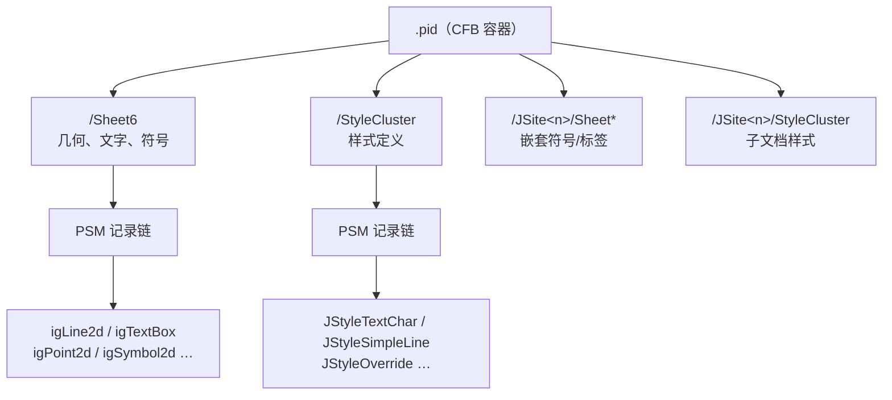
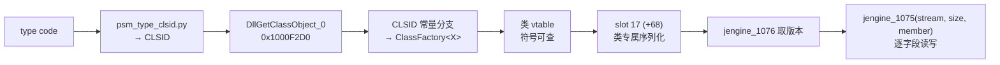

# `.pid` 文件格式指南

> 面向要读懂、扩展或调试 `pid-parse` 的人。
> 最后更新：2026-08-05。

## 先读这一段

**本文区分三个证据等级，引用任何结论前请先看它属于哪一级：**

| 等级 | 含义 | 可否据此写解码器 |
|---|---|---|
| **native-reader** | 从 SmartPlant/RAD 原生 DLL 的反编译读取序得出 | 可以 |
| **corpus** | 从多张真实图纸的字节统计得出，且跨图纸一致 | 谨慎，需 fixture ratchet |
| **hypothesis** | 单一来源或值域吻合推出 | **不可以** |

有两个 corpus 级结论被 native reader 推翻（见 §7），所以这个区分不是形式主义。

反过来也一样：**一条被判负的候选后来被证明是对的**（见 §8.1）。判负和判正一样需要
一个站得住的判据——那次用的是「取值在不在某个 id 集合里」，而 id 空间稠密到任何小整数
都能命中，所以它的阳性和阴性都不携带信息。

---

## 1. `.pid` 是什么

SmartPlant P&ID 的图纸文件，本质是一个 **CFB 容器**（与 `.doc` 同族的复合文档），
里面若干个流，每个流是一串 **PSM 记录**。

图形对象、文字、符号放在 `Sheet*` 流；线宽、颜色、字高这类显示属性放在
`StyleCluster` 流；嵌套的符号与标签各自带一套 `JSite*/…` 子流。



## 2. 快速上手

```powershell
# 看一张图解析出什么
cargo run --example pid_probe -- test-file/DWG-0201GP06-01.pid

# 看样式流的记录链
cargo run --example probe_stylecluster_records

# 把 type code 翻译成类名（需要 dlls/radsrvitem.dll 与 RAD 的 jutil.dll）
python tools/psm_type_clsid.py 0x18 0x4D 0x005A
```

从 `OpenCADStudio` 侧渲染并出图：

```powershell
$env:PID_SYMBOL_LIBRARY = "..\pid-parse\test-file\symbols-full"
cargo run --example pid_plot_dump -- ..\pid-parse\test-file\DWG-0201GP06-01.pid
```

## 3. PSM 记录信封

每条记录 6 字节头：

```text
+0  u16  type_word    低 14 位是 type code，高 2 位是 flags
+2  u32  bytes_to_follow
+6  …    payload
```

这个链头**不是 `StyleCluster` 专有的**：`Sheet*`、`PSMcluster0`、
`Dynamic Attributes Metadata`、`Unclustered Dynamic Attributes` 等流共用同一个
结构（`src/streams/cluster.rs` 早就复用 `cluster_header::parse_header()` 处理
`Sheet*`）：

```text
+0  u32  magic 0x6C90F544
+4  u32  record_count
+8       记录链开始，一条接一条
```

**从 `+8` 起顺着 `bytes_to_follow` 走就行，不需要滑窗扫描。** 2026-08-05 实测：
四张图 44 个流全部走到**零剩余**，且记录数与 pid-parse 自己的解码器逐张图相同
（359 / 279 / 563 / 48）。`probe_psm_type_code_histogram` 里那条「失败退一字节
重同步」的兜底路径实际从未被触发。

`+4` 的 `record_count` 是白送的校验和，但**只能当告警不能当断言**：多数流精确
相等，少数流实测差 1..5 条。

> ⚠ 真正的分帧陷阱不在走链，而在**在链外按 type code 滑窗找记录**。§7 那个被推翻
> 的结论就是这么来的。要找某个家族，先走链拿到记录边界，再按 type code 过滤。

## 4. type code 对照表

来源：`radsrvitem.dll!dword_5667B068`（20 字节条目，按 type code 索引）→ CLSID →
`jutil.dll` 的 RAD 注册表 → 类名。四条独立证据链互证（CLSID 表 / jutil 注册表 /
RTTI / COM 类工厂），**等级：native-reader**。

**几何族**

| code | 类名 | pid-parse 状态 |
|---|---|---|
| `0x0013` | Boundary2d Object | 解码，**故意不 emit**（与成员线重复） |
| `0x0018` | Line Object (`igLine2d`) | 已解码 |
| `0x0020` | Rectangle Object | 未解码 |
| `0x0021` | ComplexString Object | 语料 0 命中 |
| `0x003D` | SmartFrame2d Object | 已解码（页框/页幅） |
| `0x004D` | Text Object (`igTextBox`) | 已解码 |
| `0x0059` / `0x0061` / `0x0063` / `0x007E` | Circle / Arc / Ellipse / Elliptical Arc | 语料 0 命中 |
| `0x005D` | BspCurve Object | 语料 0 命中 |
| `0x005E` | Point Object (`igPoint2d`) | 已解码 |
| `0x0084` | LineString Object (`igLineString2d`) | 已解码 |
| `0x00CE` | JSymbol | 已解码 |
| `0x00FA` | **Dependency Object** | 仅解 header，尾部 raw |
| `0x00FF` | Graphics Bag | 语料 0 命中 |
| `0x0115` / `0x0117` / `0x0118` | JDim / JBalloon / JLeader | **语料 0 命中，会静默丢弃** |

**约束族（不是几何，永不可画）**

`0x0006` OnElement、`0x000F` Parallel、`0x0015` Perpendicular、`0x0017` Tangent、
`0x0019` KeyPoint、`0x0040` Concentric、`0x0069` Symmetric、`0x006A` Equal、
`0x006B` Colinear、`0x0077` Fix、`0x0082` Horizontal、`0x0085` Vertical。

**样式族（都在 `style.dll`，CLSID `47FCC331`…`47FCC338` 连号）**

| code | 类名 | 语料命中 |
|---|---|---|
| `0x0029` | JStyleMultiplexer | **0**（见 §8.3） |
| `0x002A` | JStyleSimpleFill | 25 |
| `0x002B` | JStyleHatchFill | 11 |
| `0x002C` | **JStyleTextChar** | 244 |
| `0x002D` | JStyleTextPara | 237 |
| `0x002E` | **JStyleSimpleLine** | 116 |
| `0x002F` | JStyleSimpleDashType | 13 |
| `0x0030` | **JStyleOverride** | 48 |
| `0x0032` | JStylePointSymbol | 12 |
| `0x0033` | JStyleLineTerminator | 12 |
| `0x005A` | JStyleLibrarian（`StyleCluster` 的第一条记录） | 13 |

`0x0032` / `0x0033` 补录于 2026-08-05（`tools/psm_type_clsid.py 0x32 0x33` →
`47FCC33B` / `47FCC33C`，等级 native-reader）。两者**只出现在 `StyleCluster`、
且每张图都成对等量**——线终止符本质上就是画在线端的点符号，成对出现符合语义。
`probe_stylecluster_records` 一直能看见它们，只是本表漏收；
`probe_rad_siblings_0x0029_0x0035` 只扫 `/Sheet6`，所以那个 probe 看不到。

> ⚠ CLSID 连号**不能线性外推 type code**：`47FCC337` 在表里被跳过，所以
> `0x0032` 是 `47FCC33B` 而不是直觉上的 `47FCC33A`。要判断某个 code 属于谁，
> 查 `psm_type_clsid.py`，别自己算。

## 5. 几何记录布局

**等级：native-reader（字节账全额入账，无剩余）**

`igLine2d`（`0x0018`，payload 50 字节）：

```text
+0   u32  oid
+4   u32  parent_ref
+8   u32  remaining_header（常量 12）
+12  u16  sub_type_word
+14  u32  index
+18  4×f64  start.x, start.y, end.x, end.y
```

`igPoint2d`（`0x005E`，payload 34 字节）：

```text
+0   u32  oid
+4   u32  parent_ref
+8   u32  remaining_header（常量 18）
+12  u16  sub_type_word
+14  u32  index
+18  2×f64  x, y
```

**两者字节全额入账，没有空位。** 这条事实很重要：它排除了「线宽/颜色藏在几何图元里」
这个最直觉的假设。样式不是藏起来的，是**引用出去的**——`+14` 的 `index` 就是那条引用，
见 §8.1。`igLineString2d`（`0x0084`）与 `igTextBox`（`0x004D`）在同一位置有同一字段；
`igSymbol2d`（`0x00CE`）**没有**，它的 `14..T-5` 是变长子字段。

坐标单位是**米**，页面在 1m 以内；渲染时乘 1000 转毫米。页幅由 `0x003D` 给出。

## 6. StyleCluster 的结构

**等级：native-reader**

```text
+0  u32  magic 0x6C90F544
+4  u32  count
+8       记录链开始
```

第一条恒为 `0x005A` **JStyleLibrarian**，内含样式类型目录：

```text
+0x1A  u16  目录条目数
+0x1C       首条 [GUID(16)][u32][u32]（24 字节）
            其后 [提供者 GUID(16)][样式类型 GUID(16)][u32 index][u32 0]（40 字节）
```

其余记录就是**样式实例**。

### 样式记录的共同形状

```text
[基类块 B 字节][类专属字段…]
```

version 3 的账**已经算平**（2026-08-05）：

```text
+0..11   12 字节 prologue，在类的 Load 之前
+12  u16   dash 索引，按 (w & 7) != 0 ? (w & 7) + 10 : 0 映射到成员字节 60
+14  u32   记录自己的身份（样式 id）
+18  u32   语料 718 条全为 0
+22  u32   JStyleBase 的对象引用，惰性解析
+26        类专属字段开始     ← 即 B = 26
```

**`B = 26 = 12 + 14`。** 之前记的三个互相矛盾的数**全都是对的，只是在量不同的东西**：
本表的 26 是「类字段的起点」，数原生 `DoIO` 得的 14 是「基类块本身」，拿真 fixture
字节测出的 12 是「基类块之前的 prologue」——也正是 `JStyleOverrideDecoder` 那个 18
字节扩展头减去 6 字节信封的部分。

前提（把 `jengine.dll` 也建库，它同样带完整 C++ 符号）：

- `jengine_1075` = `IOContext::DoIO(unsigned long size, void* ptr)`——**恰好消耗
  `size` 字节**。
- `jengine_1076` = `IOContext::GetObjectVersions(const GUID*, u16*, u16*)`——只是拿
  CLSID 查一张缓在 `IOContext` 上的版本表，**一个流字节都不消耗**。

`JStyleBase__ReadCommonFields` 的 load 路径就是 `DoIO(2)` + 三个 `DoIO(4)` = 14 字节，
落点连续。把这个四字段块在 payload 里滑一遍，**起点 +12 是唯一能过判据的位置**：判据
是「第四个字段（对象引用）的非零值必须命名另一条记录」，+12 得 48/48 全中，其余候选
全部 0%。

> ⚠ **version 2 的账还没平。** `JStyleSimpleLine` 是 v2，其基类 helper
> `JStyleBase__LoadV2Block` 只数出 8 字节，但 `12 + 8 = 20`，而它的类字段实测从
> `+30` 开始。要么 v2 基类块漏数了，要么 v2 的 prologue 不同。下表 `0x002E` 的偏移
> 是实测可用的，但 v2 的 `B` 仍不要引用。

> ⚠ 另一条错误指引已封：`JStyleBase__LoadV3Block` 里的 `(*this + 184)`（slot 46）
> **不读流**。它拿不到 `IOContext`，且只在存盘位执行——是存盘路径上的 getter。

样式 id 在 payload `+14`，每条记录唯一（**等级：native-reader**）。它跨全部样式族唯一，
是因为它是**基类字段**而不是每族各自的字段。

payload `+22` 是 `JStyleBase` **唯一的对象引用字段**（**等级：native-reader**）：加载
器拿它和 `this+18` 存的 id 比，一旦不同就释放 `this+16` 缓着的对象指针。每个样式族都
有这个字段，但语料里只有 `0x0030` 填了它（48/48 非零，其余 670 条全为 0）。**这一层
就是样式解析器，它写在基类里。**

复现：`_ida-probe-plant10-2026-08-05/probe_slot46.py`、`base_locate2.py`；
详见 `docs/analysis/2026-08-05-geometry-index-is-the-style-link.md`。

### `0x002C` JStyleTextChar（version 3，`B = 26`）

| 偏移 | 类型 | 含义 | 等级 |
|---|---|---|---|
| `+14` | u32 | 样式 id（基类字段） | native-reader |
| `+26` | u32 | — | native-reader（位置） |
| `+30` | u16 | 语言 / 键盘布局（读到 0 用 `GetKeyboardLayout(0)` 兜底） | native-reader |
| `+32` | u16 | — | native-reader（位置） |
| `+34` | u32 | **文字颜色**，Win32 `COLORREF` `0x00BBGGRR`；内存里的 `-1`「未设」由序列化器归一化为 `0`，故盘上永不出现 `-1` | **native-reader** |
| `+38` | u8 ×4 | — | native-reader（位置） |
| **`+42`** | **f64** | **字高，单位米** | **native-reader** |
| `+68` | u16 | 字体名长度（UTF-16 码元数） | **native-reader** |
| `+70` | UTF-16 | **字体名**；`payload == 70 + 2*len`，全语料 381/381 成立。实测取值 `Arial` 111、`Arial Narrow` 108、`宋体` 79、`仿宋` 26、`仿宋_GB2312` 25、`SimSun-ExtB` 15、`Braggadocio` 4、`Intergraph ANSI` 1。12 条是窄字节被拓宽成宽字符的厂商 bug（`宋体` 读作 `ËÎÌå`） | **native-reader** |

读序全文见 `style.dll!sub_10030A20`，记于
`docs/analysis/2026-08-13-text-colour-is-002c-plus-34.md` §4。

实测取值：1.500 / 1.588 / 2.000 / 2.293 / 2.464 / 2.469 / **2.500** / 2.540 /
2.646 / 2.822 / **3.175** / 3.500 / 3.528 / 3.704 / 4.233 / **6.350** mm
——ISO 3098 的 2.5mm、英制 1/16″ 1/8″ 1/4″、7/7.5/8/10/12 磅。

### `0x002D` JStyleTextPara（version 3，payload 恒 90 字节）

| 偏移 | 类型 | 含义 | 等级 |
|---|---|---|---|
| `+14` | u32 | 样式 id（基类字段） | native-reader |
| **`+38`** | **u32** | **它使用的 `JStyleTextChar` 的样式 id** | **corpus（237/237）** |

文字记录的 `index` 指的是**段落样式**，字高在**字符样式**上，所以这一跳是拿到字高的
必经之路。见 §8.1。

### `0x002E` JStyleSimpleLine（version 2，`B` 未坐实，见上）

| 偏移 | 类型 | 含义 | 等级 |
|---|---|---|---|
| `+14` | u32 | 样式 id（基类字段） | native-reader |
| **`+34`** | **f64** | **线宽，单位米** | **native-reader** |
| `+42` | u32 | 带 `-1` 哨兵 | native-reader（位置） |
| **`+50`** | **u32** | **颜色，`[R, G, B, 0]`（Win32 COLORREF）** | **native-reader** |

线宽实测：0.100 / 0.130 / 0.180 / 0.350 / 0.500 / 0.700 / 1.000 / 2.000 mm
——除 0.100 外全在 ISO 128 档位上。
颜色实测：`#000000` `#800000` `#FF0000` `#008000` `#808000` `#0000FF` 等 CAD 基色。

### `0x0030` JStyleOverride（version 3，`B = 26`，共 90 字节）

```text
+26 +30 +34 +38   四个 u32
+42 +50 +58 +66   四个 f64
+74 +78 +82       三个 u32
+86 +88           两个 u16
```

与 Phase 16 记录的 `4×u32 + 4×f64 + 3×u32 + 2×u16` 逐项吻合。
version 2 字段相同、次序略异，共 98 字节。

## 7. 两个被推翻的结论（务必知道）

两条都已在代码里收口，这里保留是因为旧文档与旧分析里还留着被推翻的说法。

**（一）`0x0030` 不是标注锚点。**
`JStyleOverrideEmitter` 原先把 payload 前 16 字节读作两个 f64「锚点坐标」并产出
`PidGraphicKind::Annotation`。**原生读取序显示那里是四次独立的 4 字节读取。**
「值落在 0..1」只是四个 u32 恰好拼出合法的小 double 位模式。
该锚点读法已撤回：记录仍然发出（字节溯源本身站得住），但降级为
`PidGraphicKind::Unknown` + `ProbeOnly`，不再带任何渲染器会去落笔的坐标。
OCS 的 `PID-ANNOTATION` 图层因此恒为空。

**（二）`0x00FA` 不是 GraphicGroup。**
它是 `imagdex.dex` 的 **Dependency Object**。它带两个 OID 引用，是依赖关系的两端，
不是「一个对象和它的图形」。Phase 15 那套基于形状猜出来的命名已改名为
`DecodedDependencyObjectRecord` / `PSM_TYPE_CODE_DEPENDENCY_OBJECT` /
`decode_dependency_objects`。

## 8. 还没整理完的地方

### 8.1 「几何 → 样式」链路：已打通（2026-08-05）

**`index`（payload `+14`）就是样式引用。** 它命名的是**同一个文档**的 `StyleCluster`
里的一个样式 id：

```text
几何记录 payload +14 (u32)
   └─ 在它自己那个文档的 StyleCluster 里查这个样式 id
        ├─ 落在 0x002E SimpleLine → 线宽 +34、颜色 +50
        └─ 落在 0x0030 Override   → 它的 +22 命名一条 SimpleLine → 同上
```

四张图 **558/558** 条可绘制记录（`igLine2d` / `igPoint2d` / `igLineString2d`）走通，
零未解析。落地在 `src/style_link.rs`，ratchet 在 `tests/style_link_ratchet.rs`。

**文字走同样的两跳，只是换一个字段。** `igTextBox` 的 `index` 指向的是
`0x002D JStyleTextPara`（58/58 个不同取值），而字高在 `0x002C JStyleTextChar` 上，
所以中间还有一跳：**`JStyleTextPara` 的 `+38` 命名一条 `JStyleTextChar`，237/237、
每个文档都成立**（等级：corpus）。全链跑下来 116 条文字拿到真字高，取值全落在制图
档位上——ISO 3098 的 1.5 / 2.5 / 3.5mm，英制 1/16″ 1/8″ 1/4″，其中 **3.175mm（1/8″）
占了大半**。

> ⚠ Phase 35-D 那个「`igTextBox` trailer 末 4 字节是跨图稳定的样式 id」的读法，
> 现在拿真样式表一验**站不住**：同一个值在四张图里分别落到 LineTerminator /
> SimpleLine / TextChar / Override / PointSymbol，还夹着 `218103808`、`3002759231`
> 这类大数。它观察到的**分组**是真的（21 ≈ 常规标注、56 ≈ 中文、64 ≈ 管道号），
> 但那个值不是这个 id 空间里的样式 id。字高不需要它，走 `index` 那条就够了。

`index` 曾经在这张表里被判负，**那次排除有两个 bug**，都值得记住：

| 旧判据 | 错在哪 |
|---|---|
| 把所有名字含 `style` 的流汇成一个 id 集合 | **样式 id 每个文档从 1 重数**。根存储与每个 `JSite<n>/` 都是自带 `StyleCluster` 的独立文档，混域既造出假命中也掩盖真命中 |
| 问「是不是一条 `0x002E` 的 id」 | 线**大多数指向 `0x0030 Override`**，正确答案在这个判据下算 miss |

而且「命中率」本身就是弱判据：id 在文档内是 1..N 的稠密区间（密度 79%–97%），任何范围
内的小整数都能命中。同一份输出里恒为 16 的 `sub_type_word` 拿到过 24/24——那就是噪声
水平。**换成「落到哪一类样式」之后判据才有力**：98 个不同取值无一落错类，最强一张图的
零假设概率 `5.2e-12`。详见
`docs/analysis/2026-08-05-geometry-index-is-the-style-link.md`。

仍是 corpus 的部分：**几何侧**。没有反编译代码显示原生渲染器读几何的 `+14` 去查样式表；
样式记录侧（`+14` 身份、`+22` 引用）已是 native-reader。按 §0 的规矩，corpus 级配
fixture ratchet 才可用，ratchet 已经在了。

已接进 OCS 渲染：`OpenCADStudio` 的 `.pid` 导入按 `(流路径, graphic oid)` 关联这两张
表，线宽与颜色落到 `PID-GEOMETRY` / `PID-POINT` 的实体上，字高落到 `PID-TEXT` 的文字
上。解析不出来的记录**保留消费方自己的默认值**而不是被填一个猜测——`resolve_*` 返回
`None` 的三种情形（id 未定义、落到不带该属性的样式族、override 指向的目标没有线属性）
都是良构记录，不是解析失败。

其余候选的状态不变：`0x00FA` Dependency Object 覆盖率不足；`igLine2d.sub_type_word`
恒为 16；`0x0030 +50` 是分帧错误（见 §7）。`0x0010` 子记录仍未测，但链路已通，它不再
在关键路径上。

### 8.2 已定位但证据不足的

| 项 | 现状 |
|---|---|
| `0x002E` 的 `B`（version 2 基类块） | 未坐实；`12 + 8 = 20` 对不上实测的类字段起点 `+30`，见 §6 |
| ~~`0x002C +34` 的原生读序~~ | **已关闭**：序列化器是 `style.dll!sub_10030A20`（从 `IJStyleTextCharImp` 的 get/put 访问器反查对象槽位找到，不是从 DoIO 调用点反推）。`+34` 被夹在两个已知 native-reader 锚点 `+30`／`+42` 之间且字节账精确闭合。「`-1` 哨兵」确实存在，但只在内存里——序列化器两个方向都把它归一化成 `0`，所以盘上永不出现 |
| ~~字体名字段的确切偏移~~ | **已关闭**：`+68` u16 长度 + `+70` UTF-16 正文，`payload == 70 + 2*len` 全语料 381/381 成立 |
| `0x002C` 的 version 2 路径 | 未读（`sub_10002CFC` + `sub_10002CC0`），且**已移出关键路径**：版本号不逐条写在 payload 里（拿三个已知版本的族做对照，`+0..+13` 无一列携带各族版本），所以「这条是 v2 还是 v3」在文件侧不可判定；本语料也没有一条回退是它造成的 |
| `0x002C` 里的亚毫米记录（0.254mm） | 仍未解释，但已量化：全语料 184 条文字记录中 **25 条**指到它，来自三条**除身份字段外逐字节相同**的模板样式（四张图共用）。0.254mm = 0.01″，太小不可能是实际字高，`style_link` 直接拒收让消费方保留自己的默认值；段落样式与文字记录里都没有第二个字高来源。翻案要读**消费侧**（`rad2d`）而非 `style.dll` 的序列化器——见 `docs/analysis/2026-08-10-text-height-residue-is-one-sentinel-not-version-2.md` |

### 8.3 已知风险，暂不动

**Phase 19 的 `0x0029..0x0035` 假设：可以结掉了。**
`examples/probe_rad_siblings_0x0029_0x0035.rs` 记着一条 deferred hypothesis
——CLSID 连号段 `47FCC330..47FCC33E` 可能 1:1 映射到 type code `0x29..0x35`，
且其中或许藏着别的标注类记录。2026-08-05 查清：

- 映射**确实存在**但**不是线性的**（`47FCC337` 被跳过，见 §4 的警告）。
- `0x0029` = JStyleMultiplexer，**全语料 0 命中**。这个类在 `style.dll` 里有
  vtable、有 CLSID、有 slot 17 序列化器，也就是说它**可持久化但这四张图没用它**。
- 该段里真实存在的只有 `0x0032` / `0x0033`，都是样式而非标注，已补进 §4。

对样式链路的意义：**「resolver 是一个被静默跳过的持久化记录族」这条路排除了。**
JStyleMultiplexer 这种名字最像 resolver 的类根本没落盘，剩下的解释是 resolver
在 load 时于内存中构造——这也是 §8.1 那条链路应该往「消费端」找的理由。

**标注族静默丢弃。** `igDimension`(277) / `igBalloon`(279) / `igLeader`(280) 与
`0x00FF` Graphics Bag 都通过原生图形谓词 `radsrvitem.dll!sub_56449950`，
即出现即应绘制，但全语料 0 命中且当前会**无声丢掉**。

不建议现在写解码器（无 fixture 可验证），**建议加告警**：把未知 type code 按原生
谓词分成「图形类」与「非图形类」，只对前者推点名警告。

> **2026-08-07 已落地（Phase 38 S2）**：`parsers::undecoded_census` 按谓词集合
> 给未认领记录分类，`build_normalized_geometry` 对图形类推点名警告
> （type code + 命中次数 + 流路径），OCS `report_import` 以 warn 级透传。
> 语料实测：DWG-0202 掉 1 条 `0x0020` Rectangle（`/Sheet6615`），A01 掉
> 2 条 `0x0020` + 1 条 `0x007B` Group implementation（`/JSite204/Sheet6`），
> 其余两图无图形类丢弃；标注族与 `0x00FF` 一旦出现即会点名。

### 8.4 未解码的族

`0x0020` Rectangle（Phase 34-B 负结论）、`0x0010`（638 次命中，语义未定）、
`0x00FA` 尾部、以及语料 0 命中的曲线族（Circle / Arc / Ellipse / BspCurve /
ComplexString）。

### 8.5 文档欠账

- `sheet_records.rs` 里 `igLine2d.sub_type_word` 的注释列了多个取值
  （`0x0010, 0x0001, 0x0065, 0x0032, 0x0023, 0x001F, 0x002B`），
  但两张主 fixture 上只见到 `16`。注释依据的语料需要复核。
- `docs/analysis/2026-07-27-pid-load-status-snapshot.md` 已加更新批注，
  但正文表格仍是 07-27 的版本。
- 本文与 `docs/format-notes.md` 有内容重叠，未合并。

## 9. 工具索引

| 工具 | 用途 |
|---|---|
| `examples/pid_probe`（OCS 侧） | 解析 + 渲染两侧的实体普查 |
| `examples/probe_psm_type_code_histogram` | 全语料 type code 频次 |
| `examples/probe_stylecluster_records` | StyleCluster 记录链与目录 |
| `examples/probe_jsl_text_char_style` | `0x002C` 字段分析 |
| `examples/probe_text_height_fallback` | 字高两跳按失败的那一跳归因；版本列对照定位 |
| `examples/probe_gline2d_parameter_domain` | `0x3FE6` 的链式归属取证（判定为 `0x003D` 长宽比伪命中） |
| `examples/probe_fill_style_consumers` | 哪些几何的 `index` 落到填充族（`igBoundary2d` 20/20） |
| `examples/probe_jsl_line_style` | `0x002E` 字段分析 |
| `examples/probe_dependency_object_tail_columns` | `0x00FA` 尾部列分析 |
| `examples/probe_geometry_style_link` | 几何 → 样式链路候选测试 |
| `examples/probe_jstyleoverride_link` | `0x0030` 链路候选测试 |
| `examples/probe_inferred_points` | inferred 证据分类 |
| `src/style_link.rs` | 几何 `index` → 样式 id → 线宽/颜色（两跳解析） |
| `tests/style_link_ratchet.rs` | 上者的跨 fixture ratchet：计数 + 调色板 |
| `tools/psm_type_clsid.py` | type code → CLSID → 类名 |
| `tools/clsid_registry.py` | CLSID → 模块 + 类名（查 `jutil.dll`） |

原生 DLL 在 `dlls/`（gitignore），RAD 运行时在 `D:\pid\RADInstallA~\`。
`style.dll` 带完整 C++ 符号，vtable 全部有名字。

## 10. 逆向的入口路径

要给某个样式类定位字段，走这条路（已验证三次）：



`.rdata` 的文件偏移 → VA 差值恒为 `0x10001000`，所以在文件里定位到的 CLSID
可直接对上工厂分支。

## 11. 详细分析文档

本文是索引，逐项证据见 `docs/analysis/`：

- `2026-08-05-geometry-index-is-the-style-link` — 几何 → 样式链路、基类块字节账、
  `+14` 与 `+22` 升 native-reader

以及 `2026-08-04-*`：

- `psm-type-code-registry` — type code 全表与四路互证
- `stylecluster-record-chain` — 记录链与目录结构
- `jstyletextchar-native-reader-confirmed` — 字高
- `jstylesimpleline-native-reader-confirmed` — 线宽与颜色
- `jstyleoverride-native-reader-settles-it` — override 布局与两处推翻
- `style-dll-class-chain` — CLSID → vtable 的走法
- `geometry-to-style-link-negative` — 链路候选排除（`index` 那一行已被
  `2026-08-05-geometry-index-is-the-style-link.md` 推翻，见 §8.1）
- `inferred-points-negative-note` — inferred 证据为何不画
- `annotation-families-risk` — 标注族风险
