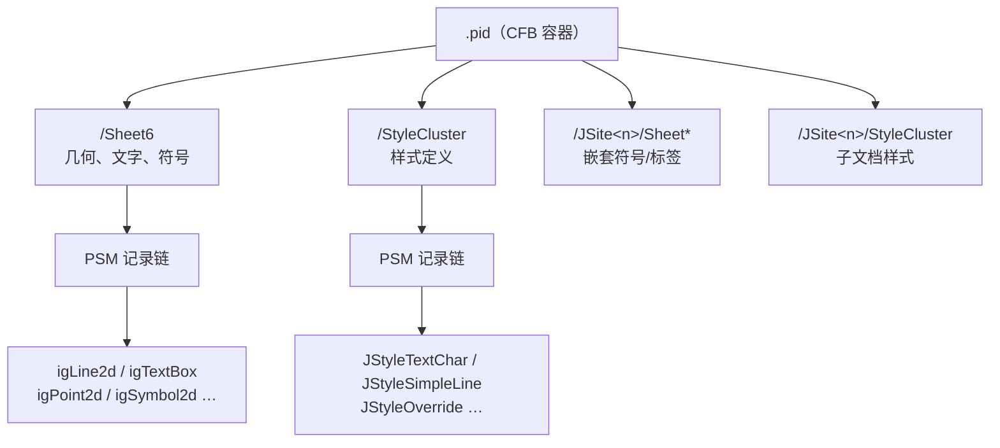
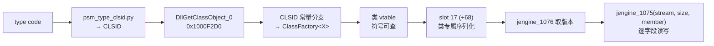

# `.pid` 文件格式指南

> 面向要读懂、扩展或调试 `pid-parse` 的人。
> 最后更新：2026-08-04。

## 先读这一段

**本文区分三个证据等级，引用任何结论前请先看它属于哪一级：**

| 等级 | 含义 | 可否据此写解码器 |
|---|---|---|
| **native-reader** | 从 SmartPlant/RAD 原生 DLL 的反编译读取序得出 | 可以 |
| **corpus** | 从多张真实图纸的字节统计得出，且跨图纸一致 | 谨慎，需 fixture ratchet |
| **hypothesis** | 单一来源或值域吻合推出 | **不可以** |

今天有两个 corpus 级结论被 native reader 推翻（见 §7），所以这个区分不是形式主义。

---

## 1. `.pid` 是什么

SmartPlant P&ID 的图纸文件，本质是一个 **CFB 容器**（与 `.doc` 同族的复合文档），
里面若干个流，每个流是一串 **PSM 记录**。

图形对象、文字、符号放在 `Sheet*` 流；线宽、颜色、字高这类显示属性放在
`StyleCluster` 流；嵌套的符号与标签各自带一套 `JSite*/…` 子流。



## 2. 快速上手

```powershell
# 看一张图解析出什么
cargo run --example pid_probe -- test-file/DWG-0201GP06-01.pid

# 看样式流的记录链
cargo run --example probe_stylecluster_records

# 把 type code 翻译成类名（需要 dlls/radsrvitem.dll 与 RAD 的 jutil.dll）
python tools/psm_type_clsid.py 0x18 0x4D 0x005A
```

从 `OpenCADStudio` 侧渲染并出图：

```powershell
$env:PID_SYMBOL_LIBRARY = "..\pid-parse\test-file\symbols-full"
cargo run --example pid_plot_dump -- ..\pid-parse\test-file\DWG-0201GP06-01.pid
```

## 3. PSM 记录信封

每条记录 6 字节头：

```text
+0  u16  type_word    低 14 位是 type code，高 2 位是 flags
+2  u32  bytes_to_follow
+6  …    payload
```

`StyleCluster` 流是**纯记录链**：`u32 magic 0x6C90F544` + `u32 count`，之后从 `+8`
起一条接一条，走到流尾**零剩余**（六个流实测全部逐字节走通）。

`Sheet*` 流**不是**纯链，家族交错，需要按 type code 滑窗扫描并做长度校验。

> ⚠ 滑窗扫描是分帧错误的高发区。**拿到一批记录后第一件事是核对 payload 长度是否
> 符合该家族的已知长度**——今天就因为跳过这一步得出过一个错误结论（§7）。

## 4. type code 对照表

来源：`radsrvitem.dll!dword_5667B068`（20 字节条目，按 type code 索引）→ CLSID →
`jutil.dll` 的 RAD 注册表 → 类名。四条独立证据链互证（CLSID 表 / jutil 注册表 /
RTTI / COM 类工厂），**等级：native-reader**。

**几何族**

| code | 类名 | pid-parse 状态 |
|---|---|---|
| `0x0013` | Boundary2d Object | 解码，**故意不 emit**（与成员线重复） |
| `0x0018` | Line Object (`igLine2d`) | 已解码 |
| `0x0020` | Rectangle Object | 未解码 |
| `0x0021` | ComplexString Object | 语料 0 命中 |
| `0x003D` | SmartFrame2d Object | 已解码（页框/页幅） |
| `0x004D` | Text Object (`igTextBox`) | 已解码 |
| `0x0059` / `0x0061` / `0x0063` / `0x007E` | Circle / Arc / Ellipse / Elliptical Arc | 语料 0 命中 |
| `0x005D` | BspCurve Object | 语料 0 命中 |
| `0x005E` | Point Object (`igPoint2d`) | 已解码 |
| `0x0084` | LineString Object (`igLineString2d`) | 已解码 |
| `0x00CE` | JSymbol | 已解码 |
| `0x00FA` | **Dependency Object** | 仅解 header，尾部 raw |
| `0x00FF` | Graphics Bag | 语料 0 命中 |
| `0x0115` / `0x0117` / `0x0118` | JDim / JBalloon / JLeader | **语料 0 命中，会静默丢弃** |

**约束族（不是几何，永不可画）**

`0x0006` OnElement、`0x000F` Parallel、`0x0015` Perpendicular、`0x0017` Tangent、
`0x0019` KeyPoint、`0x0040` Concentric、`0x0069` Symmetric、`0x006A` Equal、
`0x006B` Colinear、`0x0077` Fix、`0x0082` Horizontal、`0x0085` Vertical。

**样式族（都在 `style.dll`，CLSID `47FCC331`…`47FCC338` 连号）**

| code | 类名 |
|---|---|
| `0x002A` | JStyleSimpleFill |
| `0x002B` | JStyleHatchFill |
| `0x002C` | **JStyleTextChar** |
| `0x002D` | JStyleTextPara |
| `0x002E` | **JStyleSimpleLine** |
| `0x002F` | JStyleSimpleDashType |
| `0x0030` | **JStyleOverride** |
| `0x005A` | JStyleLibrarian（`StyleCluster` 的第一条记录） |

## 5. 几何记录布局

**等级：native-reader（字节账全额入账，无剩余）**

`igLine2d`（`0x0018`，payload 50 字节）：

```text
+0   u32  oid
+4   u32  parent_ref
+8   u32  remaining_header（常量 12）
+12  u16  sub_type_word
+14  u32  index
+18  4×f64  start.x, start.y, end.x, end.y
```

`igPoint2d`（`0x005E`，payload 34 字节）：

```text
+0   u32  oid
+4   u32  parent_ref
+8   u32  remaining_header（常量 18）
+12  u16  sub_type_word
+14  u32  index
+18  2×f64  x, y
```

**两者字节全额入账，没有空位。** 这条事实很重要：它排除了「线宽/颜色藏在几何图元里」
这个最直觉的假设。

坐标单位是**米**，页面在 1m 以内；渲染时乘 1000 转毫米。页幅由 `0x003D` 给出。

## 6. StyleCluster 的结构

**等级：native-reader**

```text
+0  u32  magic 0x6C90F544
+4  u32  count
+8       记录链开始
```

第一条恒为 `0x005A` **JStyleLibrarian**，内含样式类型目录：

```text
+0x1A  u16  目录条目数
+0x1C       首条 [GUID(16)][u32][u32]（24 字节）
            其后 [提供者 GUID(16)][样式类型 GUID(16)][u32 index][u32 0]（40 字节）
```

其余记录就是**样式实例**。

### 样式记录的共同形状

```text
[基类块 B 字节][类专属字段…]
```

**`B` 不是固定值**，取决于 version 与调用的基类 helper：

| version | 基类 helper | `B` |
|---|---|---:|
| 3 | `sub_10003814` | 26 |
| 2 | `sub_10002CFC` | 30 |

样式 id 在 payload `+14`，每条记录唯一（**等级：corpus**——基类块本身还没读）。

### `0x002C` JStyleTextChar（version 3，`B = 26`）

| 偏移 | 类型 | 含义 | 等级 |
|---|---|---|---|
| `+14` | u32 | 样式 id | corpus |
| `+26` | u32 | — | native-reader（位置） |
| `+30` | u16 | 语言 / 键盘布局（读到 0 用 `GetKeyboardLayout(0)` 兜底） | native-reader |
| `+34` | u32 | 带 `-1` 哨兵；形状符合文字颜色 | hypothesis |
| **`+42`** | **f64** | **字高，单位米** | **native-reader** |
| 尾部 | u16 len + UTF-16 | 字体名 | native-reader |

实测取值：1.500 / 1.588 / 2.000 / 2.293 / 2.464 / 2.469 / **2.500** / 2.540 /
2.646 / 2.822 / **3.175** / 3.500 / 3.528 / 3.704 / 4.233 / **6.350** mm
——ISO 3098 的 2.5mm、英制 1/16″ 1/8″ 1/4″、7/7.5/8/10/12 磅。

### `0x002E` JStyleSimpleLine（version 2，`B = 30`）

| 偏移 | 类型 | 含义 | 等级 |
|---|---|---|---|
| `+14` | u32 | 样式 id | corpus |
| **`+34`** | **f64** | **线宽，单位米** | **native-reader** |
| `+42` | u32 | 带 `-1` 哨兵 | native-reader（位置） |
| **`+50`** | **u32** | **颜色，`[R, G, B, 0]`（Win32 COLORREF）** | **native-reader** |

线宽实测：0.100 / 0.130 / 0.180 / 0.350 / 0.500 / 0.700 / 1.000 / 2.000 mm
——除 0.100 外全在 ISO 128 档位上。
颜色实测：`#000000` `#800000` `#FF0000` `#008000` `#808000` `#0000FF` 等 CAD 基色。

### `0x0030` JStyleOverride（version 3，`B = 26`，共 90 字节）

```text
+26 +30 +34 +38   四个 u32
+42 +50 +58 +66   四个 f64
+74 +78 +82       三个 u32
+86 +88           两个 u16
```

与 Phase 16 记录的 `4×u32 + 4×f64 + 3×u32 + 2×u16` 逐项吻合。
version 2 字段相同、次序略异，共 98 字节。

## 7. 两个被推翻的结论（务必知道）

**（一）`0x0030` 不是标注锚点。**
`JStyleOverrideEmitter` 现在把 payload 前 16 字节读作两个 f64「锚点坐标」并产出
`PidGraphicKind::Annotation`。**原生读取序显示那里是四次独立的 4 字节读取。**
「值落在 0..1」只是四个 u32 恰好拼出合法的小 double 位模式。
OCS 的 `PID-ANNOTATION` 图层默认隐藏，无可见损害，但该产出应撤回或降级。

**（二）`0x00FA` 不是 GraphicGroup。**
它是 `imagdex.dex` 的 **Dependency Object**。pid-parse 里
`SheetGraphicGroupDecoded` / `PSM_TYPE_CODE_GRAPHIC_GROUP` / `decode_graphic_groups`
这套命名基于 Phase 15 的一个未经证实的猜测，应当改名。它带两个 OID 引用，
是依赖关系的两端。

## 8. 还没整理完的地方

### 8.1 阻断交付的（必须解决）

**「几何 → 样式」链路仍未打通。** 知道颜色值在哪，不等于知道哪条线用哪个颜色。
`igLine2d` 没有样式 id 字段（50 字节全额入账）。四个候选已全部排除：

| 候选 | 排除理由 |
|---|---|
| `0x00FA` Dependency Object | 覆盖率不足（135 条里 4 条引用线；125 条里 26 条对 218 条线），命中偏移散乱 |
| `igLine2d.sub_type_word` | 两张图都恒为 16，不携带逐线信息 |
| `igLine2d.index` | 一张图 212/218 命中，另一张 0/24（取值超出 id 上限） |
| `0x0030` `+50` | **分帧错误**，见 §7 说明 |

未测：`0x0010` 子记录（638 次命中，「嵌在其他记录里的属性片段」）、
样式按 level 生效、`0x0030` 重新分帧后再查。

**在链路打通前不要把样式接进 OCS 渲染**——拿一个样式套所有线比继续用默认值更糟。

### 8.2 已定位但证据不足的

| 项 | 现状 |
|---|---|
| 样式 id 在 `+14` | corpus 级；需读基类块 `sub_10003814` / `sub_10002CFC` 坐实 |
| `0x002C +34` = 文字颜色 | hypothesis；原生代码只显示 `-1` 哨兵语义 |
| `0x002C` 的 version 2 路径 | 未读（`sub_10002CFC` + `sub_10002CC0`） |
| 字体名字段的确切偏移 | 用「最长 UTF-16 串」启发式读的，未定位 |
| `0x002C` 里两条亚毫米记录（0.254mm / 0.176mm） | 未解释 |

### 8.3 已知风险，暂不动

**标注族静默丢弃。** `igDimension`(277) / `igBalloon`(279) / `igLeader`(280) 与
`0x00FF` Graphics Bag 都通过原生图形谓词 `radsrvitem.dll!sub_56449950`，
即出现即应绘制，但全语料 0 命中且当前会**无声丢掉**。

不建议现在写解码器（无 fixture 可验证），**建议加告警**：把未知 type code 按原生
谓词分成「图形类」与「非图形类」，只对前者推点名警告。

### 8.4 未解码的族

`0x0020` Rectangle（Phase 34-B 负结论）、`0x0010`（638 次命中，语义未定）、
`0x00FA` 尾部、以及语料 0 命中的曲线族（Circle / Arc / Ellipse / BspCurve /
ComplexString）。

### 8.5 文档欠账

- `sheet_records.rs` 里 `igLine2d.sub_type_word` 的注释列了多个取值
  （`0x0010, 0x0001, 0x0065, 0x0032, 0x0023, 0x001F, 0x002B`），
  但两张主 fixture 上只见到 `16`。注释依据的语料需要复核。
- `docs/analysis/2026-07-27-pid-load-status-snapshot.md` 已加更新批注，
  但正文表格仍是 07-27 的版本。
- 本文与 `docs/format-notes.md` 有内容重叠，未合并。

## 9. 工具索引

| 工具 | 用途 |
|---|---|
| `examples/pid_probe`（OCS 侧） | 解析 + 渲染两侧的实体普查 |
| `examples/probe_psm_type_code_histogram` | 全语料 type code 频次 |
| `examples/probe_stylecluster_records` | StyleCluster 记录链与目录 |
| `examples/probe_jsl_text_char_style` | `0x002C` 字段分析 |
| `examples/probe_jsl_line_style` | `0x002E` 字段分析 |
| `examples/probe_graphicgroup_tail_columns` | `0x00FA` 尾部列分析 |
| `examples/probe_geometry_style_link` | 几何 → 样式链路候选测试 |
| `examples/probe_jstyleoverride_link` | `0x0030` 链路候选测试 |
| `examples/probe_inferred_points` | inferred 证据分类 |
| `tools/psm_type_clsid.py` | type code → CLSID → 类名 |
| `tools/clsid_registry.py` | CLSID → 模块 + 类名（查 `jutil.dll`） |

原生 DLL 在 `dlls/`（gitignore），RAD 运行时在 `D:\pid\RADInstallA~\`。
`style.dll` 带完整 C++ 符号，vtable 全部有名字。

## 10. 逆向的入口路径

要给某个样式类定位字段，走这条路（已验证三次）：



`.rdata` 的文件偏移 → VA 差值恒为 `0x10001000`，所以在文件里定位到的 CLSID
可直接对上工厂分支。

## 11. 详细分析文档

本文是索引，逐项证据见 `docs/analysis/2026-08-04-*.md`：

- `psm-type-code-registry` — type code 全表与四路互证
- `stylecluster-record-chain` — 记录链与目录结构
- `jstyletextchar-native-reader-confirmed` — 字高
- `jstylesimpleline-native-reader-confirmed` — 线宽与颜色
- `jstyleoverride-native-reader-settles-it` — override 布局与两处推翻
- `style-dll-class-chain` — CLSID → vtable 的走法
- `geometry-to-style-link-negative` — 链路候选排除
- `inferred-points-negative-note` — inferred 证据为何不画
- `annotation-families-risk` — 标注族风险
