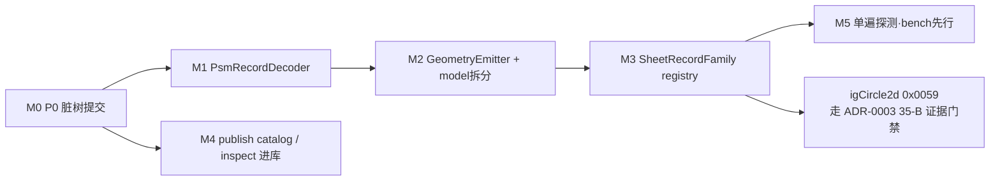

# pid-parse 架构深化总体开发计划（Master Plan）

> 日期：2026-07-18
> 来源：`/improve-codebase-architecture` 评审（7 个 deepening 候选 + 风险×工作量排表）
> 设计细节引用：`docs/plans/2026-07-16-psm-decoder-deepening-refactor-rfc-cn.md`（候选 1/2/6 已 grilling 定稿）
> 状态：收尾中（M0–M3、M4 publish、M4-I1/I2、M5 已落地；M4-I3 余项、可选 I4 与 DWG 全夹具验收待完成）
> 词汇：module · interface · implementation · depth · seam · adapter · leverage · locality（`/codebase-design`）；
> 域名词依 CONTEXT.md（Decoded / Typed Audit / Probe Evidence / Coverage Gap / Versioned Reference Corpus）

---

## 0. 目标与非目标

### 完成定义（DoD）

| # | 指标 | 现状 | 目标 |
|---|---|---|---|
| 1 | 新增一个 PSM 记录族的落地成本 | **已达成**：decoder + emitter + registry 三个 seam | 维持该 interface，并由接线测试守恒 |
| 2 | cluster 接线缺失 | **已达成**：`tests/sheet_family_wiring.rs` 逐族比对 | 测试可见（接线 == 重解码断言） |
| 3 | publish 侧新增 item type / PID tag | **已达成**：`PublishItemSpec` 统一 subtables / emission / rank / PID tags | 维持单一 catalog 与一致性测试 |
| 4 | `pid_inspect` 编排逻辑 | **部分达成**：核心只读视图已进 `InspectCommand::run()`；bin 仍 1,195 行 | 继续迁移 probe / 文件操作并压缩进程层 |
| 5 | 已知漂移 | **已达成**：`PrimitiveCircle` 保持 `Unknown` | 35-B 证据门禁前不声明 typed fields / decoded geometry |

### 非目标（红线）

- **不改任何对外公开 API**：`pub use model::*` 等再导出路径全保，零破坏。
- **不做语义写回**（ADR-0001：evidence-complete read-only）。
- **不在本计划内落地 igCircle2d 语义解码**——那条走 ADR-0003 的 35-B 证据门禁（IDA reader 证据优先），本计划只负责让它落地时有干净的 seam 可挂。
- **不抹平证据分级**：audit-only 族（0x0013 / 0x0010）继续不发射 `PidGraphicKind`。

---

## 1. 基线数字与全局守恒门禁

### 当前基线（2026-07-20 复核）

- M1：11 个 Sheet family 已共用 `PsmRecordDecoder::scan` 与 `parse_psm_header`。
- M2：geometry 由 `GeometryEmitter` / `EMITTERS` 发射；audit-only family 显式 no-op。
- M3：`SheetRecordFamily` 已驱动 cluster、byte audit、schema needle 与 wiring gate。
- publish 侧：catalog 已统一 staging / subtables / writer emission / rank / diff tags；writer 实现已按职责拆成 8 个子模块，公开路径不变。
- inspect 侧：`generate_report` 已拆为 13 个固定顺序私有 renderer；核心 report / coverage / byte-audit / geometry / Mermaid 视图已进库，`pid_inspect.rs` 仍 1,195 行。
- M5-B1：第二遍 Sheet probe 占完整解析约 8.3%（绝对约 1 ms/文件），达到继续门禁。
- M5-B2：第一遍 probe 的 `chunks` 现作为 reader 临时状态跨越 DA / crossref 阶段复用，不进入公开 model/schema。

### 每个 PR 的守恒门禁（不例外）

```bash
cargo build --locked --workspace --all-targets
cargo test  --locked --workspace --all-targets
cargo clippy --locked --workspace --all-targets -- -D warnings
cargo fmt --all -- --check
bash .github/scripts/check-missing-docs.sh
```

外加两条本计划专属守恒：

1. **黄金快照不变**：`tests/geometry_golden_snapshot.rs` 输出逐条不变；任何 Phase 若改动快照即视为回归，除非同 PR 声明「有意行为变更」并更新快照说明（全计划仅 M3-PR19 一处预期变更）。
2. **`missing_docs` 计数只降不升**；新增 pub item 必须带 rustdoc。

---

## 2. 里程碑总览与依赖

| 里程碑 | 内容 | 候选 | 规模 | 风险 | 前置 |
|---|---|---|---|---|---|
| M0 | P0：62 项脏工作树打包提交 | — | **已完成** | 低 | 无（ADR-0003 硬性要求） |
| M1 | L4 seam：`PsmRecordDecoder` + 逐族迁移 | 1 | **已完成** | 低 | M0 |
| M2 | L6 seam：`GeometryEmitter` + model 拆分 + 收尾 | 2 + 6 | **已完成** | 低 | M1 |
| M3 | `SheetRecordFamily` registry 统一接线 | 3 | **已完成** | 中 | M1（M2 完成更顺） |
| M4 | 并行轨：publish catalog + inspect 进库 | 4 + 5 | **核心完成，I3 余项待收尾** | 中 | M0（与 M1–M3 不抢文件，可并行） |
| M5 | 证据驱动的单遍探测 | 7 | **已完成（B1+B2）** | 中–高 | M3 |



---

## 3. M0 — P0 脏工作树打包（ADR-0003 决议 2 原文执行）

按 ADR-0003 已定的 3–4 个 review-unit commit 划分，不新增决策：

- [x] commit 1 — parser core：`src/config.rs`、`src/stream_paths.rs`、sheet geometry 管线改动 + 相关测试。
- [x] commit 2 — Phase 34 analysis / goal package 文档。
- [x] commit 3 — Phase 33 `0x0010` IDA 证据文档。
- [x] commit 4 — planning / misc（ROADMAP、CHANGELOG、findings、ADR）。
- [x] `tests/geometry_golden_snapshot.rs` 已作为 M1/M2 守恒真值入库。
- 验收：`git status --porcelain` 为空；5 道门禁绿；每个 commit 可独立 review。

---

## 4. M1 — L4 解码 seam（RFC Phase 0–2）

设计细节见 RFC §3.1，此处只列 PR 切分与验收。

- [x] **PR-1（RFC Phase 0/1 合并）**：`parse_psm_header` 私有 helper + 单测；`PsmRecordDecoder` trait（associated type + 默认 `scan()`）+ rustdoc；`IgLine2dDecoder` 试点，`decode_iglines` 改薄包装。
  - 红绿门禁：新路径与旧 `decode_iglines` 对全部本地 fixture **逐记录一致**（新增 parity 测试）。
  - 预期暴露：各族 advance 语义是否同构（0x0010 有「先推进再解码」特例）——若不同构，在本 PR 把 `advance_of` 的契约文档写死。
- [x] **PR-2 … PR-11（每族一个 PR，RFC Phase 2）**：已按简单→复杂迁移全部 10 个剩余 family。
  - 每 PR：实现该族 `*Decoder`，删除该族复制的扫描/头解析，旧自由函数转薄包装；金快照不变；该族原有单测 + `parser_panic_safety` 对抗矩阵全绿。
- 验收（M1 整体）：`sheet_records.rs` 不再含任何手写 scan 循环 / 头解析副本；~440 行脚手架蒸发；公开函数签名零变化。

---

## 5. M2 — L6 发射 seam + model 拆分（RFC Phase 3–5）

- [x] **PR-12/13（RFC Phase 3）**：`GeometryEmitter` trait + `EMITTERS` 表；audit-only family 实现 no-op emitter 并显式测试不发射。
  - 验收：金快照逐条不变（本里程碑最关键守恒）；`build_normalized_geometry` 主体 = 前置段 + `for e in EMITTERS`。
- [x] **PR-14（RFC Phase 4 = 候选 6）**：Sheet DTO island 已迁入 `model/sheet.rs`，`mod.rs` 保持全量再导出；其余 model 拆分不作为 M4/M5 阻塞项。
  - 约束：纯机械搬迁，挑没有在飞 PR 的窗口执行；对外 API 路径零变化；schemars 派生自动跟随。
- [x] **PR-15（RFC Phase 5）**：文档已刷新为 two-seam 模型；公开薄包装因兼容约束保留。

---

## 6. M3 — `SheetRecordFamily` registry（已完成）

registry 行的形状（设计草案，评审点之一）：

```rust
/// 每个 Sheet PSM 记录族在 registry 里恰好一行。
struct SheetRecordFamily {
    type_code: u16,                       // 0x0018 …
    name: &'static str,                   // "igLine2d"
    emits_geometry: bool,                 // audit-only = false（政策显式化）
    trace_class: SheetFamilyTraceClass,   // byte_audit 过账依据
    decode_into: fn(&[u8], &mut SheetGeometry),  // 类型擦除点：每族一个具体 fn
    record_count: fn(&SheetGeometry) -> usize,
    decoded_ranges: fn(&[u8]) -> Vec<Range<usize>>,
}
```

- [x] **PR-16**：registry 定义 + `cluster.rs` 接线改为遍历 registry；空判从 registry 派生。
- [x] **PR-17**：`tests/sheet_family_wiring.rs` 逐 fixture / sheet 断言接线结果等于原始字节重解码。
- [x] **PR-18**：byte audit trace 从 registry 派生并补入 `attribute_fragments`；其区间与 `0x0010` 重合，coverage 数字未变化。
- [x] **PR-19**：`schema.rs` needle 测试从 registry 生成；`PrimitiveCircle` 在 35-B 前保持 `Unknown`。
- 验收（M3 整体）：一族知识只住 registry 一行；漏接线在 PR-17 测试下现形。

### 评审点（请在 Plannotator 里表态）

1. `decode_into` 用 fn 指针（上述草案）还是宏生成 match？fn 指针零宏、可测；宏可再省样板但可读性降。
2. `attribute_fragments` 补账导致 coverage 数字变化，是否接受「同 PR 过账」而非单独 PR？

---

## 7. M4 — 并行轨（publish + inspect，与 M1–M3 不抢文件）

### publish 轨（候选 4）

- [x] **PR-P1**：`PublishItemSpec` 数据表统一 aliases / subtables / emission plan / rank / PID tags，并有一致性单测。
- [x] **PR-P2**：`sqlite_load::subtables_for_item_type` 已改为消费 catalog，原平行 match 已删除。
- [x] **PR-P3 … P6**：`xml_writer.rs` 已拆为 `common / drawing / meta / relationships / vessel_nozzle / pipeline / instrument_signal / components_notes_branch`；两个公开入口路径不变。原 114 个单测仍集中保留在门面模块，后续可按族迁移测试 locality。
- [x] **PR-P7**：`diff.rs::supported_pid_tags` 已由 catalog 的 emission plan 派生。
- **硬性执行条件**：本轨所有 PR 必须在带全夹具（`test-file/backup-test/...` DWG）的机器上跑测试——DWG 对照测试软跳过会静默漏回归。CI 若无夹具，PR 描述中附本地全夹具跑绿的证据。
  - 2026-07-20 当前机器缺少 `DWG-0202GP06-01_p/extracted/Export.mdf`；代码门禁已绿，但本条全夹具准入尚未满足，不能据此宣称 DWG parity 已完整验收。

### inspect 轨（候选 5，可在 publish 轨之后或穿插）

- [x] **PR-I1**：新增进程无关的 `InspectCommand / InspectRequest / InspectOutcome`；Report / Coverage / ByteAudit / Geometry / Object Graph Mermaid / Cross-reference Mermaid 已迁入并可库内直测。
- [x] **PR-I2**：`generate_report` 已拆为 13 个固定顺序私有 section renderer，原输出顺序与测试保持不变。
- [ ] **PR-I3（部分完成）**：CLI 已把上述核心只读路径映射到库接口并统一 Findings→退出码 3；probe、schema、diff、controlled-diff、round-trip、export 与 set-* 仍留在进程层，`pid_inspect.rs` 现 1,195 行，19 个 spawn 测试仍作为端到端守恒保留。原定 ~100 行目标尚未达到。
- [ ] **PR-I4（可选）**：`pid_writer_validate.rs` 同法收尾（`writer::validate::round_trip_report`）。

---

## 8. M5 — 单遍探测（候选 7，证据先行，可砍）

- [x] **PR-B1**（2026-07-19 实测）：`benches/pid_pipeline.rs` 新增 `parse_pid_gongyi`（11.91 ms）与 `probe_sheet_streams_gongyi`（0.994 ms，单遍全 Sheet probe）。重复的第二遍 probe ≈ 全解析时长的 **8.3%**。
  - **决策门禁**：占比 < 5% → 关闭候选 7，写一条 ADR 记录「不再重提」（防未来评审重复建议）；占比 ≥ 5% → 进 PR-B2。
  - **门禁结果：8.3% ≥ 5%，候选 7 保留**，PR-B2 排在 M4 之后执行（绝对收益 ~1 ms/文件，优先级仍低于 M4）。
- [x] **PR-B2（条件触发）**：轻量两阶段构建（第一遍 probe+decode 缓存 `chunks`；DA 尾巴 → endpoints → crossref 后消费缓存补算 object hints）。
  - `parse_file` 当前也经 `parse_pid_package` 路径在解析期临时持有 `raw_streams`；缓存必须是 reader 侧临时状态，不进入公开 `PidDocument` / serde schema。
  - 实现：`streams::sheet_geometry::SheetProbeCache` 仅在 reader 调用链中流转；endpoint 阶段复用启动时收集的 raw Sheet bytes，不再重开 CFB stream。
  - 同机交叉复测（Criterion，20 samples，warm-up 1 s，measurement 4 s）：HEAD 基线 `12.246 ms`，B2 `11.878 ms`，中心估计减少约 `0.368 ms / 3.0%`。收益小于 B1 的独立完整 probe 上界，但重复 probe 已从调用图移除。

### 2026-07-20 收尾验证

- `cargo build --locked --workspace --all-targets`：通过。
- `cargo test --locked --workspace --all-targets`：通过（含 geometry golden、Sheet family wiring、inspect 69 个库测试与 19 个 CLI 测试）。
- `cargo clippy --locked --workspace --all-targets -- -D warnings`：通过。
- `cargo fmt --all -- --check`：通过。
- missing-docs ratchet：PowerShell 等价执行 `cargo rustdoc --lib --locked -- -W missing-docs`，`current=0 / baseline=0`；本机 `bash` launcher 因 `REGDB_E_CLASSNOTREG` 无法直接运行包装脚本。
- DWG MDF：缺失，相关 Stage 2–4 parity 测试软跳过；这是当前唯一硬性验收阻塞。

---

## 9. 风险登记表

| 风险 | 影响 | 缓解 |
|---|---|---|
| 各族 advance 语义不同构（0x0010「先推进再解码」） | M1 trait 契约返工 | PR-1 试点即写死 `advance_of` 契约文档；不同构族允许 override `scan` |
| 金快照覆盖不到 cluster 接线层 | M1/M2 期间接线回归静默 | M3-PR17 接线一致性测试；在此之前每族迁移 PR 手工核对 `parse_real_files` 计数 ratchet |
| byte_audit 过账（attribute_fragments） | coverage 数字变化被误判回归 | 唯一预期变更收敛在 M3-PR18，同 PR 更新基线 + CHANGELOG 说明 |
| model.rs 拆分与在飞 PR 冲突 | 大面积 rebase | PR-14 挑空窗执行；纯机械、可随时重做 |
| DWG 夹具软跳过 | publish 轨回归漏检 | M4 硬性执行条件：全夹具机器跑绿为 PR 准入 |
| registry 类型擦除设计不确定 | M3 返工 | PR-16 前先以 2 族做 spike；评审点 1 先定案 |
| igCircle2d 在 M1 完成前拿到 35-B 语义证据 | 新旧模板混用 | 若发生：igCircle2d 直接按新 seam 落地（decoder + emitter + registry 行），作为新模板首个实战验证 |

---

## 10. 排期与并行度

- 串行主线：M0 → M1 → M2 → M3（读侧文件互相咬合，禁止并行）。
- M4 与 M1–M3 并行（publish / inspect 侧不抢读侧文件）。
- M5 最后，且有明确砍掉条件。
- 总量 ~25–30 个 PR，全部遵守「一 PR 一收敛可回滚」+ squash-merge --delete-branch。
- 建议节奏：M0 一次性完成；M1 每族 PR 小而快（半天级）；M4 的 xml_writer 搬迁按族批量、避免长期半搬状态。

## 11. ADR 对齐声明

- **ADR-0001**：全计划均为读侧结构重构，零语义写回；audit-only 政策以 no-op emitter + registry 行显式化，只加强不放松。
- **ADR-0002**：corpus 契约不动；所有 ratchet 变更（仅 M3-PR18 一处）同 PR 显式过账。
- **ADR-0003**：M0 即其 P0 决议；curve-family 主线（igCircle2d 起）在 M1 后按新 seam 接入，35-B 语义证据门禁不因本计划放松；`0x0010` Mode B 仍为侧线。
