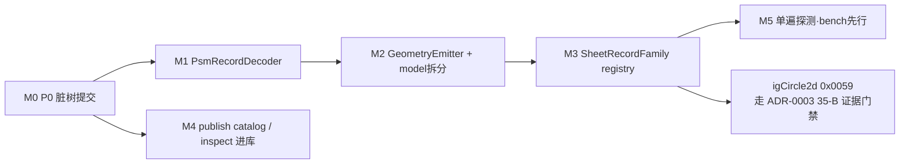

# pid-parse 架构深化总体开发计划（Master Plan）

> 日期：2026-07-18
> 来源：`/improve-codebase-architecture` 评审（7 个 deepening 候选 + 风险×工作量排表）
> 设计细节引用：`docs/plans/2026-07-16-psm-decoder-deepening-refactor-rfc-cn.md`（候选 1/2/6 已 grilling 定稿）
> 状态：待评审（Plannotator 标注中）
> 词汇：module · interface · implementation · depth · seam · adapter · leverage · locality（`/codebase-design`）；
> 域名词依 CONTEXT.md（Decoded / Typed Audit / Probe Evidence / Coverage Gap / Versioned Reference Corpus）

---

## 0. 目标与非目标

### 完成定义（DoD）

| # | 指标 | 现状 | 目标 |
|---|---|---|---|
| 1 | 新增一个 PSM 记录族的落地成本 | 手工同步 ~10 个文件（igBoundary2d 实测） | 1 个 `PsmRecordDecoder` + 1 个 `GeometryEmitter` + registry 1 行 |
| 2 | cluster 接线缺失 | 静默（tests 直接重解码原始字节，绕过接线 seam） | 测试可见（接线 == 重解码断言）或编译期报错 |
| 3 | publish 侧新增 item type / PID tag | 3 份平行匹配表同步改（sqlite_load / xml_writer / diff） | catalog 1 行，三方消费 |
| 4 | `pid_inspect` 编排逻辑 | 困在 1,454 行 bin，仅进程 spawn 可测 | 库内 `InspectCommand::run()` 可直接单测 |
| 5 | 已知漂移 | schema 声明 `PrimitiveCircle` 但无 decoder；`attribute_fragments` 在 byte_audit 缺席 | registry 行显式标注（Planned / trace 补账），漂移可查 |

### 非目标（红线）

- **不改任何对外公开 API**：`pub use model::*` 等再导出路径全保，零破坏。
- **不做语义写回**（ADR-0001：evidence-complete read-only）。
- **不在本计划内落地 igCircle2d 语义解码**——那条走 ADR-0003 的 35-B 证据门禁（IDA reader 证据优先），本计划只负责让它落地时有干净的 seam 可挂。
- **不抹平证据分级**：audit-only 族（0x0013 / 0x0010）继续不发射 `PidGraphicKind`。

---

## 1. 基线数字与全局守恒门禁

### 基线（2026-07-18 实测）

- 11 个 decoder 族；11 份复制的 scan 循环 + 11 份 PSM 头解析（~440 行脚手架，`sheet_records.rs` 6,619 行）
- 13 个 `From` 桥 + 13 个 `SheetGeometry.decoded_*` 字段（`model.rs` 4,193 行）
- `build_normalized_geometry` 单函数 ~726 行、7 个逐族发射臂（`geometry.rs`）
- `schema.rs` ~35 个手写 needle；`byte_audit/aggregate.rs` 8 个逐族 trace 循环
- publish 侧：`xml_writer.rs` 6,016 行（2 pub fn / 54 私有 fn）、`diff.rs` 15-tag 平行表、`sqlite_load.rs` ~12 臂 subtable 表
- inspect 侧：`generate_report` 917 行（全库最大函数）、`pid_inspect.rs` 1,454 行
- 工作树：62 项未提交（Phase 33/34 backlog）

### 每个 PR 的守恒门禁（不例外）

```bash
cargo build --locked --workspace --all-targets
cargo test  --locked --workspace --all-targets
cargo clippy --locked --workspace --all-targets -- -D warnings
cargo fmt --all -- --check
bash .github/scripts/check-missing-docs.sh
```

外加两条本计划专属守恒：

1. **黄金快照不变**：`tests/geometry_golden_snapshot.rs` 输出逐条不变；任何 Phase 若改动快照即视为回归，除非同 PR 声明「有意行为变更」并更新快照说明（全计划仅 M3-PR19 一处预期变更）。
2. **`missing_docs` 计数只降不升**；新增 pub item 必须带 rustdoc。

---

## 2. 里程碑总览与依赖

| 里程碑 | 内容 | 候选 | 规模 | 风险 | 前置 |
|---|---|---|---|---|---|
| M0 | P0：62 项脏工作树打包提交 | — | 3–4 commit | 低 | 无（ADR-0003 硬性要求） |
| M1 | L4 seam：`PsmRecordDecoder` + 逐族迁移 | 1 | ~11 PR | 低 | M0 |
| M2 | L6 seam：`GeometryEmitter` + model 拆分 + 收尾 | 2 + 6 | ~4 PR | 低 | M1 |
| M3 | `SheetRecordFamily` registry 统一接线 | 3 | ~4 PR | 中 | M1（M2 完成更顺） |
| M4 | 并行轨：publish catalog + inspect 进库 | 4 + 5 | ~8–13 PR | 中 | M0（与 M1–M3 不抢文件，可并行） |
| M5 | 证据驱动的单遍探测 | 7 | bench + ~2 PR | 中–高 | 先拿 bench 证据，可砍 |



---

## 3. M0 — P0 脏工作树打包（ADR-0003 决议 2 原文执行）

按 ADR-0003 已定的 3–4 个 review-unit commit 划分，不新增决策：

- [ ] commit 1 — parser core：`src/config.rs`、`src/stream_paths.rs`、sheet geometry 管线改动 + 相关测试（注意 ADR-0003 约束：这两个文件必须与包含 `mod config` / `pub mod stream_paths` 声明的 `lib.rs` 同 commit）
- [ ] commit 2 — Phase 34 analysis / goal package 文档
- [ ] commit 3 — Phase 33 `0x0010` IDA 证据文档
- [ ] commit 4 — planning / misc（ROADMAP、CHANGELOG、findings、ADR）
- [ ] `tests/geometry_golden_snapshot.rs` 已在工作树中：归入 commit 1（它是 M1/M2 的守恒真值，必须最先入库）
- 验收：`git status --porcelain` 为空；5 道门禁绿；每个 commit 可独立 review。

---

## 4. M1 — L4 解码 seam（RFC Phase 0–2）

设计细节见 RFC §3.1，此处只列 PR 切分与验收。

- [ ] **PR-1（RFC Phase 0/1 合并）**：`parse_psm_header` 私有 helper + 单测；`PsmRecordDecoder` trait（associated type + 默认 `scan()`）+ rustdoc；`IgLine2dDecoder` 试点，`decode_iglines` 改薄包装。
  - 红绿门禁：新路径与旧 `decode_iglines` 对全部本地 fixture **逐记录一致**（新增 parity 测试）。
  - 预期暴露：各族 advance 语义是否同构（0x0010 有「先推进再解码」特例）——若不同构，在本 PR 把 `advance_of` 的契约文档写死。
- [ ] **PR-2 … PR-11（每族一个 PR，RFC Phase 2）**：迁移顺序按简单→复杂：igPoint2d → igTextBox → igSymbol2d → igLineString2d → GLine2d → jstyleOverride → graphicGroup → subRecords0x0010 → attributeFragment → igBoundary2d。
  - 每 PR：实现该族 `*Decoder`，删除该族复制的扫描/头解析，旧自由函数转薄包装；金快照不变；该族原有单测 + `parser_panic_safety` 对抗矩阵全绿。
- 验收（M1 整体）：`sheet_records.rs` 不再含任何手写 scan 循环 / 头解析副本；~440 行脚手架蒸发；公开函数签名零变化。

---

## 5. M2 — L6 发射 seam + model 拆分（RFC Phase 3–5）

- [ ] **PR-12/13（RFC Phase 3）**：`GeometryEmitter` trait + `EMITTERS` 表；逐族把 `geometry.rs` 的 for-arm 迁进 emitter；audit-only 族（0x0013 / 0x0010）实现 no-op emitter 并**显式测试不发射**。
  - 验收：金快照逐条不变（本里程碑最关键守恒）；`build_normalized_geometry` 主体 = 前置段 + `for e in EMITTERS`。
- [ ] **PR-14（RFC Phase 4 = 候选 6）**：`model.rs` → `model/` 子模块（`decoded_records.rs`、`sheet_geometry.rs`，其余居民 `document / psm / object_graph / coverage / sheet_schema` 同批或后批搬）；`mod.rs` 全量 `pub use`。
  - 约束：纯机械搬迁，挑没有在飞 PR 的窗口执行；对外 API 路径零变化；schemars 派生自动跟随。
- [ ] **PR-15（RFC Phase 5）**：薄包装移除或降 `pub(crate)`；刷新 AGENTS.md「七层模板」→「新增族 = 1 decoder + 1 emitter」；刷新 ARCHITECTURE.md；`cargo audit`。

---

## 6. M3 — `SheetRecordFamily` registry（候选 3，RFC 之外净新增）

registry 行的形状（设计草案，评审点之一）：

```rust
/// 每个 Sheet PSM 记录族在 registry 里恰好一行。
struct SheetRecordFamily {
    type_code: u16,                       // 0x0018 …
    name: &'static str,                   // "igLine2d"
    schema_kind: SheetRecordKind,
    schema_status: FamilyStatus,          // Active / Planned（吃掉 PrimitiveCircle 漂移）
    emits_geometry: bool,                 // audit-only = false（政策显式化）
    trace_confidence: TraceConfidence,    // byte_audit 过账依据
    decode_into: fn(&[u8], &mut SheetGeometry),  // 类型擦除点：每族一个具体 fn
}
```

- [ ] **PR-16**：registry 定义 + `cluster.rs` 接线改为遍历 registry；`SheetGeometry::is_empty` 从 registry 派生（删掉 12 连 `&&` 空判）。
- [ ] **PR-17（接线一致性测试，堵住静默缺口）**：`PidParser::parse_package(fixture)` 后逐族断言 `sheet.geometry.decoded_* == decode_*(raw_bytes)`。这是金快照覆盖不到的 L3 接线层，必须独立成测试。
- [ ] **PR-18（唯一预期行为变更）**：byte_audit trace 从 registry 派生；**把 `attribute_fragments` 补进 trace**——coverage 数字会变，属有意过账：同 PR 更新 coverage ratchet 基线并在 CHANGELOG 说明（ADR-0002：ratchet 变更须显式可见）。
- [ ] **PR-19**：`schema.rs` needle 测试改为从 registry 生成；`PrimitiveCircle` 标 `Planned` 消除文档漂移。
- 验收（M3 整体）：一族知识只住 registry 一行；漏接线在 PR-17 测试下现形。

### 评审点（请在 Plannotator 里表态）

1. `decode_into` 用 fn 指针（上述草案）还是宏生成 match？fn 指针零宏、可测；宏可再省样板但可读性降。
2. `attribute_fragments` 补账导致 coverage 数字变化，是否接受「同 PR 过账」而非单独 PR？

---

## 7. M4 — 并行轨（publish + inspect，与 M1–M3 不抢文件）

### publish 轨（候选 4）

- [ ] **PR-P1**：`PublishItemCatalog` 数据表 `{ item_type, subtables[], writer_fn, pid_tags[] }` + catalog 一致性单测（三方清单对齐即测试，先不动消费方）。
- [ ] **PR-P2**：`sqlite_load::subtables_for_item_type` 改为消费 catalog，删 ~12 臂平行表。
- [ ] **PR-P3 … P6**：`xml_writer.rs` 逐族搬进 `src/publish/xml/` 子模块（emitter 内核 + drawing / relationships / vessel / pipeline / …），每 PR 2–4 族，100 个原地单测随族迁移；对外 2 个 pub fn 门面不动。
- [ ] **PR-P7**：`diff.rs::supported_pid_tags` 改为消费 catalog，删平行 tag 表。
- **硬性执行条件**：本轨所有 PR 必须在带全夹具（`test-file/backup-test/...` DWG）的机器上跑测试——DWG 对照测试软跳过会静默漏回归。CI 若无夹具，PR 描述中附本地全夹具跑绿的证据。

### inspect 轨（候选 5，可在 publish 轨之后或穿插）

- [ ] **PR-I1**：`inspect::commands` 模块：`InspectCommand` 枚举 + `run(cmd) -> InspectOutput` 骨架，先迁 2–3 个子命令。
- [ ] **PR-I2**：`generate_report`（917 行）拆成可组合 section renderer（streams / jsites / crossref / sheet provenance），文件尾部现有测试按 section 就位。
- [ ] **PR-I3**：`pid_inspect.rs` 缩到 ~100 行（参数解析 + 打印）；`tests/inspect_cli.rs` 的 19 个 spawn 测试大半转库内直调，保留 1–2 个 CLI 冒烟。
- [ ] **PR-I4（可选）**：`pid_writer_validate.rs` 同法收尾（`writer::validate::round_trip_report`）。

---

## 8. M5 — 单遍探测（候选 7，证据先行，可砍）

- [x] **PR-B1**（2026-07-19 实测）：`benches/pid_pipeline.rs` 新增 `parse_pid_gongyi`（11.91 ms）与 `probe_sheet_streams_gongyi`（0.994 ms，单遍全 Sheet probe）。重复的第二遍 probe ≈ 全解析时长的 **8.3%**。
  - **决策门禁**：占比 < 5% → 关闭候选 7，写一条 ADR 记录「不再重提」（防未来评审重复建议）；占比 ≥ 5% → 进 PR-B2。
  - **门禁结果：8.3% ≥ 5%，候选 7 保留**，PR-B2 排在 M4 之后执行（绝对收益 ~1 ms/文件，优先级仍低于 M4）。
- [ ] **PR-B2（条件触发）**：`SheetGeometryBuilder` 两阶段构建（第一遍 probe+decode 缓存；第二遍只注入 crossref field_x 补算 object hints），调用顺序不变式（DA 尾巴 → endpoints → crossref → hints）收进 builder 的 interface 并可断言。
  - 注意内存权衡：`parse_file` 流式路径不保留原始字节，缓存策略只对 `parse_package` 路径生效，`parse_file` 保持现状。

---

## 9. 风险登记表

| 风险 | 影响 | 缓解 |
|---|---|---|
| 各族 advance 语义不同构（0x0010「先推进再解码」） | M1 trait 契约返工 | PR-1 试点即写死 `advance_of` 契约文档；不同构族允许 override `scan` |
| 金快照覆盖不到 cluster 接线层 | M1/M2 期间接线回归静默 | M3-PR17 接线一致性测试；在此之前每族迁移 PR 手工核对 `parse_real_files` 计数 ratchet |
| byte_audit 过账（attribute_fragments） | coverage 数字变化被误判回归 | 唯一预期变更收敛在 M3-PR18，同 PR 更新基线 + CHANGELOG 说明 |
| model.rs 拆分与在飞 PR 冲突 | 大面积 rebase | PR-14 挑空窗执行；纯机械、可随时重做 |
| DWG 夹具软跳过 | publish 轨回归漏检 | M4 硬性执行条件：全夹具机器跑绿为 PR 准入 |
| registry 类型擦除设计不确定 | M3 返工 | PR-16 前先以 2 族做 spike；评审点 1 先定案 |
| igCircle2d 在 M1 完成前拿到 35-B 语义证据 | 新旧模板混用 | 若发生：igCircle2d 直接按新 seam 落地（decoder + emitter + registry 行），作为新模板首个实战验证 |

---

## 10. 排期与并行度

- 串行主线：M0 → M1 → M2 → M3（读侧文件互相咬合，禁止并行）。
- M4 与 M1–M3 并行（publish / inspect 侧不抢读侧文件）。
- M5 最后，且有明确砍掉条件。
- 总量 ~25–30 个 PR，全部遵守「一 PR 一收敛可回滚」+ squash-merge --delete-branch。
- 建议节奏：M0 一次性完成；M1 每族 PR 小而快（半天级）；M4 的 xml_writer 搬迁按族批量、避免长期半搬状态。

## 11. ADR 对齐声明

- **ADR-0001**：全计划均为读侧结构重构，零语义写回；audit-only 政策以 no-op emitter + registry 行显式化，只加强不放松。
- **ADR-0002**：corpus 契约不动；所有 ratchet 变更（仅 M3-PR18 一处）同 PR 显式过账。
- **ADR-0003**：M0 即其 P0 决议；curve-family 主线（igCircle2d 起）在 M1 后按新 seam 接入，35-B 语义证据门禁不因本计划放松；`0x0010` Mode B 仍为侧线。
