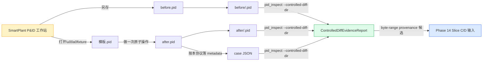

# Phase 14 Plan B：控制 diff fixture 采集协议

## 目标产出

一份**可由非 agent 人类直接照做**的操作协议文档，使得任何拥有
SmartPlant P&ID 工作站访问权限的操作员都能产出可被
`pid_parse::inspect::controlled_diff` 直接消费的 fixture：

- 一组 before / after `.pid` 文件对（每对放大同一种 SmartPlant 原子
  编辑操作的字节变更）
- 配套 metadata sidecar (`metadata/<case>.json`)，符合
  `pid_parse::inspect::controlled_diff::ControlledDiffMetadata` 的
  schema（`case` / `operation` / `expected` / `notes`）
- 一份可重复运行的验证步骤，跑 `pid_inspect --controlled-diff-dir
  <root>` 能产出非空 `ControlledDiffEvidenceReport`，且至少包含 1
  个 modified `/Sheet*` stream

## 为什么需要这个

`docs/analysis/2026-05-13-ida-pro-mcp-reconnaissance.md` 已证实
Phase 14 IDA 反向路径被 B1（`rad2d.dll` / `pidobjectmanager.dll`
入仓）硬阻塞，且 import-level 二次确认已 commit (`5880315`)。在
B1 解锁之前，Phase 14 的另一条证据链是 **controlled `.pid` edit
diff** —— 通过 SmartPlant 自己生成 byte-level 证据：

`pid_parse::inspect::controlled_diff` 上一会话 commit `54e5c06` 已
落地，等的就是 fixture 进来——目前 `tests/inspect_cli.rs` 用合成
CFB 数据测了 CLI 路径，但**没有任何真实 SmartPlant 编辑 fixture**
进过这个管道。本 goal 填这块缺口。

## 上下文（必读）

| 文档 | 作用 |
|---|---|
| `docs/plans/2026-05-09-controlled-diff-evidence-report-plan.md` | 计划本体，定义模块边界和 First Red Test |
| `docs/analysis/2026-05-09-controlled-pid-diff-protocol.md` | **前情**：上一版协议草案（本 goal 是它的可执行升级） |
| `src/inspect/controlled_diff.rs` | 已落地的消费侧：DTO + 纯 builder，硬约束 `promoted_geometry = false` |
| `src/bin/pid_inspect.rs` 里的 `controlled_pid_diff_cases` 函数 | 已落地的文件系统扫描：`before/<case>.pid` + `after/<case>.pid` + `metadata/<case>.json` 三目录约定 |
| `tests/inspect_cli.rs` 里的 `build_controlled_diff_fixture` 辅助 | 合成 CFB fixture 的现有 helper，可作为 sidecar 字段示例 |
| `goals/phase14-sppid-sheet-geometry/blockers.md` Stop-and-ask #1 | 7 天 B1 未解后切 Plan B 的触发条件 |

## 限制清单（硬约束）

- 协议**不**得依赖 agent 在线，必须是离线纸面可执行：操作员 + 一台
  装了 SmartPlant P&ID 的工作站，全部自助
- fixture sidecar metadata schema **必须**与
  `ControlledDiffMetadata` 当前字段（`case` / `operation` /
  `expected` / 可选 `notes`）完全一致；schema 漂移视为破坏 phase 14
  防晋升不变式
- 每个 case 的 SmartPlant 操作**必须**是单一原子操作（"放一条线" /
  "改一个 tag" / "移一个 symbol"），禁止多操作叠加—否则 byte diff
  不能归因到具体几何变更
- `before` / `after` 文件**必须**保持其他所有条件相同：相同模板、
  相同视图、相同 user、相同时间窗内连续操作—禁止跨日 / 跨用户
  采集
- fixture 数量小目标 **6 case**（line / polyline / circle / arc /
  text / symbol 各一），最小可接受 **2 case**（line + circle）作为
  早期 Slice C/D 输入
- 协议**不**得包含 SmartPlant 软件下载 / 破解 / 试用版获取建议——
  操作员被假设已有合法 license
- fixture 文件本身**不**入 git（`.pid` 是 plant-proprietary 数据）；
  仅协议文档入 git，fixture 放在 `test-file/controlled-diff/`（已
  在 `.gitignore` 模式或者本 goal 顺手补 ignore）

## 非目标

- **不**实现 typed decoder：本 goal 只产出**采集协议**，不动
  `src/parsers/sheet_records.rs` / `src/geometry.rs`
- **不**承诺单次 fixture 能立即升级 `PidGeometryConfidence` —
  fixture 是输入证据，decoder 是另一个独立 goal
- **不**做 SmartPlant 自动化脚本：协议是给人手动操作的，不写 VBA /
  AutoIt
- **不**修改 `pid_parse::inspect::controlled_diff` 的接口——本 goal
  只生产协议 + 文档 fixture 样本

## Ask Before（要先问）

- 把任何 `.pid` 真实 fixture 加进 `test-file/` 并 commit 进 git
  （plant 数据敏感性）
- 改变 `ControlledDiffMetadata` 的 schema 字段（影响下游所有 fixture）
- 在 SmartPlant 工作站上用任何 third-party 工具（AutoIt 等）做半自
  动化采集 —— 半自动化会污染 byte diff 的可解释性
- 把协议从 SmartPlant 12.x 反向扩展到 SmartPlant 11.x / 7.x 等版本
  —— 跨版本字节兼容性是另一研究领域

## Done Means（完成判据）

满足以下 4 条同时成立：

1. `docs/protocols/2026-05-XX-controlled-pid-diff-collection.md`（新增）
   有完整 step-by-step 协议、字段表、SmartPlant 操作步骤、metadata
   sidecar JSON schema
2. 至少 **2 个示例 case** 在协议里被全程演示（line + circle）：包
   括 SmartPlant 操作截图等位置占位、`expected` JSON 内容、预期
   stream diff 结构
3. 协议文档自身的"自检"步骤可以从一台**新**工作站零起步跑通——任何
   读者按文档走完都能产出能被 `pid_inspect --controlled-diff-dir`
   消费的目录结构
4. `goals/phase14-plan-b-controlled-diff-protocol/progress.jsonl` 至
   少有 4 条 evidence（goal 创建 + 草案落 docs/protocols + 至少 1
   个 SmartPlant 操作员的反馈记录 + 完成确认）

非目标 / 停止条件全部写入 `blockers.md`。
