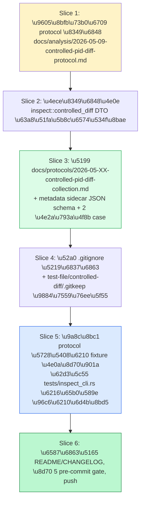

# Plan: Phase 14 Plan B 控制 diff fixture 采集协议

> **[DRAFT — awaiting plannotator gate]**：本会话用户未在 plannotator
> 浏览器面板，5 道 gate 未跑。当用户回到面板时执行 `plannotator
> annotate goals/phase14-plan-b-controlled-diff-protocol/<doc>.md
> --gate` 五道，按反馈修订。修订前本文档视为 draft，不能驱动 Codex
> /goal 启动。

## 方案总览

`pid_parse::inspect::controlled_diff` 上一会话 commit `54e5c06` 落
地了消费侧：库模块 + CLI refactor + 4 个 DTO + 2 个 pure builder。
但 **消费侧无真实输入**——`tests/inspect_cli.rs` 用合成 CFB 测了
CLI，但没有任何真实 SmartPlant 编辑 fixture 进过这个管道。本 goal
产出**采集协议**填这块缺口，使有 SmartPlant P&ID 工作站的操作员能
照做、产出能被 `pid_inspect --controlled-diff-dir` 消费的目录结构。

## 为什么是这条路

`docs/analysis/2026-05-13-ida-pro-mcp-reconnaissance.md` 已证实
Phase 14 IDA 反向被 B1 硬阻塞，且 import-level 二次确认已 commit
(`5880315`)。两条 evidence chain 备选：

| 路径 | 现状 | 解锁条件 |
|---|---|---|
| (A) IDA 反向核心 DLL | B1 hard-blocked | 用户提供 `rad2d.dll` / `pidobjectmanager.dll` |
| (B) Controlled diff fixture | 需要协议 + 工作站 | 本 goal 产出协议；fixture 采集是后续工作 |

本 goal 走 (B)。它**不**生成 fixture 本身，只产出协议——fixture 由
操作员按协议手动采集。因此本 goal **完全在 agent 侧能完成**，不依赖
B1。

## 怎么干

### Slice 表

| Slice | 目的 | 主要文件 | Done when | 风险 |
|---|---|---|---|---|
| **1** | 读现有草案 + DTO + CLI 现状 | `docs/analysis/2026-05-09-controlled-pid-diff-protocol.md`, `src/inspect/controlled_diff.rs`, `src/bin/pid_inspect.rs::controlled_pid_diff_cases` | 形成"协议缺什么"诊断列表（≥ 5 条） | 草案已足够，goal 多余 → 调整为"草案升级版"narrative |
| **2** | 推协议字段表 | 无文件改动，仅在 plan.md 此处沉淀字段表 | 字段表清单含 `case` / `operation` / `expected` / `notes` schema + SmartPlant 操作分类 6 类 + sidecar JSON 例 ≥ 2 | 字段不全 → Slice 3 修补 |
| **3** | **核心交付**：写 protocol 文档 | `docs/protocols/2026-05-XX-controlled-pid-diff-collection.md`（新） | 文档含：1) 前置条件 / 2) 工作站准备步骤 / 3) 每类 case 的 SmartPlant 操作步骤序号 / 4) sidecar JSON schema + 完整示例 / 5) 目录约定 / 6) 验证步骤（跑 pid_inspect --controlled-diff-dir） | SmartPlant UI 版本差异 → 限定 SmartPlant 12.x，其他版本另案 |
| **4** | 保护 fixture 不入 git | `.gitignore`, `test-file/controlled-diff/.gitkeep`（新） | `.pid` 文件被 ignore，目录结构骨架在 repo；agent 跑测试时找得到约定目录 | gitignore 漏写 → CI fixture path 测试失败 |
| **5** | 协议自检 | `tests/inspect_cli.rs`（扩展） | 新增 `controlled_diff_protocol_synthetic_two_case_walkthrough` 集成测试：合成 2 个 case 走协议目录约定，断言 `ControlledDiffEvidenceReport` 含 2 cases、`promoted_geometry=false`、each case has `first_modified.path.starts_with("/Sheet")` | 合成 fixture 不够真 → Slice 3 协议加 "real fixture" vs "synthetic" 标签 |
| **6** | 收口 | `CHANGELOG.md` `README.md`（如有相关章节），跑 5 道 pre-commit gate + push | 全 gate 绿；commit + push 到 origin/main | CI flaky |

## Acceptance Criteria

- [ ] **AC1**：`docs/protocols/2026-05-XX-controlled-pid-diff-collection.md`
      文档存在，体量 ≥ 300 行（充分协议），含 1–5 节
      （前置条件 / 工作站准备 / 操作步骤分类 / metadata sidecar
      schema / 目录约定 + 验证）
- [ ] **AC2**：metadata sidecar schema 与
      `ControlledDiffMetadata` 字段（`case` / `operation` /
      `expected` / `notes`）逐字段对照，含 JSON 示例 ≥ 2 个（line +
      circle）
- [ ] **AC3**：协议覆盖 SmartPlant 6 类原子操作：放线 / 放
      polyline / 放 circle / 放 arc / 放 text / 放 symbol，每类
      至少 1 个完整 case 演示
- [ ] **AC4**：协议含可重复执行的"自检"段：跑 `pid_inspect
      --controlled-diff-dir <root>` 后预期看到的 stdout / JSON 形
      状 example
- [ ] **AC5**：`.gitignore` 规则保证 `test-file/controlled-diff/**/*.pid`
      不入 git；`test-file/controlled-diff/.gitkeep` 入 git 作为
      目录占位
- [ ] **AC6**：`tests/inspect_cli.rs` 增加
      `controlled_diff_protocol_synthetic_two_case_walkthrough`
      集成测试通过；不依赖真实 `.pid` fixture（用合成 CFB），但走
      完整协议目录约定
- [ ] **AC7**：5 道 pre-commit gate 全绿 + CI on `main` 全绿
- [ ] **AC8**：`progress.jsonl` 含 AC1–AC7 各自一条 evidence

## Required Evidence

| Requirement | Evidence | Where |
|---|---|---|
| AC1 | `git diff docs/protocols/...md` + 行数 | `progress.jsonl` |
| AC2 | 与 `controlled_diff.rs::ControlledDiffMetadata` 字段对照表 | 协议文档自身 |
| AC3 | 6 个 case sample（每类一个示例 sidecar JSON + SmartPlant 步骤）| 协议文档自身 |
| AC4 | 协议中的 stdout / JSON example block | 协议文档自身 |
| AC5 | `git ls-files test-file/controlled-diff/` 仅含 `.gitkeep` + 协议 README | shell 输出截图 |
| AC6 | `cargo test --locked --test inspect_cli controlled_diff_protocol_synthetic_two_case_walkthrough` 通过 | `progress.jsonl` |
| AC7 | CI run URL | `progress.jsonl` |

## Completion Audit

声明完成前遍历 AC1–AC8 每项，按 evidence 来源核对真实 artifact。
任何一项缺失 / 弱 / 不确定，goal 视为未完成。
