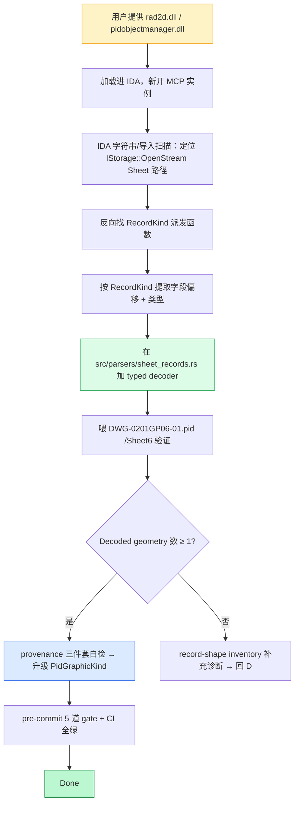

# Phase 14：SPPID Sheet 几何 primitive 解码器

## 目标产出

在 7 类 Sheet 几何 primitive（`PrimitiveLine` / `PrimitivePolyline` /
`PrimitiveCircle` / `PrimitiveArc` / `TextPlacementStyle` /
`SymbolPlacement` / `CoordinatePageMetadata`）中，**至少一类**输出
`PidGeometryConfidence::Decoded`，并且：

- `PidGraphicProvenance.stream_path` 指向 `Sheet*` 流
- `PidGraphicProvenance.byte_range` 是 bounded 的、覆盖源记录
- `PidGraphicProvenance.record_kind` 与 `PidGraphicKind::decoded_sheet_record_kind()` 一致

**关键约束**：decoder 的字节布局证据必须**来自 IDA Pro 对 SPPID 运行
时 DLL 的逆向**（`rad2d.dll` / `pidobjectmanager.dll` 等），而不只是
controlled `.pid` before/after diff 的字节差异。Controlled diff 是
辅助证据，IDA 反向是主证据。

## 流程总览

`A` 是当前最大的硬阻塞——8 个已加载 IDA 实例都被证实是上层 COM 调度
层（详见 `docs/analysis/2026-05-13-ida-pro-mcp-reconnaissance.md`），
无法直接回答字节布局问题。

## 上下文（必读）

| 文档 | 作用 |
|---|---|
| `docs/plans/2026-05-09-phase-14-sppid-full-geometry-plan-cn.md` | 已有的 Phase 14 任务表（14-01…14-05） + anti-goal + 升级门 |
| `docs/analysis/2026-05-09-primitive-line-record-evidence.md` | 现行 line 输出是 `EndpointPair + Inferred`，禁止当成 decoded |
| `docs/analysis/2026-05-09-external-sppid-format-evidence.md` | Hexagon/Bentley 公开文档**没有** record 级字节证据，外部检索路径已穷尽 |
| `docs/analysis/2026-05-13-ida-pro-mcp-reconnaissance.md` | 本会话刚交付的 IDA 侦察：8 个 binary 都不是 Sheet 解析器，等 rad2d.dll / pidobjectmanager.dll |
| 仓库 commit `54e5c06` | `pid_parse::inspect::controlled_diff` 模块——`promoted_geometry = false` 硬不变式 |

## 当前回归地板

- `DWG-0201GP06-01.pid` `/Sheet6` 推断 **117 个 point + 49 条 line**
- registry fixture 5 个，目标 8+
- 测试规模 970+（776 lib + 4 bin + 200+ integration），CI 全绿

## 限制清单（硬约束）

- 每个 decoded entity **必须**三件套 provenance 闭环（见上）
- `Sheet*` coverage 升级只允许配合 typed decoder 字段消费，不允许文档单方面提升
- 现有 inferred line 输出**不许退化**（数量 ≥ 49）
- **禁用** relationship 拓扑回填：靠 endpoint pair / object graph 推位置算 `Inferred`，不算 `Decoded`
- 5 道 pre-commit gate 必须保持：build / test / clippy -D warnings / fmt --check / `missing_docs` ratchet (0=0)
- `main` 上 CI workflow 必须继续通过
- 引入新 crate 依赖到主 crate 前 ASK BEFORE（vendored `oxidized-mdf` 是 GPL-3.0，新 GPL 依赖需明确批准）

## 非目标

- **不**做编辑/写回 Sheet 几何——本 goal 只解读
- **不**把现有 `EndpointPair + Inferred` line 重标为 `Decoded`，endpoint topology 是单独的 confidence tier
- **不**解析 Oracle exp 行数据（DWG-0202GP06-01_p 用 Oracle 12c，row 反向是另一个独立项目）
- **不**统一 fixture registry 到 8+，那是别的 goal
- **不**修改 `pid_parse::inspect::controlled_diff` 的 `promoted_geometry = false` 不变式——decoder 通过 `src/geometry.rs` 走自己的晋升路径
- **不**把任何二进制 DLL 提交进 git（`dlls/` 是本地 IDA 素材）

## Ask Before（要先问）

- 给主 crate 添加任何 binary / fixture / schema 依赖（非 `#[cfg(test)]`）
- 把 `Sheet*` coverage 分级从 `IdentifiedOnly` 升到 `PartiallyDecoded`
- 给 `SheetRecordKind` 加新 enum variant（schema 是 `pub`，下游契约）
- 在 `test-file/` 下加新 fixture 文件（私有样本不能未批准入仓）
- 改动 `RUSTFLAGS=-Dwarnings` CI 行为或 `missing_docs` ratchet baseline
- 改写 IDA 数据库（`.i64`）状态：分析结论需要能 export 成注释 / 类型定义，才能脱离 IDB 存活

## Done Means（完成判据）

满足以下 4 条同时成立：

1. 至少 1 类 Sheet primitive 在至少 1 个 registry fixture 上输出 `Decoded`，三件套 provenance 完整
2. decoder 在 `src/parsers/sheet_records.rs` 或 `src/geometry.rs` 里文档化，注释带 IDA 推出的字节偏移 / 结构形状
3. `plan.md` 里详尽 acceptance 与磁盘真实 artifact + `progress.jsonl` 条目一致
4. `main` 上 CI 在 merge 后绿

停止条件全部写入 `blockers.md`。
