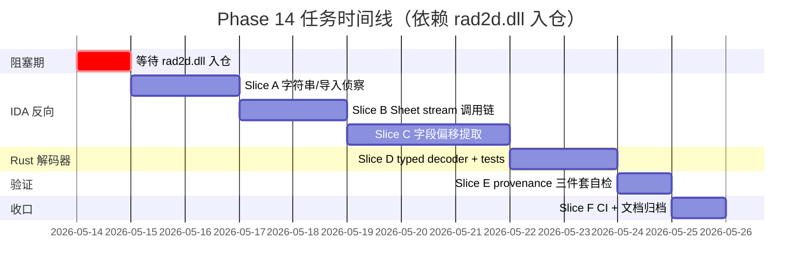

# Plan: Phase 14 SPPID Sheet 几何 primitive 解码器

## 方案总览

本 goal 把项目从 "Sheet probe + endpoint inferred + object hint" 推
进到 **至少一类 SPPID Sheet primitive 输出 decoded geometry**。方法
是：

1. 在 IDA Pro 里加载 SPPID 真正负责 Sheet primitive 读写的核心 DLL
   （`rad2d.dll` / `pidobjectmanager.dll`），不是已有 8 个上层 COM
   调度 binary
2. 从 `IStorage::OpenStream("Sheet*")` 调用点反向走，找到 record kind
   派发函数
3. 提取每个 primitive 的字节布局（marker / length / coordinate fields）
4. 在 `src/parsers/sheet_records.rs` 加 typed decoder，写 red test 再
   实现
5. 与 controlled `.pid` before/after diff 交叉验证（`pid_parse::inspect::controlled_diff`
   是验证助手，不是证据来源主线）

**先锋类**选 `PrimitiveLine` —— 项目里已有 49 条 inferred line 作为
对比基线，最容易判断 decoded 是否扩展且不退化。

## 为什么是这条路

`docs/analysis/2026-05-09-primitive-line-record-evidence.md` 已锁定：
现有 line 来自 endpoint pair 推断，**不是** 记录级字节解码。
`docs/analysis/2026-05-09-external-sppid-format-evidence.md` 验证：公开
文档没字节布局。`docs/analysis/2026-05-13-ida-pro-mcp-reconnaissance.md`
验证：当前 IDA 加载的 8 个 SPPID binary 都是上层 COM 层，**不是**
Sheet 字节解析器。

剩下两条路：

| 路 | 时间 | 风险 |
|---|---|---|
| (A) IDA 反向核心 DLL | 数小时～数天 | DLL 获取难度，IDA 分析深度 |
| (B) Controlled diff 字节差异归纳 | 数周 | 需多个独立 fixture 才能区分 schema vs payload |

用户决策选 (A)，先等 DLL 入仓。Controlled diff 退化为 verification
助手。

## 怎么干

### Phase 14 任务拆分（沿用 `docs/plans/2026-05-09-phase-14-sppid-full-geometry-plan-cn.md` 的 5 个任务）

### Slice 表

| Slice | 目的 | 主要文件 / 系统 | Done when | 风险 |
|---|---|---|---|---|
| **A** | IDA 字符串 / 导入扫描；定位 `IStorage::OpenStream` / `IStream::Read` 调用点 | `rad2d.dll.i64`、`pidobjectmanager.dll.i64`、`docs/analysis/2026-05-XX-rad2d-sheet-callsites.md`（新） | 至少 1 个 binary 里找到 ≥ 1 个 `OpenStream("SheetN")` xref + 解码 dispatcher 函数地址 | 找不到对应函数（DLL 是错的） |
| **B** | 反向解码 dispatcher：找 RecordKind 派发表 | 同 A，加 `docs/analysis/2026-05-XX-rad2d-recordkind-dispatch.md`（新） | dispatcher 函数被反编译，至少识别出 5 个 record kind 派发入口（line/polyline/circle/arc/text） | 派发用 vtable 而不是 switch（多走一层间接） |
| **C** | 提取 `PrimitiveLine` 字节布局：marker、length、coord 字段类型 | `docs/analysis/2026-05-XX-rad2d-primitive-line-layout.md`（新）+ IDA struct 定义 | byte-level 表：偏移 / 大小 / 类型 / 含义；与 `DWG-0201GP06-01.pid /Sheet6` 实际字节交叉验证 | f64 vs i32 不确定；endian 不确定 |
| **D** | Rust typed decoder 实现 | `src/parsers/sheet_records.rs`（新增 fn）、`src/model.rs`（如需新字段）、`src/geometry.rs`（新增 PidGraphicKind::Line decoded 路径）、`tests/parser_panic_safety.rs`、`tests/parse_real_files.rs` | 至少 1 条 decoded line 出现，且 panic-safety smoke 全过 | 单 fixture 不够稳，需要多个反向验证 |
| **E** | provenance 三件套 + coverage 升级判断 | 同 D，加 `src/inspect/coverage.rs` | `PidGraphicProvenance.{stream_path, byte_range, record_kind}` 全部填，`coverage.rs` 决定是否升级 `Sheet*` 分级 | coverage 升级误升、被 user revert |
| **F** | 文档归档 + CI 收口 | `docs/sppid/v0.10.x-status.md`、`README.md`、`CHANGELOG.md`、`docs/plans/2026-05-09-phase-14-sppid-full-geometry-plan-cn.md`（更新状态） | 5 道 pre-commit gate 绿 + CI on `main` 绿 + 用户最终签收 | CI 出现 flaky 测试 |

### 顺序约束

A → B → C 是串行硬依赖（IDA 反向链），C → D 是 IDA 结论 → Rust 实
现的转译，D → E → F 是收口序列。

## 阶段边界

本 goal **不**做以下事情（已写入 `brief.md` 非目标，这里复述决策点）：

- 不做 7 类 primitive 全做完——选 PrimitiveLine 一类闭环就算 done。
  其他 6 类是后续独立 goal（每类一个 goal 包）
- 不做编辑 / 写回——读路径闭环就算
- 不动 `pid_parse::inspect::controlled_diff` 的 `promoted_geometry =
  false` 不变式

如果 Slice C 反向走不通（IDA 拿到的 DLL 是错的 / 字节布局太复杂 / 没
有可识别的 marker），**触发 stop-and-ask**：在 `progress.jsonl` 写
fail evidence + 在 `blockers.md` 加新 entry + 让用户决定换 DLL / 加
fixture / 转 Plan B。

## 指导备注（Steering Notes）

- 整个 goal 把 IDA 当作**主证据来源**，controlled diff 是辅助。如果
  反过来——decoder 只能在 1 个 controlled diff 上成立但 IDA 字节
  推断不一致——视为弱证据，需要再加 2 个独立 fixture 才能升 `Decoded`
- IDA 注释 / struct 定义 / 函数重命名 **必须 export** 出来（写进
  docs/analysis/ 的对应文档），不能只留在 `.i64` 里。`.i64` 是工具
  state，会丢；docs/analysis/ 是结论
- Rust 实现走 TDD：先在 `tests/parser_panic_safety.rs` 加 adversarial
  入口断言 → 再加 red unit test 用真实字节 → 再实现 decoder
- 每完成一个 Slice，append 一个 `progress.jsonl` 条目（含命令 / 状态
  / artifact 路径）

## Acceptance Criteria

- [ ] **AC1**：`rad2d.dll` 或 `pidobjectmanager.dll` 进 IDA 实例
      （新端口），`docs/analysis/2026-05-13-ida-pro-mcp-reconnaissance.md`
      的 "Open questions" 第 1 条标记 resolved
- [ ] **AC2**：至少 1 个 `IStorage::OpenStream("SheetN")` 调用点被
      IDA 反编译，地址写入新增 `docs/analysis/2026-05-XX-rad2d-sheet-callsites.md`
- [ ] **AC3**：record kind dispatcher 函数被反编译，识别出至少 5 个
      record kind 入口（line/polyline/circle/arc/text），写入
      `docs/analysis/2026-05-XX-rad2d-recordkind-dispatch.md`
- [ ] **AC4**：`PrimitiveLine` 字节布局表（offset / type / 含义）落
      到 `docs/analysis/2026-05-XX-rad2d-primitive-line-layout.md`，
      并与 `DWG-0201GP06-01.pid /Sheet6` 实际字节交叉验证至少 3 个
      line record
- [ ] **AC5**：`src/parsers/sheet_records.rs` 新增 `decode_primitive_line()`
      函数，带 IDA 来源注释（指向 AC4 文档）
- [ ] **AC6**：`tests/parser_panic_safety.rs` 增加 `decode_primitive_line`
      入口的 adversarial 字节 smoke，不 panic
- [ ] **AC7**：`tests/parse_real_files.rs` 增加
      `primitive_line_decoder_emits_decoded_lines_with_provenance` 测
      试；至少 1 个 fixture 上输出 ≥ 1 条 decoded `PidGraphicKind::Line`
- [ ] **AC8**：existing inferred-line 输出 ≥ 49 条不退化（regression guard）
- [ ] **AC9**：所有 decoded line 的 provenance 三件套（`stream_path`
      / `byte_range` / `record_kind`）全部非空且一致
- [ ] **AC10**：5 道 pre-commit gate 全绿 + CI on `main` 全绿
- [ ] **AC11**：`progress.jsonl` 含 AC1–AC10 各自一条 evidence 记录

## Required Evidence

| Requirement | Evidence to inspect | Where recorded |
|---|---|---|
| AC1 | `gh api` / IDA `list_instances` 结果 | `progress.jsonl` + `blockers.md` 标 resolved |
| AC2 | `docs/analysis/2026-05-XX-rad2d-sheet-callsites.md` 含函数地址 | git diff 文档 + `progress.jsonl` |
| AC3 | `docs/analysis/2026-05-XX-rad2d-recordkind-dispatch.md` 含 dispatcher 反编译 | git diff 文档 + `progress.jsonl` |
| AC4 | `docs/analysis/2026-05-XX-rad2d-primitive-line-layout.md` 含字节表 | 文档 + 引用真实 hex dump |
| AC5–AC7 | `cargo test --locked -j 1 --test parse_real_files primitive_line_decoder_emits_decoded_lines_with_provenance -- --nocapture` 输出 | `progress.jsonl` 含输出截图 |
| AC8 | `cargo test --locked -j 1 --test parse_real_files dwg0201_produces_inferred_endpoint_lines -- --nocapture` 通过 | `progress.jsonl` |
| AC9 | `decoded_geometry_provenance_record_kind_matches_payload_kind` 测试 | `progress.jsonl` |
| AC10 | CI run URL（gh run watch 输出）+ pre-commit gate 命令输出 | `progress.jsonl` |
| AC11 | `progress.jsonl` 自身 | 文件检视 |

## Completion Audit

声明完成前，必须遍历 AC1–AC11 每一项，对照 `progress.jsonl` 真实记
录与 git 真实 diff。任何一项缺证据 / 证据弱 / 不确定，goal 视为未
完成。

特别注意：**AC9 是 phase 14 evidence contract 的核心**，三件套有任
何一项空，整个 decoded line 立刻退回 `Inferred`，AC10 之前的 gate
也无法保证整体闭环。
